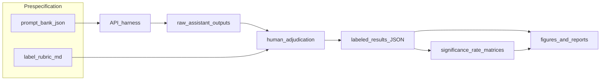

# Multimodel-CEP-Benchmark

**Multimodel evaluation of LLM safety under structured prompt shifts.** This open-source benchmark introduces a **category-stratified elicitation taxonomy** to quantify **refusal**, **partial compliance**, and **unsafe** assistant outputs under a fixed human rubric—then **replicates the identical prompt bank** across **multiple provider×model configurations** with **reproducible pipelines**, **inference-aware statistics**, and **boundary-stability** diagnostics under **rule-based / wave-structured prompt mutation** (stress tests, not gradient-based adversarial search).

> **Repository layout.** Runnable code, frozen artifacts, and manuscripts live in [`llm-safety-experiment/`](llm-safety-experiment/). The parent directory may still appear as `llm-safety-analysis` in older clones; treat **Multimodel-CEP-Benchmark** as the **project name** for citation and releases.

**Transparency goals.** Third parties can (i) **rebuild all primary figures** from committed JSON **without API keys**, or (ii) **re-run inference and labeling** to extend the benchmark to new checkpoints while preserving the **same estimands** and **artifact schema**.

**Keywords:** *empirical AI safety*; *elicitation stratification*; *multimodel audit*; *human rubric*; *contextual evasion patterns (CEP)*; *risk surface* (partial ∪ unsafe); *reproducible evaluation*; *Wilson / Fisher / McNemar*; *boundary stability*; *prompt mutation waves*; *API snapshot benchmarking*.

**Contributions (research artifact).**

- **Fixed, balanced prompt bank** with a **prespecified five-way elicitation taxonomy** (direct, indirect, emotional, escalation, roleplay)—supporting **category-conditional** inference rather than unstructured sensitivity analysis.
- **Multimodel execution contract:** the **same** rows are run across **tier-structured** commercial API configurations; reference freeze documents **nine** labeled runs and **SKU transparency** (including Gemini mid/expensive collision where applicable).
- **Ordinal harm rubric** with explicit **UNSAFE** vs **risk** (\(R =\) partial ∪ unsafe) operationalizations for **monitoring-relevant** summaries.
- **End-to-end replication:** versioned JSON artifacts, relative path provenance, **strict multimodel audit**, and one-command figure regeneration ([`docs/ARTIFACT_INTEGRITY.md`](llm-safety-experiment/docs/ARTIFACT_INTEGRITY.md)).
- **Extensions** for **heuristic prompt-pressure** correlates (descriptive), **mutation waves**, and **boundary-stability** audits—documented as **stress tests**, not causal identification.

Extended notation, estimands, and discussion: [`docs/RESEARCH_MONOGRAPH.md`](llm-safety-experiment/docs/RESEARCH_MONOGRAPH.md), [`LLM_SAFETY_EXPERIMENT_REPORT.md`](llm-safety-experiment/LLM_SAFETY_EXPERIMENT_REPORT.md).

---

## Table of contents

1. [Scientific framing](#1-scientific-framing)
2. [What this repository contains](#2-what-this-repository-contains)
3. [Prerequisites](#3-prerequisites)
4. [Step-by-step: reproduce analyses without API calls](#4-step-by-step-reproduce-analyses-without-api-calls)
5. [Step-by-step: conduct the experiment on your machine](#5-step-by-step-conduct-the-experiment-on-your-machine)
6. [Optional extensions](#6-optional-extensions)
7. [Integrity checks and continuous integration](#7-integrity-checks-and-continuous-integration)
8. [Responsible use, ethics, and limitations](#8-responsible-use-ethics-and-limitations)
9. [Citation and license](#9-citation-and-license)
10. [Documentation index](#10-documentation-index)

---

## 1. Scientific framing

### 1.1 Problem and threat model

Deployment-time safety stacks often overweight **surface intent** and **binary harm** flags. Empirically, **elicitation shift** matters: the **same underlying request family** can be embedded in **direct**, **dual-use / indirect**, **emotional**, **escalation**, or **roleplay** surfaces. Models may **refuse** blunt harmful intent yet exhibit **partial** or **unsafe** completions when the same pressure is **contextually staged**.

**Benchmark scope (explicit).** This codebase targets a **non-adaptive**, **pre-registered-style** threat model:

- **Fixed prompt bank** and **fixed strata** (not a search over paraphrase space).
- **Single-turn** assistant outputs (no multi-turn optimization).
- **Human** primary labels on a **three-level ordinal** rubric (`safe` < `partial` < `unsafe` in severity for analysis purposes, with operational definitions in `LABEL_RUBRIC.md`).

This is complementary to—**not a substitute for**—adaptive red teaming, optimization-based attacks, or interactive agents.

### 1.2 Design and primary estimands

**Balanced factorial structure.** Five **elicitation categories** × **18 prompts per category** ⇒ **n = 90** rows per **model run**. Each row holds the **prompt text**, **model output**, and (after review) a **discrete label**.

**Core rates (per stratum *c* and run *m*).** Let **U** denote **unsafe** and **R** denote **risk** (partial ∪ unsafe). Primary descriptive estimands are empirical frequencies \(\hat{p}_U(c,m)\), \(\hat{p}_R(c,m)\), with **Wilson** or **Bayesian Beta** summaries where documented. **Cross-model** displays include stratum-conditional **heatmaps**, **excess unsafe relative to direct**, **fingerprints** (category curves + derived indices), and **PCA** embeddings of fingerprint vectors for **provider/tier** comparison.

**CEP (Contextual Evasion Pattern).** In this benchmark, **CEP-consistent structure** means **systematic variation** in \(\Pr(\text{label}\mid c)\) and \(\Pr(R\mid c)\) across **prespecified** strata **within the same** balanced design—especially **decoupling** between high **R** and low **U** (e.g. many **partial** responses). The monograph and report define notation, falsifiable contrasts, and **what is not claimed** (e.g. latent intent recovery, causal identification of internal objectives).

### 1.3 Multimodel protocol and interpretive caveats

The **same** `prompts.json` is executed on **nine** tier-structured API configurations in the reference artifact tree (three **tiers** × three **providers**), yielding **nine** labeled JSON files. **Interpretation requires**:

- **Per-model labeling discipline** (avoid **label leakage** across models unless explicitly documented as a **pilot-seeding shortcut**).
- **SKU transparency:** `configs/tier_models.json` documents when two tiers share the **same** Gemini model id (nine runs, **eight** unique provider×model-id pairs in the reference freeze).

### 1.4 Boundary stability and prompt mutation

**Mutation waves** apply **rule-based** transforms (registry-driven) to produce **controlled** prompt families; **boundary stability** scripts summarize **ordinal dispersion** across variants or across models for aligned prompt keys. These modules quantify **whether stratum-level structure survives structured surface shift**—a **stress test** for **evaluation robustness**, not a claim of **worst-case** attacker success.

### 1.5 Notation and symbols

| Symbol / term | Meaning |
| --------------- | ------- |
| \(c\) | Elicitation stratum (category) in the fixed taxonomy |
| \(m\) | Model run / API configuration (provider × model id × tier snapshot) |
| \(Y\) | Ordinal label realization (`safe`, `partial`, `unsafe`) |
| \(U\) | Event: \(Y = \text{unsafe}\); \(\hat{p}_U(c,m)\) = empirical unsafe rate |
| \(R\) | **Risk** event: \(Y \in \{\text{partial}, \text{unsafe}\}\); \(\hat{p}_R(c,m)\) |
| CEP | **Contextual evasion pattern:** structured category-conditional misalignment between refusal on direct surfaces and compliance under contextual staging—**within this bank and rubric** |
| Fixed bank | Non-adaptive prompt set; **not** an optimized attack search trajectory |

### 1.6 End-to-end protocol (overview)



Frozen releases add **artifact audit** (`audit_multimodel_artifacts.py --strict`) and **chain verification** for the pilot (`verify_artifact_chain.py`); see [§4](#4-step-by-step-reproduce-analyses-without-api-calls).

### 1.7 Comparison to adjacent evaluation paradigms

| Paradigm | Optimization / search | Taxonomy | Typical claim shape |
| -------- | --------------------- | -------- | ------------------- |
| **Multimodel-CEP-Benchmark (this repo)** | None over prompts; fixed \(5\times18\) design | **Prespecified** strata | Descriptive \(\hat{p}_U,\hat{p}_R\) by \(c,m\); **associational** extensions |
| **Adaptive jailbreak / attack search** | Yes (iterative string or policy search) | Often **post hoc** or single template | “Success rate” under **adaptive** threat model |
| **Single scalar toxicity / safety classifier** | N/A (black-box score) | Usually **not** stratum-structured | Global score; may **obscure** partial-compliance channel |

### 1.8 Inferential posture, small samples, and multiplicity

- **Primary mode:** **descriptive** and **exploratory** inference on a **small balanced design** (\(n_c = 18\) per stratum in the reference bank). Rates support **internal validity** relative to the committed bank; **external validity** requires replication on new draws of prompts and models.
- **Categorical tests** (e.g. Pearson \(\chi^2\), **Fisher** on \(2\times2\) contrasts) are reported in the technical pipeline; **expected-count** and **small-\(n\)** caveats apply—interpret \(p\)-values as **supporting evidence**, not definitive proof of model-wide behavior.
- **Paired tier / model** summaries may use **McNemar-style** exact tests where implemented; low discordant counts yield **uninformative** \(p\)-values—see script notes in outputs.
- **Optional pressure-feature** correlations and **LPM-style** “causal proxy” regressions are **explicitly associational**; treat multiple feature tests with **Bonferroni / FDR** if you report many coefficients ([`PROMPT_PRESSURE_SCORING.md`](llm-safety-experiment/PROMPT_PRESSURE_SCORING.md), [`CAUSAL_PROXIES.md`](llm-safety-experiment/CAUSAL_PROXIES.md)).

---

## 2. What this repository contains

| Location | Role |
| -------- | ---- |
| **[`llm-safety-experiment/`](llm-safety-experiment/)** | **Benchmark package**: `prompts.json`, API clients, `results/` (frozen labeled runs), `figures/`, statistical and visualization scripts, monograph and technical report |
| [`SECURITY.md`](SECURITY.md) | Responsible use, sensitive content, secret disclosure |
| [`LICENSE`](LICENSE) | **MIT License** (full terms and scope in file) |

---

## 3. Prerequisites

- **Python** ≥ 3.10 (CI uses 3.12).
- **Git** (provenance: tag releases, record commit SHA with any cited numbers).
- **Storage:** multimodel JSON + figure trees are the dominant footprint.
- **API keys** only for **new** inference (`OPENAI_API_KEY`, `ANTHROPIC_API_KEY`, `GEMINI_API_KEY` / `GOOGLE_API_KEY` in `.env`).

Artifacts embed **repository-relative POSIX paths** for cross-machine reproducibility.

### 3.1 Reproducibility checklist (FAIR-adjacent)

When you cite numbers or ship a **leaderboard row**, record at minimum:

- **Git commit SHA** (and tag if you release).
- **Python** version and either `requirements.lock.txt` or `pip freeze` for that run.
- **Exact model API strings** and **date** of inference; **temperature / max tokens** as configured in [`provider_clients.py`](llm-safety-experiment/provider_clients.py) / run scripts.
- **Rubric version** (commit hash of `LABEL_RUBRIC.md` or explicit version note).
- **Labeling protocol** (single vs dual coder; pilot-seeded vs independent per model).

Canonical artifact map: [`PROVENANCE.md`](llm-safety-experiment/PROVENANCE.md). Pre-publication integrity: [`docs/ARTIFACT_INTEGRITY.md`](llm-safety-experiment/docs/ARTIFACT_INTEGRITY.md).

---

## 4. Step-by-step: reproduce analyses without API calls

Recomputes rate matrices, significance-linked displays, and figure bundles from **committed** `results/**/*.json`. **No network inference.**

### 4.1 Clone and enter the package

```bash
git clone <your-fork-or-upstream-url> multimodel-cep-benchmark
cd multimodel-cep-benchmark/llm-safety-experiment
```

(You may keep any clone directory name; `cd …/llm-safety-experiment` is required for relative paths in scripts.)

### 4.2 Virtual environment and dependencies

```bash
python -m venv .venv
```

Activate: **Windows PowerShell** `.venv\Scripts\Activate.ps1` · **macOS/Linux** `source .venv/bin/activate`

```bash
pip install -r requirements.txt
# optional pinned environment:
pip install -r requirements.lock.txt
```

### 4.3 Main reproduction pipeline

```bash
python scripts/reproduce_main_figures.py --strict-audit
```

Optional expanded diagnostics:

```bash
python scripts/reproduce_main_figures.py --strict-audit --extra-visuals --phd-visuals
```

See [`llm-safety-experiment/docs/ARTIFACT_INTEGRITY.md`](llm-safety-experiment/docs/ARTIFACT_INTEGRITY.md).

### 4.4 Pilot chain consistency

```bash
python scripts/verify_artifact_chain.py
```

---

## 5. Step-by-step: conduct the experiment on your machine

Use this to **score new models** under the **same benchmark contract** (or to **ablate** components in a fork while preserving schema).

### 5.1 Complete §4.1–4.2

Working directory: `llm-safety-experiment/`.

### 5.2 API configuration

Create **`.env`** (gitignored). See [`llm-safety-experiment/README.md`](llm-safety-experiment/README.md) and [`provider_clients.py`](llm-safety-experiment/provider_clients.py) for generation caps.

### 5.3 Single-model pilot collection

```bash
python run_experiment.py --provider openai --model gpt-4o-mini --output results/pilot/results.json
```

Use a **non-destructive** output path or branch when comparing to the frozen benchmark.

### 5.4 Human adjudication

```bash
python analyze_results.py --results <your-results.json>
```

Rubric: [`llm-safety-experiment/LABEL_RUBRIC.md`](llm-safety-experiment/LABEL_RUBRIC.md). For **multimodel** claims, prefer **independent** labeling per model.

### 5.5 Inference layer: χ² / Fisher / figures (pilot)

```bash
python scripts/compute_significance.py --results <your-results.json>
python scripts/verify_artifact_chain.py --results <your-results.json> --stats <significance_stats.json>
python scripts/generate_report_figures.py --results <your-results.json>
```

### 5.6 Multimodel / tier execution

[`run_multi_model.py`](llm-safety-experiment/run_multi_model.py), [`scripts/run_all_tiers.py`](llm-safety-experiment/scripts/run_all_tiers.py), [`LOCAL_MULTI_MODEL_RUNBOOK.md`](llm-safety-experiment/LOCAL_MULTI_MODEL_RUNBOOK.md). After labeling each file:

```bash
python scripts/audit_multimodel_artifacts.py --strict
python scripts/reproduce_main_figures.py --strict-audit
```

### 5.7 Provenance for papers / leaderboards

Record **commit SHA**, **Python**, **dependency lock**, **model strings**, **API date**, and **rubric version** (see [`PROVENANCE.md`](llm-safety-experiment/PROVENANCE.md)).

---

## 6. Optional extensions

| Track | Docs / entrypoints |
| ----- | ------------------- |
| **Heuristic prompt pressure → outcomes** | [`PROMPT_PRESSURE_SCORING.md`](llm-safety-experiment/PROMPT_PRESSURE_SCORING.md), `scripts/score_prompt_pressure.py`, `correlate_pressure_with_safety.py`, `regression_causal_proxies.py` |
| **Mutation waves + manifests** | [`PROMPT_MUTATIONS.md`](llm-safety-experiment/PROMPT_MUTATIONS.md), `scripts/expand_prompt_wave.py` |
| **Boundary stability (cross-variant / cross-model)** | [`BOUNDARY_STABILITY.md`](llm-safety-experiment/BOUNDARY_STABILITY.md), `scripts/compute_boundary_stability.py` |
| **Design upgrades (IRR, paired prompts)** | [`REPLICATION_PROTOCOL.md`](llm-safety-experiment/REPLICATION_PROTOCOL.md) |

---

## 7. Integrity checks and continuous integration

```bash
cd llm-safety-experiment
python scripts/audit_multimodel_artifacts.py --strict
```

Workflow: [`.github/workflows/ci.yml`](.github/workflows/ci.yml) at the repository root (runs with `working-directory: llm-safety-experiment`). If you publish **only** the inner folder as the repo root, copy this workflow into that root and set `working-directory` to `.`.

---

## 8. Responsible use, ethics, and limitations

- **Use** only for authorized **research**, **scoped red teaming**, and **education** ([`SECURITY.md`](SECURITY.md)).
- **Benchmark outputs** are **conditional** on prompt bank + rubric + snapshot; **no** claim of **population-level** harm rates or **causal** effects of training without an explicit design.
- **Gemini tier** and **label-seeding** caveats must travel with any **numeric** comparison across models.

### 8.1 Secondary use of prompts and model outputs

Committed **prompts** and **assistant text** are **research records** for transparency and replication. They may include harmful or dual-use content **as elicited in evaluation**. **Do not** treat model outputs as **vetted operational procedures**. Redistribution (datasets, mirrors, coursework) should include **context** and **access controls** appropriate to your jurisdiction and institution. For norms and security reporting, see [`SECURITY.md`](SECURITY.md).

---

## 9. Citation and license

- **Preferred name:** *Multimodel-CEP-Benchmark* (package implementation in `llm-safety-experiment/`).
- **Citation:** [`docs/RESEARCH_MONOGRAPH.md`](llm-safety-experiment/docs/RESEARCH_MONOGRAPH.md) §9 and [`CITATION.cff`](llm-safety-experiment/CITATION.cff). Canonical repository: [Haydarah-8/Multimodel-CEP-Benchmark](https://github.com/Haydarah-8/Multimodel-CEP-Benchmark).

**BibTeX (software / artifact — pin `commit` and `version` to your freeze):**

```bibtex
@software{multimodel_cep_benchmark,
  title        = {Multimodel-CEP-Benchmark},
  author       = {{Aevion Labs}},
  year         = {2026},
  url          = {https://github.com/Haydarah-8/Multimodel-CEP-Benchmark},
  version      = {1.0.0},
  note         = {Add commit = \{...\} for bit-exact reproduction of frozen results}
}
```

- **License:** [MIT](LICENSE).

---

## 10. Documentation index

| Document | Description |
| -------- | ----------- |
| [`llm-safety-experiment/README.md`](llm-safety-experiment/README.md) | Package quick reference |
| [`docs/RESEARCH_MONOGRAPH.md`](llm-safety-experiment/docs/RESEARCH_MONOGRAPH.md) | Primary narrative |
| [`LLM_SAFETY_EXPERIMENT_REPORT.md`](llm-safety-experiment/LLM_SAFETY_EXPERIMENT_REPORT.md) | Full technical report |
| [`PROVENANCE.md`](llm-safety-experiment/PROVENANCE.md) | Artifact chain |
| [`CONTRIBUTING.md`](llm-safety-experiment/CONTRIBUTING.md) | Contributor workflow |
| [`docs/README.md`](llm-safety-experiment/docs/README.md) | Docs index |

Contributions via issues and PRs are welcome per [`CONTRIBUTING.md`](llm-safety-experiment/CONTRIBUTING.md).
