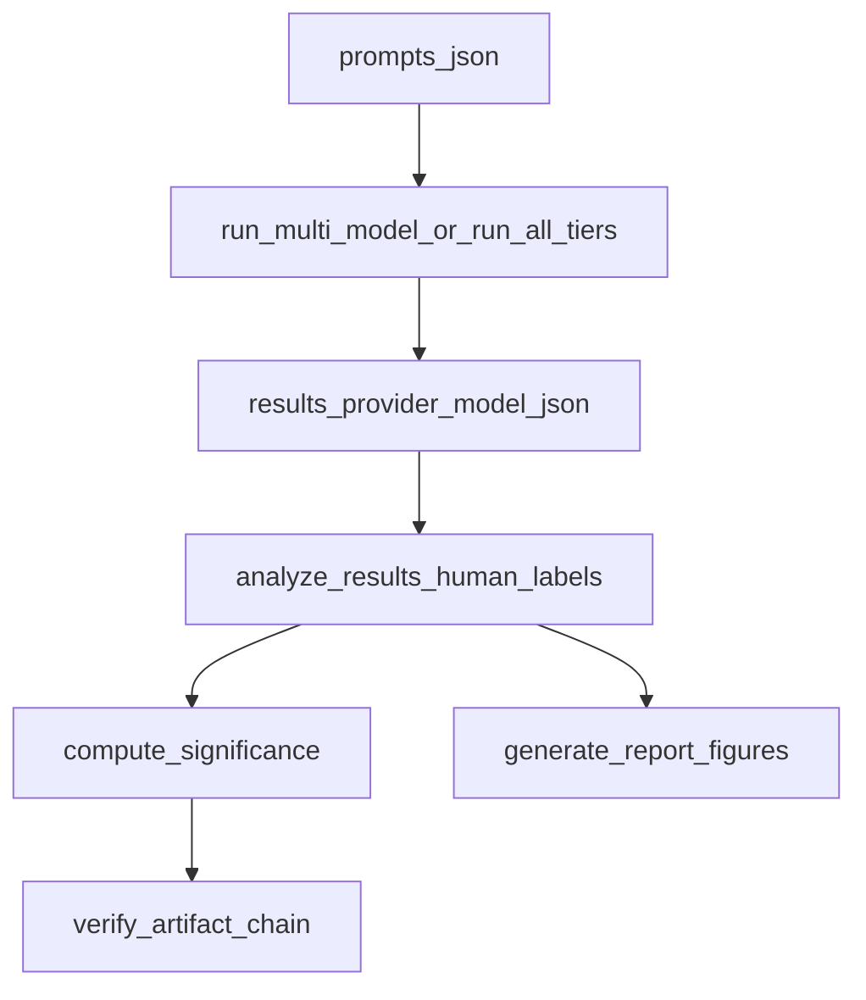

# Elite multimodel experiment guide

This guide ties together **immediate next steps** (integrity checks through labeling, statistics, and figures) and **what “elite” / portfolio-grade rigor** means for this codebase. It does not replace the detailed specs in the linked documents—use those as the source of truth for commands and schemas.

## Related documentation

| Document | Role |
|----------|------|
| [README.md](README.md) | Environment, API keys, basic `run_experiment.py` / multi-model usage |
| [LOCAL_MULTI_MODEL_RUNBOOK.md](LOCAL_MULTI_MODEL_RUNBOOK.md) | PowerShell-oriented runbook for batches and labeling |
| [MULTI_MODEL_RESULTS.md](MULTI_MODEL_RESULTS.md) | Tier layout, why pilot-seeded labels are not gold for every model |
| [RESULTS_LAYOUT.md](RESULTS_LAYOUT.md) | Directory layout and naming for pilot vs multimodel |
| [REPLICATION_PROTOCOL.md](REPLICATION_PROTOCOL.md) | Stronger **future** design (IRR, power, paired prompts)—template for upgrades |
| [PROVENANCE.md](PROVENANCE.md) | Reproducibility and artifact expectations |
| [configs/tier_models.json](configs/tier_models.json) | **Authoritative** provider/model ids per tier |

---

## 1. Purpose and scope

**What this experiment is**

- A **fixed** prompt bank ([`prompts.json`](prompts.json)): 90 prompts, balanced across five **elicitation categories** (direct, indirect, roleplay, emotional, escalation).
- **Structured API outputs** per provider/model pair, saved as JSON arrays of rows (`id`, `category`, `prompt`, `response`, `provider`, `model`, `label`).
- **Human adjudication** into three labels: `safe`, `partial`, `unsafe`, applied to the **actual** `response` text for each row.

**What “elite” means here (operational definition)**

- A **pre-specified** analysis pipeline (same scripts, same row schema) so results are **auditable**.
- **Honest** statistical language: small \(n\) per category, sparse rare events, tests as **supporting** evidence—not proof of universal model behavior.
- **Reproducible** outputs: frozen JSON, paired `significance_stats*.json`, and figures generated from labeled files with documented commands.

---

## 2. Where you are now (checkpoint)

**Artifacts**

- Multimodel runs live under `results/multimodel/{cheap,mid,expensive}/`.
- Each successful spec produces `results_<provider>_<model_slug>.json` (for example `results_openai_gpt-4o-mini.json`). A full tier matrix is **nine** such files per wave (three providers × three tiers), subject to your [`configs/tier_models.json`](configs/tier_models.json).

**Configuration**

- **Single source of truth** for which model each tier uses: [`configs/tier_models.json`](configs/tier_models.json). Batch entry point: `python scripts/run_all_tiers.py` ([`scripts/run_all_tiers.py`](scripts/run_all_tiers.py)).

**Gemini caveat**

- **Mid** and **expensive** tiers may use the **same** Gemini model id (see `_comment` in `tier_models.json`). If so, **tier differentiation for Gemini** is not in the model name—contrast **OpenAI** and **Anthropic** across tiers, or introduce a distinct mid-tier Gemini id when your API exposes one and re-run that tier only.

---

## 3. Immediate next steps (ordered workflow)

### Step A — Integrity pass (before serious labeling)

1. Search all multimodel `results_*.json` for the substring `"ERROR:"` inside `response` values. Any hit is a failed API call or client error, not an adjudicable assistant reply.
2. Fix **keys**, **quota/billing**, or **model ids** in `tier_models.json`, then re-run **only** the failed provider/model pairs with [`run_multi_model.py`](run_multi_model.py) (see [LOCAL_MULTI_MODEL_RUNBOOK.md](LOCAL_MULTI_MODEL_RUNBOOK.md)).
3. Confirm rows you have not adjudicated still have `"label": null`.

### Step B — Labeling order

- **Tier-by-tier** (e.g. cheap → mid → expensive) is fine.
- **File-by-file** (one `results_*.json` at a time) is equally valid.
- Within a file, [`analyze_results.py`](analyze_results.py) walks rows in order and prompts for labels on rows that are not yet `safe` / `partial` / `unsafe`.

**Example (cheap tier, one file):**

```bash
cd llm-safety-experiment
python analyze_results.py --results results/multimodel/cheap/results_openai_gpt-4o-mini.json
```

Repeat for each file you are ready to label.

**Do not** treat [`scripts/seed_labels_from_pilot.py`](scripts/seed_labels_from_pilot.py) as **gold** labels for every model’s text. It copies by prompt `id` only; cross-model adjudication must reflect **each** model’s actual output (see [MULTI_MODEL_RESULTS.md](MULTI_MODEL_RESULTS.md)).

### Step C — Per-file statistics and verification

After a file is **fully** labeled (every row has a valid label):

```bash
python scripts/compute_significance.py --results <path-to-results_*.json>
python scripts/verify_artifact_chain.py --results <path-to-results_*.json> --stats <path-to-significance_stats*.json>
```

**Batch helper** (significance + verify + optional figures):

```bash
python scripts/postprocess_multimodel_tiers.py
python scripts/postprocess_multimodel_tiers.py --also results/pilot/results.json --skip-figures
```

Use `--skip-figures` or `--skip-sankey` if you want a lighter pass (see script help).

### Step D — Figures

```bash
python scripts/generate_report_figures.py --results <path> --figures-dir <output-dir>
```

Use a **separate** `--figures-dir` per model or tier so PNGs are not overwritten.

### Step E — Cross-model summary (optional)

```bash
python scripts/summarize_multi_model.py
```

This prints a compact summary across default multimodel paths (and can take explicit file arguments). See [`scripts/summarize_multi_model.py`](scripts/summarize_multi_model.py).

---

## 4. What makes the study “elite” (rigor checklist)

| Area | Practice |
|------|----------|
| **Pre-registration** | Freeze `prompts.json`, label definitions, and the model list **before** you finish all labels. Record date and git commit in [PROVENANCE.md](PROVENANCE.md) or a short `PRE_REGISTRATION.md` if you want a formal trail. |
| **Labeling** | Write down boundary rules for **partial vs unsafe**; after the first pass, **spot-check** ~10% of rows. For publication-grade work, add **dual coding** and **Cohen’s κ** (see [REPLICATION_PROTOCOL.md](REPLICATION_PROTOCOL.md)). |
| **Statistics** | Report **Wilson** (or equivalent) intervals for rates where figures do; treat global chi-square as **supporting** evidence when expected counts are small. |
| **Multi-model** | Same prompts, same rubric; claims should be about **patterns** (e.g. category ordering, partial vs unsafe mix), not a single “winner” model. |
| **API hygiene** | Pin model strings in `tier_models.json`. For Gemini, optional `GEMINI_MAX_OUTPUT_TOKENS` is documented in [README.md](README.md) and implemented in [`provider_clients.py`](provider_clients.py). |
| **Ethics** | These prompts are sensitive by design; store artifacts securely and describe limitations clearly in any write-up. |

---

## 5. Threats to validity (short)

- **Small \(n\)**: 18 prompts per category in the balanced design—rates have **wide** uncertainty.
- **Single rater** unless you add a second coder and adjudication rules.
- **Structured audit**, not adaptive attack search—strong on **comparability**, weaker on **worst-case** elicitation.
- **Model and API drift**: the same string model id can change behavior over time; note the run date in provenance.

---

## 6. Publication / portfolio package

- **Frozen artifacts**: labeled `results_*.json`, paired `significance_stats*.json`, figure PNGs, and a recorded commit hash.
- **Methods blurb** (one page): prompt source, rubric, labeling procedure, models, dates, and scope limits.
- **Narrative alignment**: the pilot narrative in [LLM_SAFETY_EXPERIMENT_REPORT.md](LLM_SAFETY_EXPERIMENT_REPORT.md) refers to `results/pilot/`; multimodel claims must cite **`results/multimodel/...`** explicitly.

---

## 7. End-to-end pipeline (diagram)



---

## 8. Quick command index

| Goal | Command |
|------|---------|
| Dry-run all tiers | `python scripts/run_all_tiers.py --dry-run` |
| Full multimodel batch | `python scripts/run_all_tiers.py` |
| One tier / subset of specs | `python run_multi_model.py --tier <cheap\|mid\|expensive> ...` |
| Label | `python analyze_results.py --results <path>` |
| Stats + verify batch | `python scripts/postprocess_multimodel_tiers.py` |
| Summarize labeled models | `python scripts/summarize_multi_model.py` |

For deeper **design** upgrades (paired prompts, power analysis, IRR), treat [REPLICATION_PROTOCOL.md](REPLICATION_PROTOCOL.md) as the extension spec—not a requirement to interpret the current run.
