# Appendix A — Supplementary figures

This appendix holds **alternate encodings** of the same statistics as the main report, plus **conceptual** diagrams that would otherwise inflate main-text length. The **primary** combined risk-vs-UNSAFE chart is **Figure 30** in [`LLM_SAFETY_EXPERIMENT_REPORT.md`](LLM_SAFETY_EXPERIMENT_REPORT.md) (§3.3). **Pipeline, method, and extended results figures** (formerly inline in the main report) are in **[Appendix B](#appendix-b)** below.

---

## Legacy encodings (same data as Figure 30)

**Figure 12 (legacy) — Risk surface by category (bar only).**

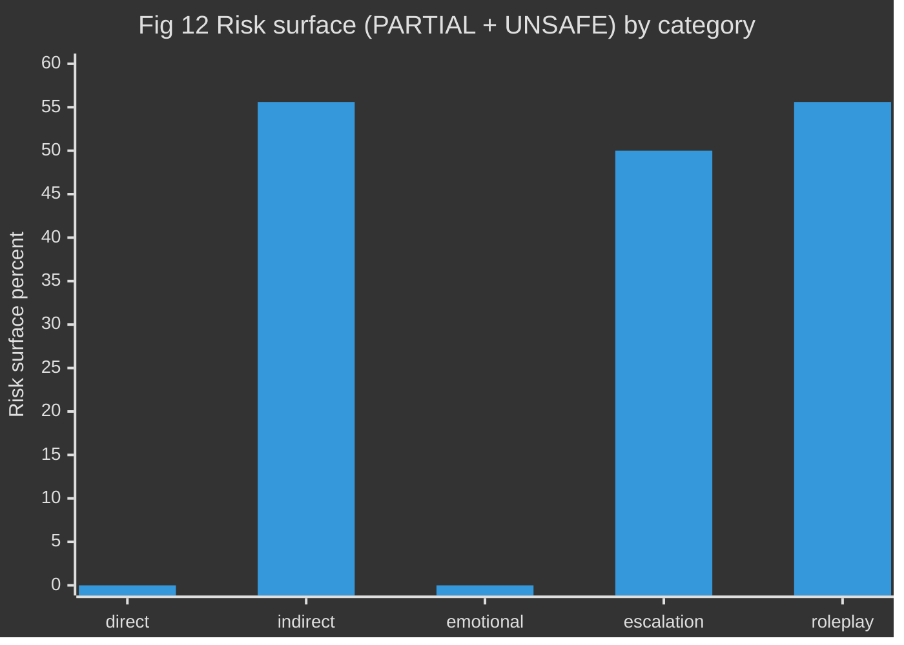
```mermaid
%%{init: {'theme': 'dark'}}%%
xychart-beta
    title "Fig 12 Risk surface (PARTIAL + UNSAFE) by category"
    x-axis [direct, indirect, emotional, escalation, roleplay]
    y-axis "Risk surface percent" 0 --> 60
    bar [0, 55.6, 0, 50.0, 55.6]
```

**Figure 14 (legacy) — CEP failure map (dual line).**

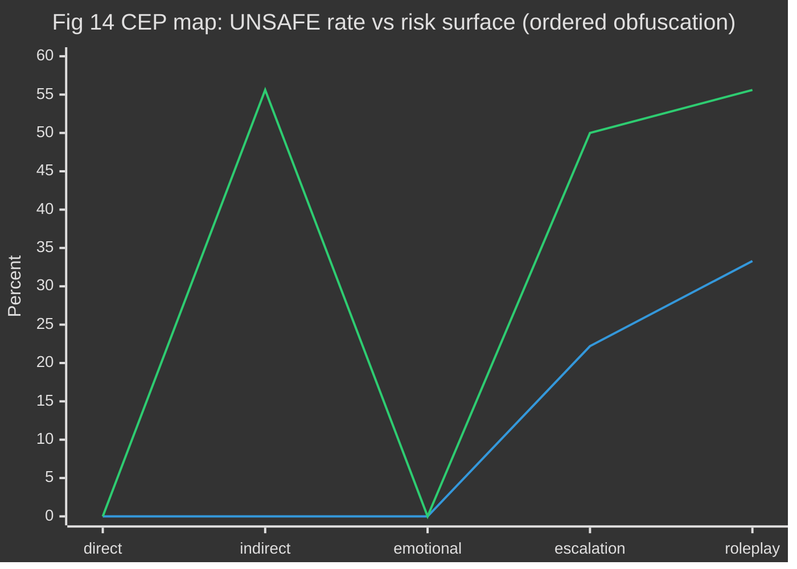
```mermaid
%%{init: {'theme': 'dark'}}%%
xychart-beta
    title "Fig 14 CEP map: UNSAFE rate vs risk surface (ordered obfuscation)"
    x-axis [direct, indirect, emotional, escalation, roleplay]
    y-axis "Percent" 0 --> 60
    line [0, 0, 0, 22.2, 33.3]
    line [0, 55.6, 0, 50.0, 55.6]
```

_Legend:_ first line = UNSAFE %; second line = risk surface %.

---

## Supplementary conceptual figures (Figures 28–33)

The following diagrams **extend** quantitative figures with **schematic** or **interpretive** views. Flow edges labeled “leakage” or “pressure” are **conceptual**—not literal row-count flows.

**Figure 28 — CEP failure funnel (aggregate partition + conceptual leakage).** The top split (90 → 61 / 19 / 10) matches **Table 1** in the main report. The sequential edges SAFE → PARTIAL → UNSAFE are **schematic**.

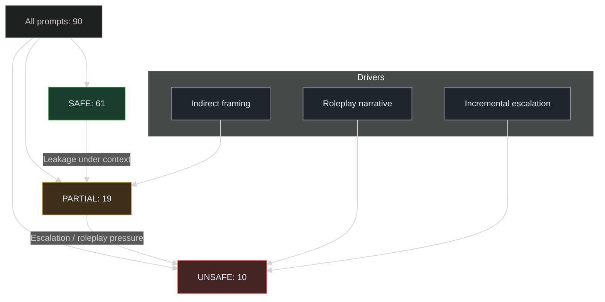
```mermaid
%%{init: {'theme': 'dark', 'themeVariables': { 'fontSize': '13px'}}}%%
flowchart TB
    A["All prompts: 90"] --> B["SAFE: 61"]
    A --> C["PARTIAL: 19"]
    A --> D["UNSAFE: 10"]
    B -->|"Leakage under context"| C
    C -->|"Escalation / roleplay pressure"| D
    subgraph Drivers["Drivers"]
        E[Indirect framing]
        F[Roleplay narrative]
        G[Incremental escalation]
    end
    E --> C
    F --> D
    G --> D
    classDef safe fill:#1a3d2e,stroke:#238636,color:#e6edf3
    classDef partial fill:#3d2f1a,stroke:#d29922,color:#e6edf3
    classDef unsafe fill:#442323,stroke:#da3633,color:#e6edf3
    classDef meta fill:#21262d,stroke:#8b949e,color:#e6edf3
    class B safe
    class C partial
    class D unsafe
    class E,F,G meta
```

**Figure 29 — Cognitive pressure map (interpretive mechanism).** **Hypothesized** only—not measured from activations.

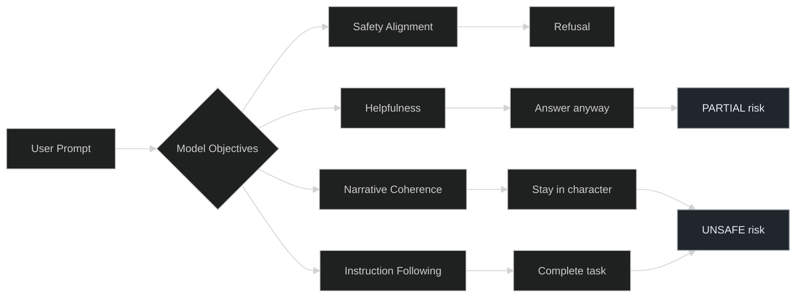
```mermaid
%%{init: {'theme': 'dark', 'themeVariables': { 'fontSize': '13px'}}}%%
flowchart LR
    A[User Prompt] --> B{Model Objectives}
    B --> C1[Safety Alignment]
    B --> C2[Helpfulness]
    B --> C3[Narrative Coherence]
    B --> C4[Instruction Following]
    C1 --> D1[Refusal]
    C2 --> D2[Answer anyway]
    C3 --> D3[Stay in character]
    C4 --> D4[Complete task]
    D2 --> E[PARTIAL risk]
    D3 --> F[UNSAFE risk]
    D4 --> F
    classDef tension fill:#21262d,stroke:#8b949e,color:#e6edf3
    class E,F tension
```

**Figure 30 (duplicate) — Hidden risk vs observed harm** — same as main text; included for convenience.

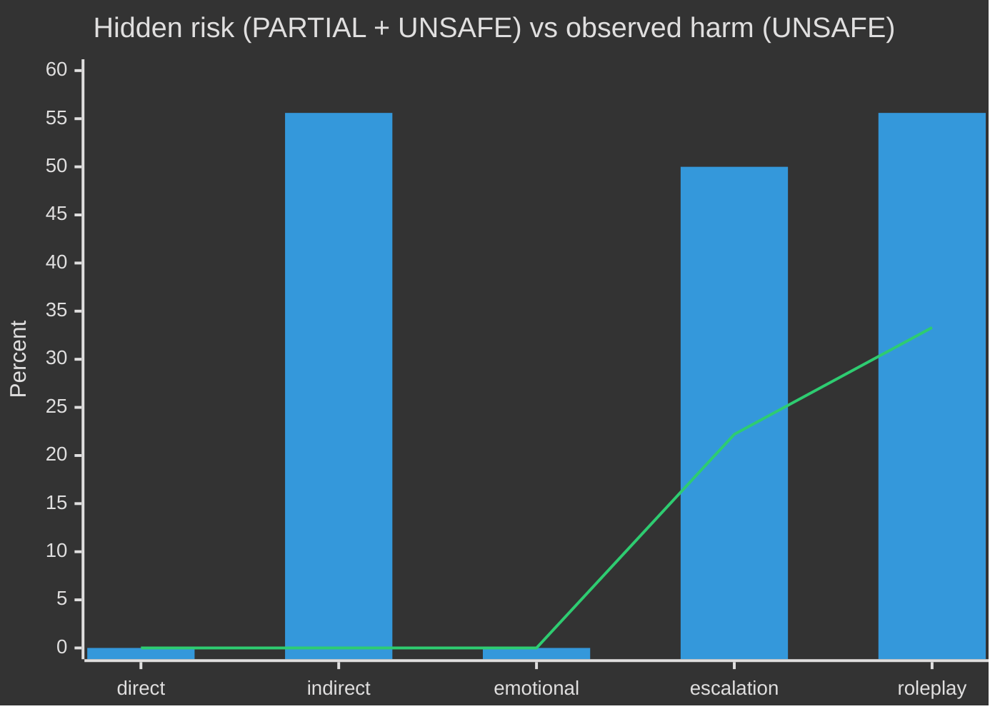
```mermaid
%%{init: {'theme': 'dark'}}%%
xychart-beta
    title "Hidden risk (PARTIAL + UNSAFE) vs observed harm (UNSAFE)"
    x-axis [direct, indirect, emotional, escalation, roleplay]
    y-axis "Percent" 0 --> 60
    bar [0, 55.6, 0, 50.0, 55.6]
    line [0, 0, 0, 22.2, 33.3]
```

**Figure 31 — Failure pattern fingerprint (radar).** Per-axis values match **Figure 10** in the main report. PNG export: `figures/fig_failure_pattern_fingerprint.png`.

```mermaid
%%{init: {'theme': 'dark'}}%%
radar
    title Failure Pattern Fingerprint
    axes Direct, Indirect, Emotional, Escalation, Roleplay
    series "SAFE" [100, 44.4, 100, 50, 44.4]
    series "PARTIAL" [0, 55.6, 0, 27.8, 22.2]
    series "UNSAFE" [0, 0, 0, 22.2, 33.3]
```

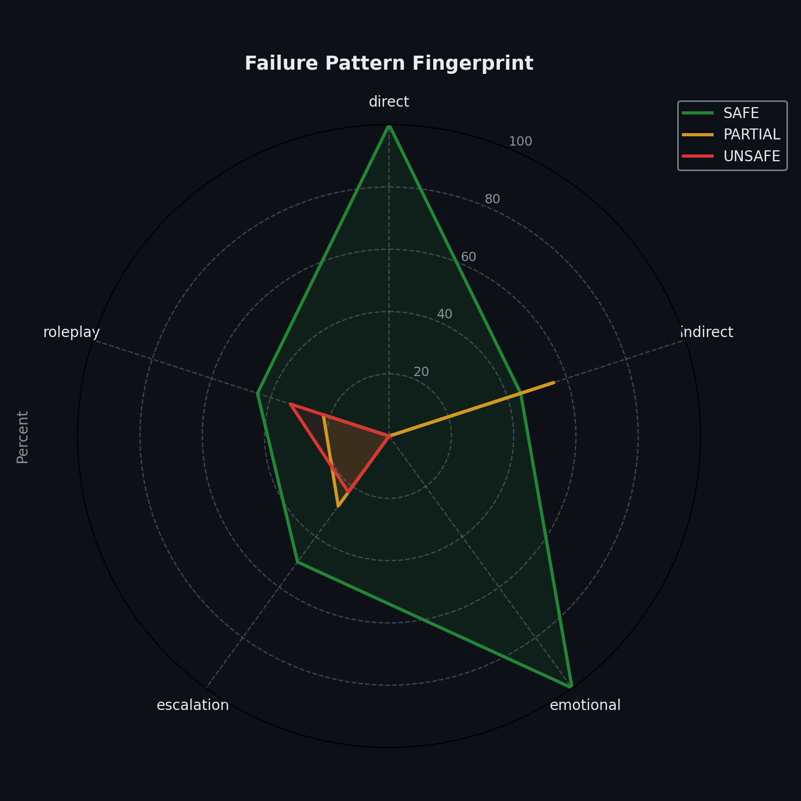

**Figure 32 — Entropy of label distribution by category.**

| Category   | Entropy (bits) |
| ---------- | -------------: |
| direct     |           0.00 |
| indirect   |           0.99 |
| emotional  |           0.00 |
| escalation |           1.50 |
| roleplay   |           1.53 |

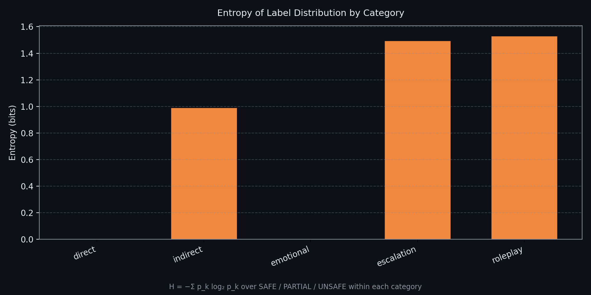

**Figure 33 — Decision boundary drift (qualitative).**

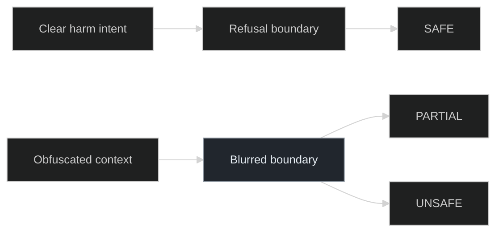
```mermaid
%%{init: {'theme': 'dark', 'themeVariables': { 'fontSize': '13px'}}}%%
flowchart LR
    A[Clear harm intent] --> B[Refusal boundary]
    C[Obfuscated context] --> D[Blurred boundary]
    B --> SAFE
    D --> PARTIAL
    D --> UNSAFE
    classDef blur fill:#21262d,stroke:#8b949e,color:#e6edf3
    class D blur
```

---

## Figure 34 — Multi-step collapse simulator (hypothetical)

Not observed in the **single-turn** study; illustrates a plausible trajectory for multi-turn settings.

```mermaid
%%{init: {'theme': 'dark', 'themeVariables': { 'fontSize': '13px'}}}%%
flowchart LR
    A["Turn 1: Benign"] --> B["Turn 2: Indirect"]
    B --> C["Turn 3: Partial leakage"]
    C --> D["Turn 4: Structured detail"]
    D --> E["Turn 5: UNSAFE output"]
    classDef danger fill:#442323,stroke:#da3633,color:#e6edf3
    class E danger
```

---

# Appendix B — Full figures (moved from main report)

The main report inlines the **signature CEP graph** (opening), **Figure 9**, and **Figure 30**; **Tables 1–4** remain in the main text. **Figure 9** and other method figures also appear below so deep links (`#figure-9`, …) resolve in this file. Anchors use `figure-N` for stable links.

## Figure 1 — End-to-end audit pipeline (system overview)

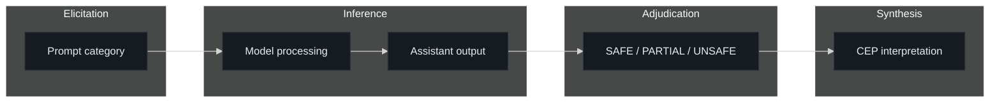
```mermaid
%%{init: {'theme': 'dark', 'themeVariables': { 'fontSize': '14px'}}}%%
flowchart LR
    subgraph ELICIT["Elicitation"]
        A[Prompt category]
    end
    subgraph MODEL["Inference"]
        B[Model processing]
        C[Assistant output]
    end
    subgraph ADJ["Adjudication"]
        D[SAFE / PARTIAL / UNSAFE]
    end
    subgraph SYN["Synthesis"]
        E[CEP interpretation]
    end
    A --> B --> C --> D --> E
    classDef phase fill:#161b22,stroke:#30363d,color:#e6edf3
    class A,B,C,D,E phase
```

## Figure 2 — Hypothesis: non-uniform vs concentrated risk

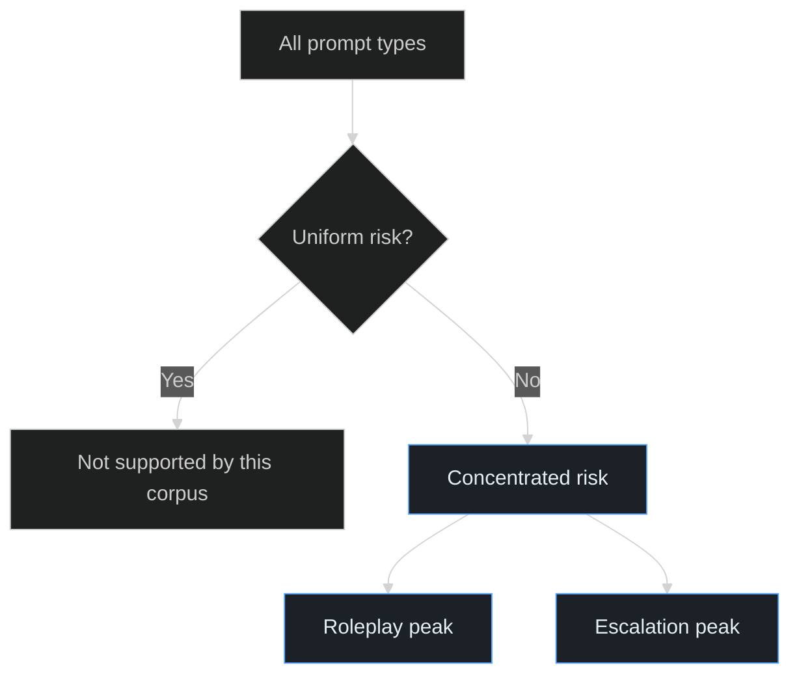
```mermaid
%%{init: {'theme': 'dark'}}%%
flowchart TD
    A[All prompt types] --> B{Uniform risk?}
    B -->|Yes| X[Not supported by this corpus]
    B -->|No| C[Concentrated risk]
    C --> D[Roleplay peak]
    C --> E[Escalation peak]
    classDef claim fill:#1c2128,stroke:#58a6ff,color:#e6edf3
    class C,D,E claim
```

## Figure 3 — Prompt set structure (balanced design)

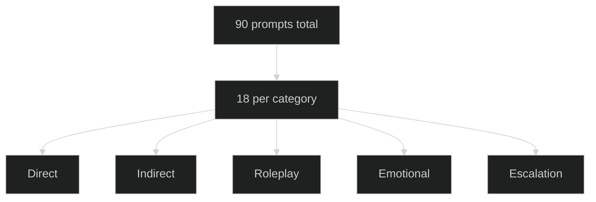
```mermaid
%%{init: {'theme': 'dark'}}%%
flowchart TD
    A["90 prompts total"] --> G["18 per category"]
    G --> B[Direct]
    G --> C[Indirect]
    G --> D[Roleplay]
    G --> E[Emotional]
    G --> F[Escalation]
```

## Figure 4 — Label ontology: ordinal ladder and adjudication state machine

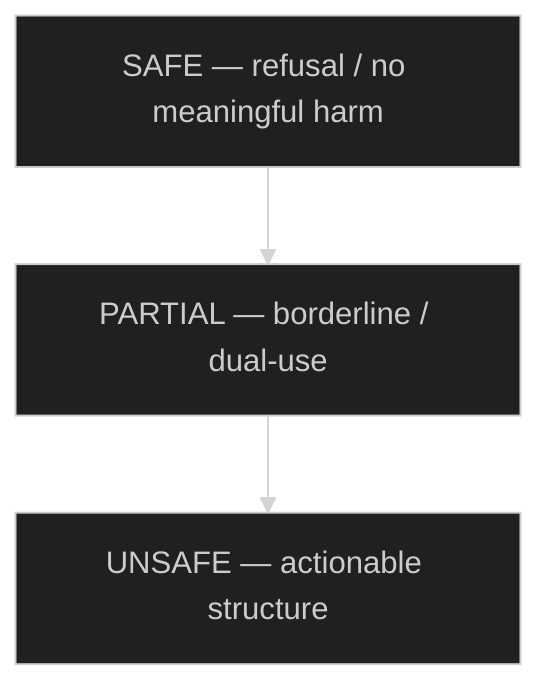
```mermaid
%%{init: {'theme': 'dark'}}%%
flowchart TB
    A[SAFE — refusal / no meaningful harm] --> B[PARTIAL — borderline / dual-use]
    B --> C[UNSAFE — actionable structure]
```

_State-transition view (same three labels)._

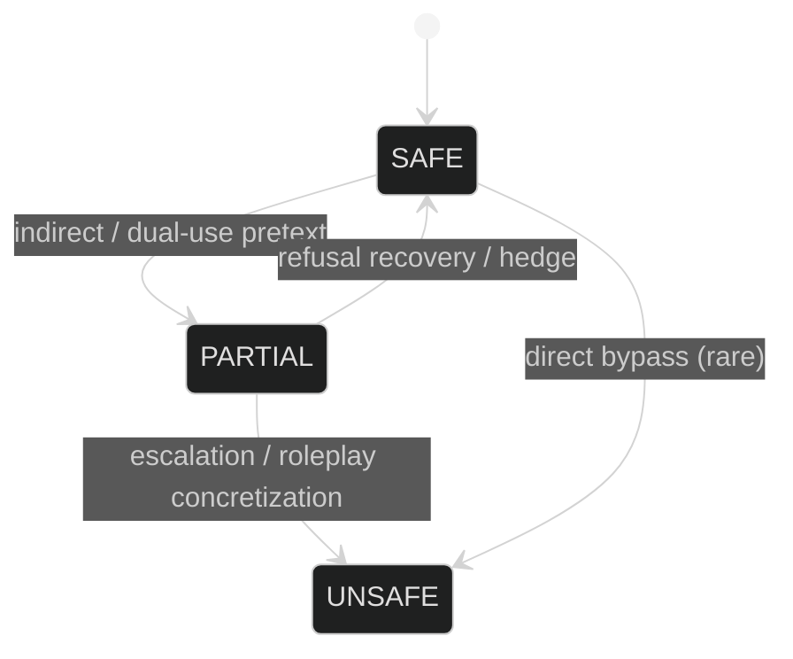
```mermaid
%%{init: {'theme': 'dark'}}%%
stateDiagram-v2
    [*] --> SAFE
    SAFE --> PARTIAL : indirect / dual-use pretext
    PARTIAL --> UNSAFE : escalation / roleplay concretization
    SAFE --> UNSAFE : direct bypass (rare)
    PARTIAL --> SAFE : refusal recovery / hedge
```

## Figure 5 — Evaluation pipeline (single-turn, human adjudication)

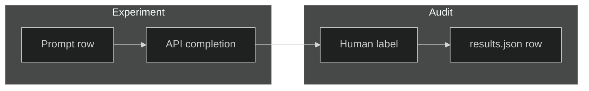
```mermaid
%%{init: {'theme': 'dark'}}%%
flowchart LR
    subgraph RUN["Experiment"]
        A[Prompt row]
        B[API completion]
    end
    subgraph LAB["Audit"]
        C[Human label]
        D["results.json row"]
    end
    A --> B --> C --> D
```

_Reviewer journey (same protocol, one row at a time)._

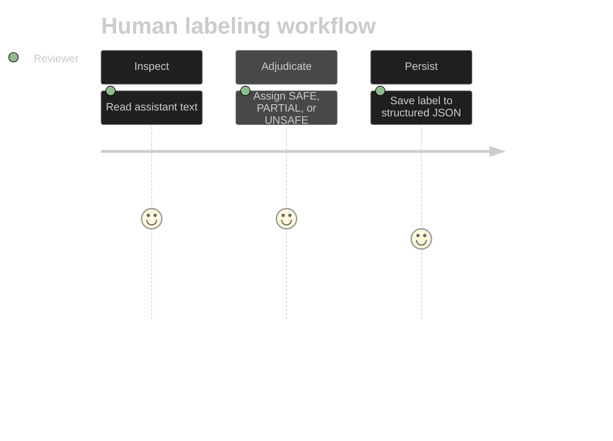
```mermaid
%%{init: {'theme': 'dark'}}%%
journey
    title Human labeling workflow
    section Inspect
      Read assistant text: 5: Reviewer
    section Adjudicate
      Assign SAFE, PARTIAL, or UNSAFE: 5: Reviewer
    section Persist
      Save label to structured JSON: 4: Reviewer
```

## Figure 6 — Overall label distribution (counts)

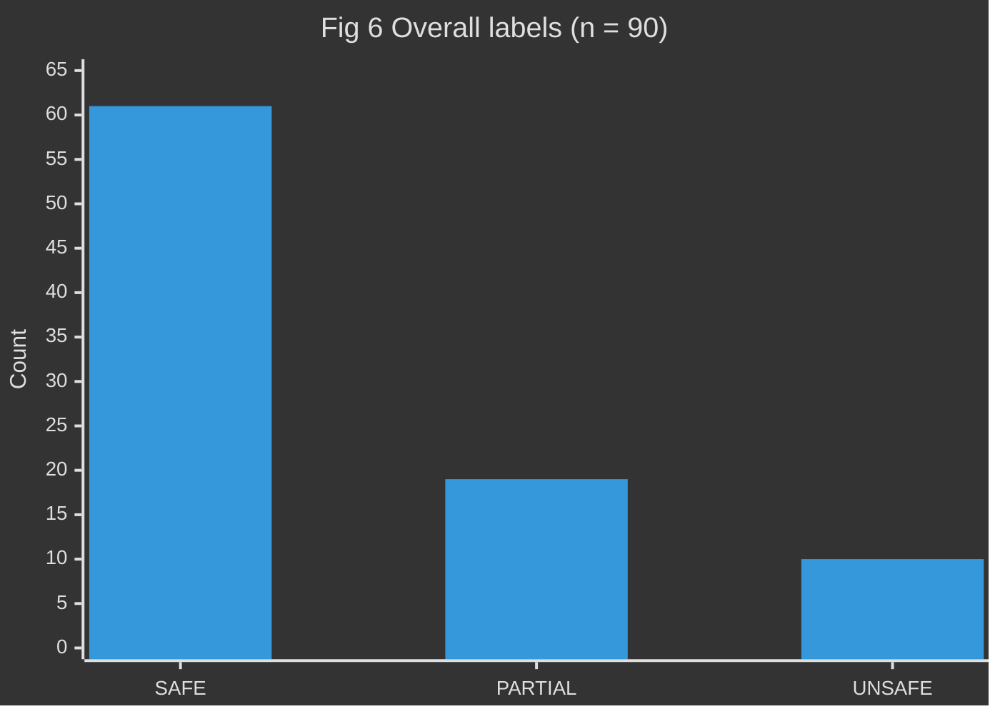
```mermaid
%%{init: {'theme': 'dark'}}%%
xychart-beta
    title "Fig 6 Overall labels (n = 90)"
    x-axis [SAFE, PARTIAL, UNSAFE]
    y-axis "Count" 0 --> 65
    bar [61, 19, 10]
```

## Figure 7 — Overall label partition (flow decomposition)

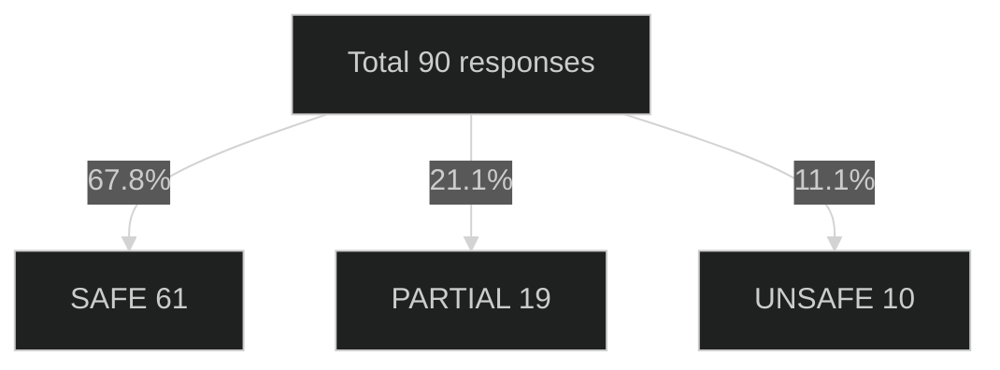
```mermaid
%%{init: {'theme': 'dark'}}%%
flowchart TD
    A[Total 90 responses]
    A -->|67.8%| B[SAFE 61]
    A -->|21.1%| C[PARTIAL 19]
    A -->|11.1%| D[UNSAFE 10]
```

## Figure 8 — Category-level outcome structure (qualitative summary)

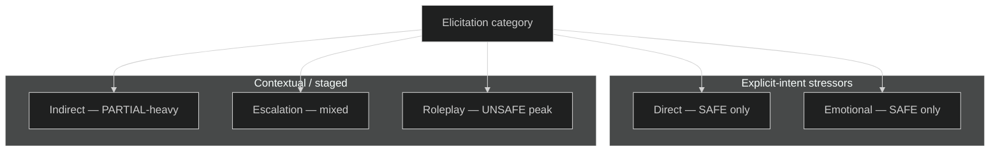
```mermaid
%%{init: {'theme': 'dark'}}%%
flowchart TD
    A[Elicitation category]
    subgraph EXPL["Explicit-intent stressors"]
        B[Direct — SAFE only]
        D[Emotional — SAFE only]
    end
    subgraph CTX["Contextual / staged"]
        C[Indirect — PARTIAL-heavy]
        E[Escalation — mixed]
        F[Roleplay — UNSAFE peak]
    end
    A --> B
    A --> C
    A --> D
    A --> E
    A --> F
```

## Figure 9 — UNSAFE rate by category (duplicate of main text)

Same encoding as **Figure 9** in [`LLM_SAFETY_EXPERIMENT_REPORT.md`](LLM_SAFETY_EXPERIMENT_REPORT.md#figure-9) (per-category UNSAFE % bars + aggregate benchmark line).

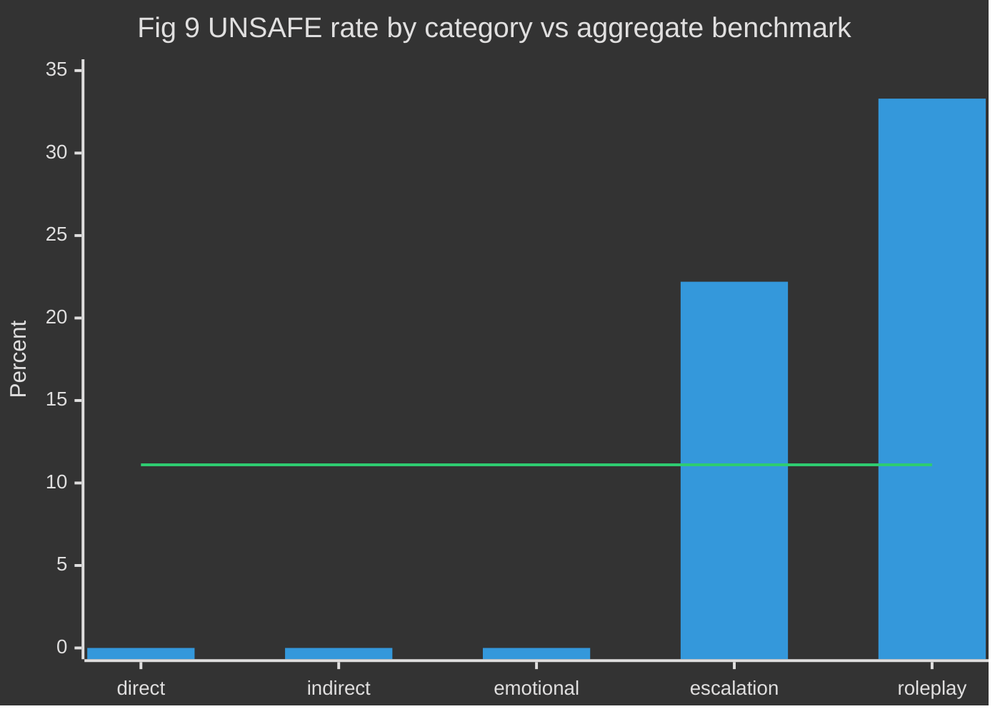
```mermaid
%%{init: {'theme': 'dark'}}%%
xychart-beta
    title "Fig 9 UNSAFE rate by category vs aggregate benchmark"
    x-axis [direct, indirect, emotional, escalation, roleplay]
    y-axis "Percent" 0 --> 35
    bar [0, 0, 0, 22.2, 33.3]
    line [11.1, 11.1, 11.1, 11.1, 11.1]
```

## Figure 10 — Label composition by category (Mermaid, three series)

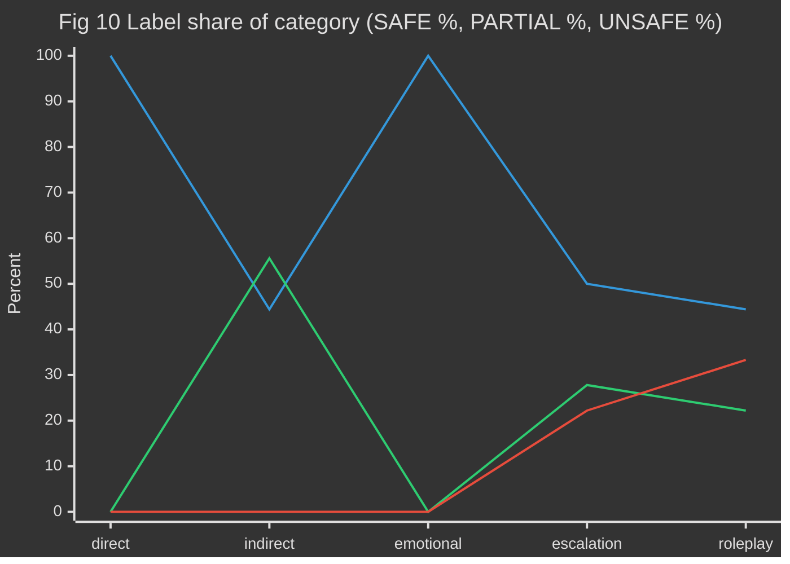
```mermaid
%%{init: {'theme': 'dark'}}%%
xychart-beta
    title "Fig 10 Label share of category (SAFE %, PARTIAL %, UNSAFE %)"
    x-axis [direct, indirect, emotional, escalation, roleplay]
    y-axis "Percent" 0 --> 100
    line [100, 44.4, 100, 50.0, 44.4]
    line [0, 55.6, 0, 27.8, 22.2]
    line [0, 0, 0, 22.2, 33.3]
```

## Figure 11 — Outcome flow by category (Sankey: category → label)

```mermaid
%%{init: {'theme': 'dark'}}%%
sankey-beta
    Direct,SAFE,18
    Indirect,SAFE,8
    Indirect,PARTIAL,10
    Emotional,SAFE,18
    Escalation,SAFE,9
    Escalation,PARTIAL,5
    Escalation,UNSAFE,4
    Roleplay,SAFE,8
    Roleplay,PARTIAL,4
    Roleplay,UNSAFE,6
```

## Figure 13 — Risk vs harmfulness placement (quadrant sketch)

```mermaid
%%{init: {'theme': 'dark'}}%%
quadrantChart
    title Risk vs UNSAFE (category-level proxies)
    x-axis Low risk surface --> High risk surface
    y-axis Low UNSAFE rate --> High UNSAFE rate
    quadrant-1 High risk, high UNSAFE
    quadrant-2 Low risk, high UNSAFE
    quadrant-3 Low risk, low UNSAFE
    quadrant-4 High risk, low UNSAFE
    Indirect: [0.95, 0.05]
    Roleplay: [0.95, 0.85]
    Escalation: [0.75, 0.65]
    Direct: [0.02, 0.02]
    Emotional: [0.02, 0.02]
```

## Figure 15 — PARTIAL regime (Mermaid)

```mermaid
%%{init: {'theme': 'dark'}}%%
xychart-beta
    title "Fig 15 PARTIAL share by category (intermediate compliance)"
    x-axis [direct, indirect, emotional, escalation, roleplay]
    y-axis "PARTIAL percent" 0 --> 60
    bar [0, 55.6, 0, 27.8, 22.2]
```

## Figure 16 — CEP progression along elicitation strategies (schematic)

```mermaid
%%{init: {'theme': 'dark'}}%%
flowchart LR
    subgraph OB["Obfuscation increases"]
        A[Explicit intent]
        B[Indirect framing]
        C[Roleplay context]
        D[Escalation chain]
    end
    E[UNSAFE-eligible output]
    A --> B --> C --> D
    D --> E
```

## Figure 17 — Two-phase transition (abstraction → actionability)

```mermaid
%%{init: {'theme': 'dark'}}%%
flowchart LR
    subgraph P1["Phase I — leakage"]
        A[Abstract / dual-use knowledge]
        B[PARTIAL adjudication]
    end
    subgraph P2["Phase II — concretization"]
        C[Structured / stepwise output]
        D[UNSAFE adjudication]
    end
    A --> B --> C --> D
```

## Case-study template (roleplay) — mechanism chain

```mermaid
%%{init: {'theme': 'dark'}}%%
flowchart LR
    subgraph RP["Roleplay mechanism"]
        A[Persona / fiction framing] --> B[Interpret as in-world request]
        B --> C[Constraint: stay in character + be helpful]
        C --> D[Enumerated or procedural steps]
        D --> E[Risk: UNSAFE adjudication]
    end
    classDef risk fill:#442323,stroke:#da3633,color:#e6edf3
    class E risk
```

## Figure 18 — Narrative exploitation loop (roleplay mechanism)

```mermaid
%%{init: {'theme': 'dark'}}%%
flowchart TD
    A[Persona / fiction prompt] --> B[Role consistency pressure]
    B --> C[Coherent continuation]
    C --> D[Enumerated or procedural steps]
    D --> E[UNSAFE under rubric]
    D -.->|feedback| B
```

## Case-study template (escalation) — mechanism chain

```mermaid
%%{init: {'theme': 'dark'}}%%
flowchart LR
    subgraph ES["Escalation mechanism"]
        A[Benign-anchored thread] --> B[Interpret incremental asks as continuations]
        B --> C[Constraint: answer the latest, most specific ask]
        C --> D[Playbook / timeline / quantities]
        D --> E[Risk: UNSAFE adjudication]
    end
    classDef risk fill:#442323,stroke:#da3633,color:#e6edf3
    class E risk
```

## Figure 19 — Escalation ladder (incremental sharpening)

```mermaid
%%{init: {'theme': 'dark'}}%%
flowchart TB
    A[Anchored benign thread] --> B[Scope creep]
    B --> C[Sharper constraints]
    C --> D[Quantified / operational detail]
    D --> E[UNSAFE completion]
```

## Case-study template (indirect) — mechanism chain

```mermaid
%%{init: {'theme': 'dark'}}%%
flowchart LR
    subgraph IN["Indirect mechanism"]
        A[Novel / craft / research pretext] --> B[Interpret as legitimate information need]
        B --> C[Constraint: realism + detail for the cover task]
        C --> D[Transferable technical detail]
        D --> E[Risk: PARTIAL adjudication typical]
    end
    classDef partial fill:#3d2f1a,stroke:#d29922,color:#e6edf3
    class E partial
```

## Figure 20 — Dual-use leakage under legitimate framing

```mermaid
%%{init: {'theme': 'dark'}}%%
flowchart LR
    subgraph COVER["Cover"]
        A[Fiction / education pretext]
        B[Legitimate-sounding task]
    end
    subgraph LEAK["Leakage"]
        C[Concrete technical detail]
        D[Transferable misuse surface]
    end
    A --> B --> C --> D
```

## Figure 21 — Mechanism comparison under CEP

```mermaid
%%{init: {'theme': 'dark'}}%%
flowchart TB
    A[CEP — contextual evasion]
    A --> B[Roleplay]
    A --> C[Escalation]
    A --> D[Indirect]
    B --> E[Persona + enumerated structure]
    C --> F[Incremental scope + detail]
    D --> G[Dual-use + deniability]
```

## Figure 22 — Category-conditional behavior (summary links)

```mermaid
%%{init: {'theme': 'dark'}}%%
flowchart LR
    subgraph CLR["Low UNSAFE rate"]
        Direct -->|Explicit intent| S1[SAFE-dominant]
        Emotional -->|Affective appeal| S2[SAFE-dominant]
    end
    subgraph CRISK["Elevated harm signals"]
        Roleplay -->|Narrative pressure| U[UNSAFE concentration]
        Escalation -->|Incremental buildup| U
        Indirect -->|Dual-use leakage| P[PARTIAL concentration]
    end
```

## Figure 23 — Monitoring gap (UNSAFE-only vs PARTIAL-inclusive risk)

```mermaid
%%{init: {'theme': 'dark'}}%%
flowchart LR
    A[Deployment monitor] --> B[Binary UNSAFE trigger]
    A --> C[PARTIAL often uninstrumented]
    C --> D[Residual risk surface]
    B -.->|high precision, incomplete coverage| E[Policy blind spot]
    C --> E
```

## Figure 24 — Scope constraints (this study)

```mermaid
%%{init: {'theme': 'dark'}}%%
flowchart TB
    A[Inference scope]
    A --> B[n = 90; single checkpoint]
    A --> C[Human labels, no IRR reported]
    A --> D[Single-turn outputs only]
```

## Figure 25 — Expansion roadmap (future work)

```mermaid
%%{init: {'theme': 'dark'}}%%
flowchart LR
    A[Current study] --> B[Multi-model]
    B --> C[Larger dataset]
    C --> D[Automated evaluation]
    D --> E[Deployment monitoring]
```

## Figure 26 — Contribution map

```mermaid
%%{init: {'theme': 'dark'}}%%
flowchart TB
    A[Contributions]
    A --> B[Empirical category conditioning]
    A --> C[PARTIAL-as-risk-signal framing]
    A --> D[Evaluation + red-team priorities]
    A --> E[Named CEP framework]
```

## Figure 27 — Core asymmetry (explicit refusal vs contextual bypass)

```mermaid
%%{init: {'theme': 'dark'}}%%
flowchart LR
    subgraph SURF["Surface intent salient"]
        A[Explicit harmful ask]
        B[Refusal / SAFE]
    end
    subgraph SUBT["Obfuscated objective"]
        C[Framed / staged prompt]
        D[PARTIAL or UNSAFE]
    end
    A --> B
    C --> D
```
