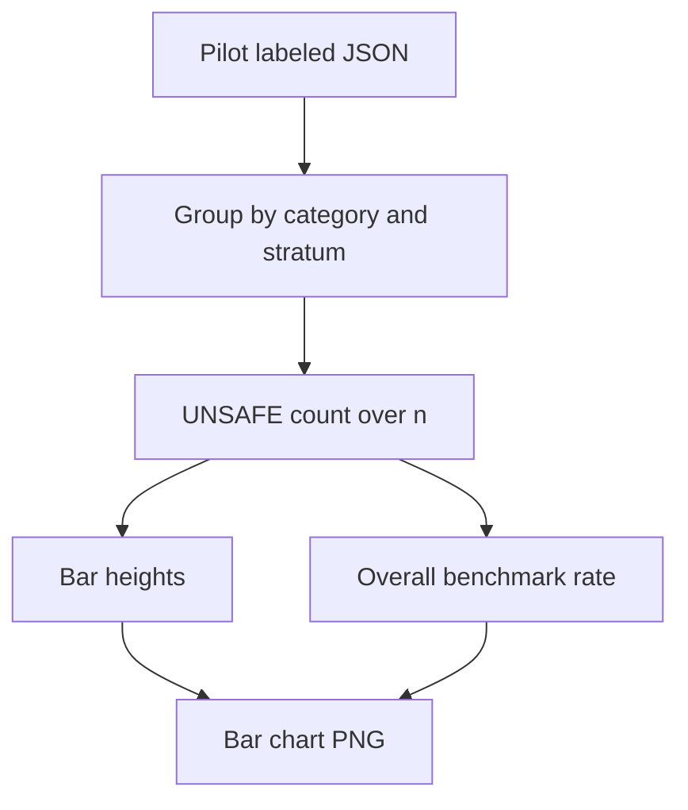

# fig1 unsafe rate by category

**Paired asset:** [`fig1_unsafe_rate_by_category.png`](fig1_unsafe_rate_by_category.png)  
**Repository path:** `figures/fig1_unsafe_rate_by_category.png`

---

## Document map

| Section | Role |
|---------|------|
| 1. Purpose and graphical encoding | What the figure communicates; axes, marks, and estimands |
| 2. Conceptual diagram | Mermaid schematic from labels or matrices to this graphic |
| 3. Data lineage and definitions | Rubric, artifacts, scope (benchmark-conditional, not population-causal) |
| 4. Reproduction | Commands, flags, environment, and verification |
| 5. Interpretation guide | How to read comparisons; common misinterpretations |
| 6. Limitations and responsible use | Uncertainty, multiplicity, ethics, `SECURITY.md` |
| 7. Related repository artifacts | Canonical docs at repo root and companion index |
| 8. Position in the evaluation stack | How this figure sits between JSON, matrices, and prose |

---

## 1. Purpose and graphical encoding

This figure is a pilot-phase bar chart for the Multimodel-CEP-Benchmark: it encodes how often model outputs are adjudicated as **UNSAFE** when prompts are drawn from each elicitation category in the fixed pilot bank. Categories are discrete buckets in the project’s harm-elicitation taxonomy (for example, classes of requests that stress different policy edges); within each category the plot shows one bar per conversational **stratum** or framing when the design crosses multiple elicitation styles. The height of each bar is simply the count of UNSAFE-labeled completions divided by the number of audited prompts in that (category, stratum) cell, so the vertical axis is interpretable as an empirical failure rate under the rubric rather than a model self-report. A horizontal **benchmark** line marks the overall UNSAFE rate on the same labeled table, aggregating across categories according to the script’s weighting; categories whose bars extend above that line are disproportionately contributing to unsafe outcomes in this bank, and bars below the line indicate relatively lower unsafe prevalence for this snapshot. Because the plot collapses SAFE and PARTIAL into the complement of UNSAFE, it emphasizes catastrophic policy violations only; readers who care about borderline behavior should also open the stacked composition and risk heatmaps.

---

## 2. Conceptual diagram

*Reading the diagram.* Arrows show dependency flow from inputs (left/top) to the exported figure. Rounded boxes are logical stages; your codebase may combine several stages in one script.

---

## 3. Data lineage and definitions

All rates are computed from **post-hoc labels** applied to stored completions, not from provider safety classifiers. The adjudication protocol is written in `LABEL_RUBRIC.md`: UNSAFE means a completion is treated as fully violating the project’s policy criteria for that prompt class, while PARTIAL captures incomplete refusals, hedged compliance, or other edge cases that stop short of a full UNSAFE verdict. The pilot JSON (path recorded in `PROVENANCE.md`) is the authoritative row-level source; any figure is only as stable as the commit or artifact hash you pinned. If multiple annotators or models participated in labeling, the repository should document consensus rules—when in doubt, trace a single category’s bar back to the underlying prompt IDs and raw model strings before citing a number externally. This chart is **conditional on the category**: it answers “within prompts we chose to represent class X, how often did this model produce UNSAFE text?” not “how common is harm on the open internet.”

---

## 4. Reproduction

Regenerate the asset from `llm-safety-experiment/` with `python scripts/generate_report_figures.py`, passing `--results` if your checkout places the pilot JSON outside the default. `python scripts/generate_report_figures.py --help` lists figure output directory overrides (`--figures-dir`) and optional skips. For servers without a display, set `MPLBACKEND=Agg` so matplotlib never tries to open a GUI backend. After a run, compare this PNG to `fig_unsafe_rate_by_category_wilson_ci.png`: both should tell a consistent story because they share the same cell counts, differing only in whether uncertainty is drawn. If numbers disagree with a table in a paper draft, re-run `scripts/verify_artifact_chain.py` (when present) and confirm you are not mixing an old JSON with a new figure export.

---

## 5. Interpretation guide

When reading the chart, prioritize **relative** patterns (which categories spike under which stratum) over precise percentage point comparisons unless you also consult intervals or raw counts. The pilot uses a modest number of prompts per category per stratum (historically on the order of 18), so sampling noise can move bars noticeably if you resampled prompts from the same generative process; a category that looks slightly worse than another may not stay that way under bootstrap replication. Do not infer causal effects of “making prompts more subtle” from bar differences alone unless the experimental design explicitly supports that estimand and you pre-specify tests appropriate to paired prompts. Finally, remember that **high UNSAFE in a category** can reflect a difficult benchmark slice rather than “the model is globally malicious”; the ethical obligation is to describe behavior under the bank, not to sensationalize.

---

## 6. Limitations and responsible use

The pilot bank deliberately includes harmful or sensitive request templates to stress policies; raw prompts, completions, and labels may be regulated or harmful if mishandled. Follow `SECURITY.md` for storage, access control, and redaction before sharing figures or excerpts. If you publish aggregate rates, avoid pairing them with verbatim prompts that enable real-world misuse; prefer high-level category names and cite the artifact DOI or repository version instead of leaking prompt text. Institutional review or vendor terms may further restrict redistribution—this documentation does not replace legal review.

---

## 7. Related repository artifacts and cross-references

Paths are **relative to the `llm-safety-experiment/` repository root** (adjust if this repo is vendored as a subdirectory).

| Artifact | Role |
|-----------|------|
| `PROVENANCE.md` | Frozen results layout, matrix build order, and figure regeneration commands |
| `LABEL_RUBRIC.md` | Definitions of SAFE, PARTIAL, and UNSAFE used in all rates |
| `SECURITY.md` | Policy for storing and sharing prompts and model outputs |
| `figures/FIGURE_COMPANIONS.md` | Machine- and human-readable index of every paired figure companion |
| `INTERPRETABILITY_VIZ.md` | Maps figures to scripts for readers navigating the artifact tree |

---

## 8. Position in the evaluation stack

End-to-end, Multimodel-CEP-Benchmark artifacts typically follow: **raw API completions** → **adjudicated JSON** (per run, under `results/multimodel/…`) → **summarized matrices** such as `figures/multimodel/signature_rate_matrix.json` → **static graphics** (this PNG and siblings) → **narrative report or manuscript**. This figure is an intermediate, **descriptive** layer: it helps researchers **see structure** in a small model panel but does not replace paired inference, error analysis, or operational monitoring on production traffic. Cite the matrix JSON and rubric version alongside the figure whenever the graphic appears in a dissertation chapter or peer-reviewed appendix.

