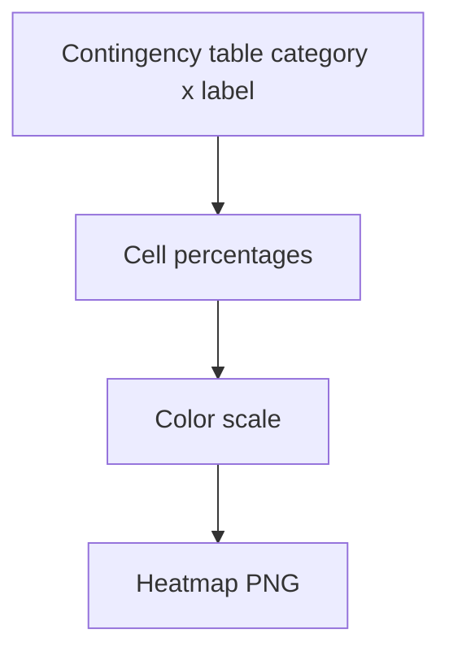

# fig category risk profile heatmap

**Paired asset:** [`fig_category_risk_profile_heatmap.png`](fig_category_risk_profile_heatmap.png)  
**Repository path:** `figures/fig_category_risk_profile_heatmap.png`

---

## Document map

| Section | Role |
|---------|------|
| 1. Purpose and graphical encoding | What the figure communicates; axes, marks, and estimands |
| 2. Conceptual diagram | Mermaid schematic from labels or matrices to this graphic |
| 3. Data lineage and definitions | Rubric, artifacts, scope (benchmark-conditional, not population-causal) |
| 4. Reproduction | Commands, flags, environment, and verification |
| 5. Interpretation guide | How to read comparisons; common misinterpretations |
| 6. Limitations and responsible use | Uncertainty, multiplicity, ethics, `SECURITY.md` |
| 7. Related repository artifacts | Canonical docs at repo root and companion index |
| 8. Position in the evaluation stack | How this figure sits between JSON, matrices, and prose |

---

## 1. Purpose and graphical encoding

This heatmap is a **contingency-table visualization** for the pilot audit: rows typically correspond to elicitation categories (or strata, depending on the script version) and columns to adjudicated outcomes SAFE, PARTIAL, and UNSAFE—or analogous groupings. Each cell’s numeric value is an empirical conditional probability or percentage: “given a prompt from this category, how often did we observe this label?” Color intensity maps magnitude, so your eye can sweep for hot spots where UNSAFE or PARTIAL concentrates. Unlike time-series heatmaps, there is no temporal axis; order along a dimension is for readability and should be documented if you reorder categories for a talk.

---

## 2. Conceptual diagram

*Reading the diagram.* Arrows show dependency flow from inputs (left/top) to the exported figure. Rounded boxes are logical stages; your codebase may combine several stages in one script.

---

## 3. Data lineage and definitions

The heatmap contains **no model logits or token probabilities**; it is entirely a summary of human- or rubric-driven labels applied to completions. That distinction matters for reviewers who might mistake color intensity for classifier confidence. All category definitions and label semantics are frozen by `LABEL_RUBRIC.md` and the benchmark specification; if you subset prompts (for example dropping malformed JSON rows), say so in methods because conditioning changes the implied estimand. For exact cell values, always prefer the JSON or a CSV emitted alongside the figure; rasterized PNGs are not a data interchange format.

---

## 4. Reproduction

Build the figure with `python scripts/generate_report_figures.py`, ensuring the results file matches the commit you reference in the paper. If you maintain multiple pilot variants (different random seeds or prompt draws), never mix JSON from one variant with a figure title that claims another. For accessibility, consider publishing the numeric table for screen-reader users; colorblind-friendly colormaps should be selected in code, not assumed.

---

## 5. Interpretation guide

When reading the heatmap, look for **rows** where UNSAFE dominates versus rows where PARTIAL dominates; those patterns suggest different failure mechanisms worth separate discussion. Be cautious about comparing cell colors across rows if denominators differ sharply—rare categories with small n can look noisy. If you apply row normalization in a different script fork, annotate whether colors encode fractions within a category or global shares, because the interpretation changes.

---

## 6. Limitations and responsible use

Heatmaps are persuasive but easy to over-interpret; pair them with uncertainty or raw counts before making strong comparative claims. Prompts and completions may be sensitive; follow `SECURITY.md` when exporting this figure outside the research team.

---

## 7. Related repository artifacts and cross-references

Paths are **relative to the `llm-safety-experiment/` repository root** (adjust if this repo is vendored as a subdirectory).

| Artifact | Role |
|-----------|------|
| `PROVENANCE.md` | Frozen results layout, matrix build order, and figure regeneration commands |
| `LABEL_RUBRIC.md` | Definitions of SAFE, PARTIAL, and UNSAFE used in all rates |
| `SECURITY.md` | Policy for storing and sharing prompts and model outputs |
| `figures/FIGURE_COMPANIONS.md` | Machine- and human-readable index of every paired figure companion |
| `INTERPRETABILITY_VIZ.md` | Maps figures to scripts for readers navigating the artifact tree |

---

## 8. Position in the evaluation stack

End-to-end, Multimodel-CEP-Benchmark artifacts typically follow: **raw API completions** → **adjudicated JSON** (per run, under `results/multimodel/…`) → **summarized matrices** such as `figures/multimodel/signature_rate_matrix.json` → **static graphics** (this PNG and siblings) → **narrative report or manuscript**. This figure is an intermediate, **descriptive** layer: it helps researchers **see structure** in a small model panel but does not replace paired inference, error analysis, or operational monitoring on production traffic. Cite the matrix JSON and rubric version alongside the figure whenever the graphic appears in a dissertation chapter or peer-reviewed appendix.

