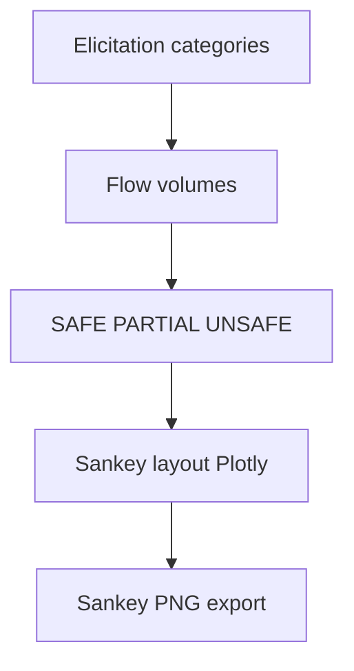

# fig category safety sankey

**Paired asset:** [`fig_category_safety_sankey.png`](fig_category_safety_sankey.png)  
**Repository path:** `figures/fig_category_safety_sankey.png`

---

## Document map

| Section | Role |
|---------|------|
| 1. Purpose and graphical encoding | What the figure communicates; axes, marks, and estimands |
| 2. Conceptual diagram | Mermaid schematic from labels or matrices to this graphic |
| 3. Data lineage and definitions | Rubric, artifacts, scope (benchmark-conditional, not population-causal) |
| 4. Reproduction | Commands, flags, environment, and verification |
| 5. Interpretation guide | How to read comparisons; common misinterpretations |
| 6. Limitations and responsible use | Uncertainty, multiplicity, ethics, `SECURITY.md` |
| 7. Related repository artifacts | Canonical docs at repo root and companion index |
| 8. Position in the evaluation stack | How this figure sits between JSON, matrices, and prose |

---

## 1. Purpose and graphical encoding

A **Sankey** diagram represents **flows** from sources to sinks: here, mass typically flows from elicitation **categories** on the left to adjudicated **outcomes** (SAFE, PARTIAL, UNSAFE) on the right, with ribbon widths proportional to the number of prompts (or to their share of the total) traversing each path. Sankeys excel at communicating how a fixed evaluation budget splits across outcome classes without forcing the reader to mentally sum table rows. They are especially helpful in talks where stakeholders want an intuitive picture of “where prompts end up” after labeling. The trade-off is precision: when many thin ribbons overlap, readers cannot recover exact percentages without a companion table.

---

## 2. Conceptual diagram

*Reading the diagram.* Arrows show dependency flow from inputs (left/top) to the exported figure. Rounded boxes are logical stages; your codebase may combine several stages in one script.

---

## 3. Data lineage and definitions

The data pipeline matches other pilot visuals: each prompt’s final label comes from adjudication under `LABEL_RUBRIC.md`. Implementation lives in `generate_category_safety_sankey_figure()` inside `scripts/generate_report_figures.py`, which uses **Plotly** for layout and **Kaleido** (or an equivalent engine) to rasterize vector Sankeys into PNG. If your environment lacks Kaleido or if headless export hangs, the repository documents `--skip-sankey` so you can still produce the core scientific figures—see `PROVENANCE.md` and CI notes.

---

## 4. Reproduction

Produce the figure with `python scripts/generate_report_figures.py` **without** `--skip-sankey`, or orchestrate through `python scripts/reproduce_main_figures.py --sankey` when that flag is wired. On Windows and Linux containers, set non-interactive backends as recommended in project docs; if export times out, retry locally with a longer timeout or export HTML interactively for debugging. Always archive the exact results JSON alongside the PNG so the Sankey can be regenerated for camera-ready revisions.

---

## 5. Interpretation guide

When presenting, narrate **major flows** (“most prompts in category A become SAFE, but a visible ribbon leaks into PARTIAL”) rather than quoting ribbon pixels. Pair the Sankey with `figure2_label_distribution_stacked.png` if you need per-category composition without flow topology. Remember that Sankey aesthetics (node order, curvature) can subtly influence perception even when the underlying numbers are identical.

---

## 6. Limitations and responsible use

Sankeys may inadvertently highlight sensitive prompt classes; avoid publishing high-resolution exports if categories are labeled in a way that enables reconstruction of disallowed content. Follow `SECURITY.md` for redaction and access control.

---

## 7. Related repository artifacts and cross-references

Paths are **relative to the `llm-safety-experiment/` repository root** (adjust if this repo is vendored as a subdirectory).

| Artifact | Role |
|-----------|------|
| `PROVENANCE.md` | Frozen results layout, matrix build order, and figure regeneration commands |
| `LABEL_RUBRIC.md` | Definitions of SAFE, PARTIAL, and UNSAFE used in all rates |
| `SECURITY.md` | Policy for storing and sharing prompts and model outputs |
| `figures/FIGURE_COMPANIONS.md` | Machine- and human-readable index of every paired figure companion |
| `INTERPRETABILITY_VIZ.md` | Maps figures to scripts for readers navigating the artifact tree |

---

## 8. Position in the evaluation stack

End-to-end, Multimodel-CEP-Benchmark artifacts typically follow: **raw API completions** → **adjudicated JSON** (per run, under `results/multimodel/…`) → **summarized matrices** such as `figures/multimodel/signature_rate_matrix.json` → **static graphics** (this PNG and siblings) → **narrative report or manuscript**. This figure is an intermediate, **descriptive** layer: it helps researchers **see structure** in a small model panel but does not replace paired inference, error analysis, or operational monitoring on production traffic. Cite the matrix JSON and rubric version alongside the figure whenever the graphic appears in a dissertation chapter or peer-reviewed appendix.

