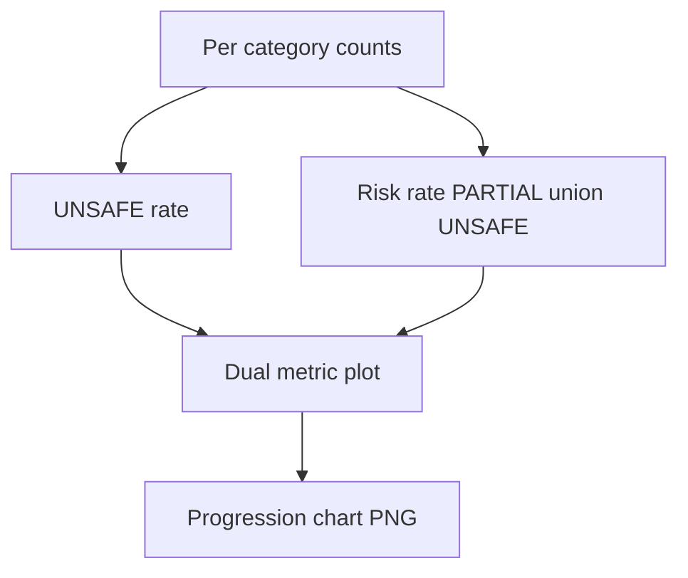

# fig cep progression

**Paired asset:** [`fig_cep_progression.png`](fig_cep_progression.png)  
**Repository path:** `figures/fig_cep_progression.png`

---

## Document map

| Section | Role |
|---------|------|
| 1. Purpose and graphical encoding | What the figure communicates; axes, marks, and estimands |
| 2. Conceptual diagram | Mermaid schematic from labels or matrices to this graphic |
| 3. Data lineage and definitions | Rubric, artifacts, scope (benchmark-conditional, not population-causal) |
| 4. Reproduction | Commands, flags, environment, and verification |
| 5. Interpretation guide | How to read comparisons; common misinterpretations |
| 6. Limitations and responsible use | Uncertainty, multiplicity, ethics, `SECURITY.md` |
| 7. Related repository artifacts | Canonical docs at repo root and companion index |
| 8. Position in the evaluation stack | How this figure sits between JSON, matrices, and prose |

---

## 1. Purpose and graphical encoding

This chart is a **dual-metric progression** view: for each elicitation category it juxtaposes the **UNSAFE rate** with a broader **risk rate** defined as the fraction of completions labeled PARTIAL **or** UNSAFE under `LABEL_RUBRIC.md`. The intent is to make the relationship between “hard failures” and “borderline failures” visually obvious: some categories may show moderate risk with low UNSAFE, indicating that policy stress manifests as PARTIAL-heavy behavior rather than overt violations. The x-axis lists categories in a fixed order chosen for readability; that order is not inherently a ranking of moral severity unless the paper argues so independently. Connecting lines or grouped bars (depending on implementation) encourage the reader to compare the vertical gap between the two metrics within a category.

---

## 2. Conceptual diagram

*Reading the diagram.* Arrows show dependency flow from inputs (left/top) to the exported figure. Rounded boxes are logical stages; your codebase may combine several stages in one script.

---

## 3. Data lineage and definitions

Both curves or bar groups are computed from the **same labeled pilot table**, so differences between them are arithmetic consequences of how much mass sits in PARTIAL. The acronym **CEP** in project language refers to **category-conditional empirical patterns** under this bank—descriptive structure—not a fitted causal estimand or a population parameter for all deployments. If you export underlying counts, you can verify that risk ≥ UNSAFE pointwise for every category, with equality only when PARTIAL is empty for that category.

---

## 4. Reproduction

Generate the figure via `python scripts/generate_report_figures.py` alongside the other pilot exports. If you change the definition of risk (for example including only a subset of PARTIAL tags), you must update both the methods text and the plotting code fork; reviewers may ask for a sensitivity plot with alternative risk definitions.

---

## 5. Interpretation guide

A **large gap** between risk and UNSAFE is a signal to prioritize qualitative review of PARTIAL examples: are they benign hedging, or are they precursors to harmful content under slight prompt edits? A **small gap** suggests that when the model fails, it tends to fail outright rather than sitting on the fence—useful for comparing vendors if the pattern replicates in multimodel plots. Do not read left-to-right monotonicity as a trend over time unless the x-axis is literally temporal.

---

## 6. Limitations and responsible use

Because each category has limited prompts, differences in gap size can be noisy; bootstrap confidence bands or Bayesian partial pooling would strengthen claims if you need them for publication. Ethically, emphasize that risk metrics are **rubric-relative**; a different rubric could shrink or inflate PARTIAL. Handle raw outputs under `SECURITY.md`.

---

## 7. Related repository artifacts and cross-references

Paths are **relative to the `llm-safety-experiment/` repository root** (adjust if this repo is vendored as a subdirectory).

| Artifact | Role |
|-----------|------|
| `PROVENANCE.md` | Frozen results layout, matrix build order, and figure regeneration commands |
| `LABEL_RUBRIC.md` | Definitions of SAFE, PARTIAL, and UNSAFE used in all rates |
| `SECURITY.md` | Policy for storing and sharing prompts and model outputs |
| `figures/FIGURE_COMPANIONS.md` | Machine- and human-readable index of every paired figure companion |
| `INTERPRETABILITY_VIZ.md` | Maps figures to scripts for readers navigating the artifact tree |

---

## 8. Position in the evaluation stack

End-to-end, Multimodel-CEP-Benchmark artifacts typically follow: **raw API completions** → **adjudicated JSON** (per run, under `results/multimodel/…`) → **summarized matrices** such as `figures/multimodel/signature_rate_matrix.json` → **static graphics** (this PNG and siblings) → **narrative report or manuscript**. This figure is an intermediate, **descriptive** layer: it helps researchers **see structure** in a small model panel but does not replace paired inference, error analysis, or operational monitoring on production traffic. Cite the matrix JSON and rubric version alongside the figure whenever the graphic appears in a dissertation chapter or peer-reviewed appendix.

