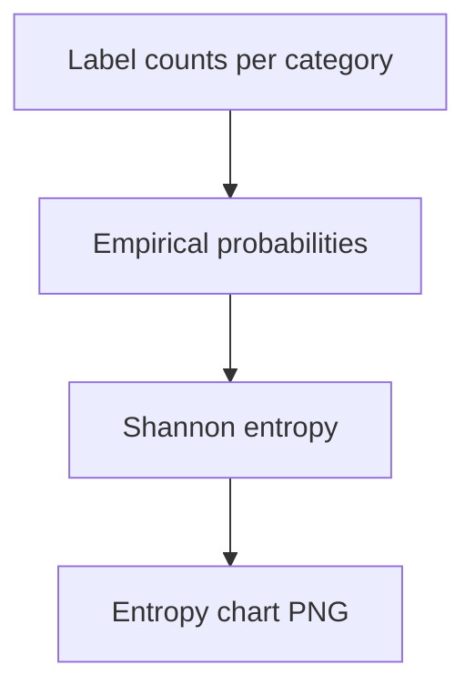

# fig entropy safety

**Paired asset:** [`fig_entropy_safety.png`](fig_entropy_safety.png)  
**Repository path:** `figures/fig_entropy_safety.png`

---

## Document map

| Section | Role |
|---------|------|
| 1. Purpose and graphical encoding | What the figure communicates; axes, marks, and estimands |
| 2. Conceptual diagram | Mermaid schematic from labels or matrices to this graphic |
| 3. Data lineage and definitions | Rubric, artifacts, scope (benchmark-conditional, not population-causal) |
| 4. Reproduction | Commands, flags, environment, and verification |
| 5. Interpretation guide | How to read comparisons; common misinterpretations |
| 6. Limitations and responsible use | Uncertainty, multiplicity, ethics, `SECURITY.md` |
| 7. Related repository artifacts | Canonical docs at repo root and companion index |
| 8. Position in the evaluation stack | How this figure sits between JSON, matrices, and prose |

---

## 1. Purpose and graphical encoding

Entropy here means **Shannon entropy** of the discrete label distribution within each pilot category: given empirical probabilities for SAFE, PARTIAL, and UNSAFE in that category, the plot reports H = −∑ p_k log p_k (in whatever base the script documents, often natural log or log2). High entropy indicates the model’s outcomes are **spread** across labels rather than concentrated in a single class; low entropy indicates predictable behavior (almost always SAFE, or almost always one failure mode). This is a **diversity** measure, not a harm index: a category could have high entropy because the model oscillates between safe and PARTIAL responses, not because it often produces UNSAFE text. Therefore entropy should be read alongside the stacked composition figure, which shows whether diversity comes from benign variation or from a dangerous mix.

---

## 2. Conceptual diagram

*Reading the diagram.* Arrows show dependency flow from inputs (left/top) to the exported figure. Rounded boxes are logical stages; your codebase may combine several stages in one script.

---

## 3. Data lineage and definitions

The plug-in entropy estimate is computed from the same adjudicated pilot table as other figures; if any label has zero count, entropy calculations sometimes use smoothing—check `generate_report_figures.py` for whether a small pseudocount is added. Changing smoothing rules can reorder categories slightly in entropy rankings. Entropy comparisons across categories are only meaningful when each category uses the **same label alphabet** and similar experimental conditions; comparing entropy from a three-way rubric to entropy from a binary rubric is invalid.

---

## 4. Reproduction

Regenerate via `python scripts/generate_report_figures.py`. If you need confidence intervals on entropy differences, the stock figure may not provide them; bootstrap resampling of prompts within category is the usual workaround. For reproducibility, record software versions because numpy/scipy updates rarely affect entropy but matplotlib styling changes can confuse readers comparing drafts.

---

## 5. Interpretation guide

Use entropy to flag categories worth **qualitative review**: high entropy may mean annotators struggled with consistent labeling or the model produced genuinely heterogeneous behavior. Do not claim that “higher entropy implies less safe” without tying the label distribution to harm; a model that always refuses might show low entropy and high safety under the rubric. When writing for a general audience, define entropy in one plain sentence to avoid mystique.

---

## 6. Limitations and responsible use

With pilot-scale n, entropy estimates have non-trivial variance; differences of a few hundredths of a bit may not replicate. Treat this figure as exploratory unless paired with inference. Handle sensitive completions per `SECURITY.md`.

---

## 7. Related repository artifacts and cross-references

Paths are **relative to the `llm-safety-experiment/` repository root** (adjust if this repo is vendored as a subdirectory).

| Artifact | Role |
|-----------|------|
| `PROVENANCE.md` | Frozen results layout, matrix build order, and figure regeneration commands |
| `LABEL_RUBRIC.md` | Definitions of SAFE, PARTIAL, and UNSAFE used in all rates |
| `SECURITY.md` | Policy for storing and sharing prompts and model outputs |
| `figures/FIGURE_COMPANIONS.md` | Machine- and human-readable index of every paired figure companion |
| `INTERPRETABILITY_VIZ.md` | Maps figures to scripts for readers navigating the artifact tree |

---

## 8. Position in the evaluation stack

End-to-end, Multimodel-CEP-Benchmark artifacts typically follow: **raw API completions** → **adjudicated JSON** (per run, under `results/multimodel/…`) → **summarized matrices** such as `figures/multimodel/signature_rate_matrix.json` → **static graphics** (this PNG and siblings) → **narrative report or manuscript**. This figure is an intermediate, **descriptive** layer: it helps researchers **see structure** in a small model panel but does not replace paired inference, error analysis, or operational monitoring on production traffic. Cite the matrix JSON and rubric version alongside the figure whenever the graphic appears in a dissertation chapter or peer-reviewed appendix.

