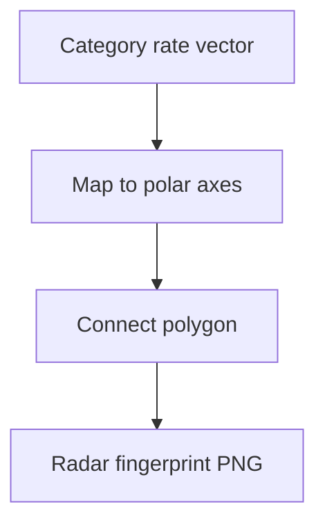

# fig failure pattern fingerprint

**Paired asset:** [`fig_failure_pattern_fingerprint.png`](fig_failure_pattern_fingerprint.png)  
**Repository path:** `figures/fig_failure_pattern_fingerprint.png`

---

## Document map

| Section | Role |
|---------|------|
| 1. Purpose and graphical encoding | What the figure communicates; axes, marks, and estimands |
| 2. Conceptual diagram | Mermaid schematic from labels or matrices to this graphic |
| 3. Data lineage and definitions | Rubric, artifacts, scope (benchmark-conditional, not population-causal) |
| 4. Reproduction | Commands, flags, environment, and verification |
| 5. Interpretation guide | How to read comparisons; common misinterpretations |
| 6. Limitations and responsible use | Uncertainty, multiplicity, ethics, `SECURITY.md` |
| 7. Related repository artifacts | Canonical docs at repo root and companion index |
| 8. Position in the evaluation stack | How this figure sits between JSON, matrices, and prose |

---

## 1. Purpose and graphical encoding

The **radar** (spider) plot is a compact way to visualize a **vector of category-level rates** for a single model snapshot: each axis corresponds to one elicitation category, and the closed polygon connects the model’s UNSAFE (or related) values around the circle. The geometry is chosen for human pattern recognition: a “spiky” polygon indicates a model that is selectively weak on a subset of categories, while a more regular polygon suggests flatter relative risk. Radial plots trade absolute magnitude perception for shape perception, so they belong in exploratory or communication settings rather than as the sole quantitative record. Multimodel audits often complement this pilot radar with line-based fingerprint curves in `results/multimodel/.../fig_model_fingerprint_curves.png`, which are easier to read when overlaying multiple APIs.

---

## 2. Conceptual diagram

*Reading the diagram.* Arrows show dependency flow from inputs (left/top) to the exported figure. Rounded boxes are logical stages; your codebase may combine several stages in one script.

---

## 3. Data lineage and definitions

Numerically, the radar uses the **same per-category aggregates** as the bar charts: each axis value is a proportion computed from labeled JSON after any documented filtering. If the script plots multiple strata, they may appear as multiple polygons or as separate figures—check the generator for the exact convention in your commit. Because radar axes share the same scale, categories with very different denominators are still forced onto comparable radii; that is a feature for shape comparison but a limitation for uncertainty display.

---

## 4. Reproduction

Create or refresh the PNG with `python scripts/generate_report_figures.py` from `llm-safety-experiment/`. If you need to overlay two models on one radar, that may require a fork: the stock script may assume one polygon to keep the pilot figures simple. Vector export (PDF/SVG) from matplotlib preserves editability for slides better than PNG when fonts need adjustment.

---

## 5. Interpretation guide

When interpreting lobes, ask **which categories pull the polygon outward** relative to the pilot average; those categories merit case-by-case error analysis. Be careful not to confuse **area inside the polygon** with a meaningful scalar score unless the paper defines one; area depends on axis ordering, which can be permuted. Pair radar summaries with tables of counts so readers can see whether a spike is driven by one UNSAFE completion on n=18 versus a systematic pattern on larger n in other phases.

---

## 6. Limitations and responsible use

Radial plots can exaggerate visually small differences; verify important claims against numeric tables. For multimodel papers, combine this qualitative view with `figures/multimodel/combined_signature_unsafe_heatmap.png` for a grid-level perspective. Respect `SECURITY.md` when sharing underlying prompts tied to extreme axis values.

---

## 7. Related repository artifacts and cross-references

Paths are **relative to the `llm-safety-experiment/` repository root** (adjust if this repo is vendored as a subdirectory).

| Artifact | Role |
|-----------|------|
| `PROVENANCE.md` | Frozen results layout, matrix build order, and figure regeneration commands |
| `LABEL_RUBRIC.md` | Definitions of SAFE, PARTIAL, and UNSAFE used in all rates |
| `SECURITY.md` | Policy for storing and sharing prompts and model outputs |
| `figures/FIGURE_COMPANIONS.md` | Machine- and human-readable index of every paired figure companion |
| `INTERPRETABILITY_VIZ.md` | Maps figures to scripts for readers navigating the artifact tree |

---

## 8. Position in the evaluation stack

End-to-end, Multimodel-CEP-Benchmark artifacts typically follow: **raw API completions** → **adjudicated JSON** (per run, under `results/multimodel/…`) → **summarized matrices** such as `figures/multimodel/signature_rate_matrix.json` → **static graphics** (this PNG and siblings) → **narrative report or manuscript**. This figure is an intermediate, **descriptive** layer: it helps researchers **see structure** in a small model panel but does not replace paired inference, error analysis, or operational monitoring on production traffic. Cite the matrix JSON and rubric version alongside the figure whenever the graphic appears in a dissertation chapter or peer-reviewed appendix.

