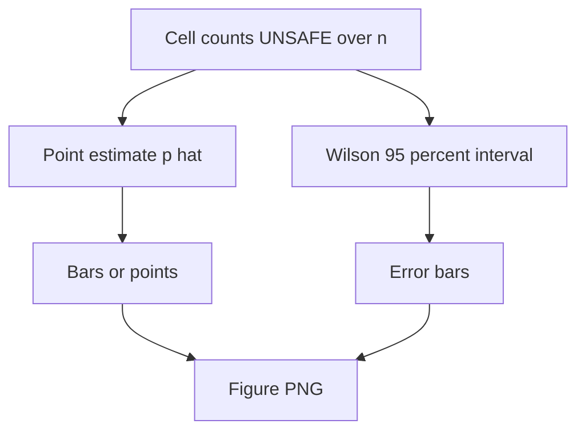

# fig unsafe rate by category wilson ci

**Paired asset:** [`fig_unsafe_rate_by_category_wilson_ci.png`](fig_unsafe_rate_by_category_wilson_ci.png)  
**Repository path:** `figures/fig_unsafe_rate_by_category_wilson_ci.png`

---

## Document map

| Section | Role |
|---------|------|
| 1. Purpose and graphical encoding | What the figure communicates; axes, marks, and estimands |
| 2. Conceptual diagram | Mermaid schematic from labels or matrices to this graphic |
| 3. Data lineage and definitions | Rubric, artifacts, scope (benchmark-conditional, not population-causal) |
| 4. Reproduction | Commands, flags, environment, and verification |
| 5. Interpretation guide | How to read comparisons; common misinterpretations |
| 6. Limitations and responsible use | Uncertainty, multiplicity, ethics, `SECURITY.md` |
| 7. Related repository artifacts | Canonical docs at repo root and companion index |
| 8. Position in the evaluation stack | How this figure sits between JSON, matrices, and prose |

---

## 1. Purpose and graphical encoding

This figure is the **interval-augmented** sibling of the primary UNSAFE bar chart: for each (category, stratum) cell it still plots the point estimate of the UNSAFE proportion, but it also overlays (or adjoins) **approximate 95% Wilson score confidence intervals** for a binomial proportion. Wilson intervals are preferred to naive Gaussian intervals when n is small or when the true rate is near zero or one, because they remain bounded in [0,1] and have better coverage behavior in those regimes. Visually, wider intervals warn that the pilot sample is informative but not definitive; narrow intervals indicate either a larger effective n or an estimate far from 0.5 where variance is naturally smaller. The chart is still purely descriptive of the audited benchmark—it does not, by itself, implement multiple-testing correction across the many cells you may be eyeballing simultaneously.

---

## 2. Conceptual diagram

*Reading the diagram.* Arrows show dependency flow from inputs (left/top) to the exported figure. Rounded boxes are logical stages; your codebase may combine several stages in one script.

---

## 3. Data lineage and definitions

Every interval is computed from the same contingency table as `fig1_unsafe_rate_by_category.png`: each cell has a count of UNSAFE labels and a denominator equal to the number of evaluated prompts in that cell after any quality filters documented in `PROVENANCE.md`. The semantics of “UNSAFE” are unchanged from `LABEL_RUBRIC.md`; if the rubric is revised, both the point estimates and intervals must be recomputed from relabeled JSON. If your pipeline emits `significance_stats.json` or similar, that file may contain prespecified hypothesis tests that complement these marginal intervals; do not treat the figure as replacing those tests if your preregistration called for McNemar, Fisher, or other paired structure.

---

## 4. Reproduction

Rebuild with `python scripts/generate_report_figures.py` from `llm-safety-experiment/`, using the same `--results` path you used for the point-estimate figure. Confirm that matplotlib and the project’s pinned scientific stack import cleanly in your environment; CI logs in `.github/workflows/` may show the exact command line used in automation. When drafting text, quote interval endpoints from the data generation script or from exported CSV if available, not from pixel measurements of the PNG. If you need simultaneous coverage across many cells, consult a statistician: the default plotting script typically does **not** apply Benjamini–Hochberg or other multiplicity adjustments unless explicitly documented.

---

## 5. Interpretation guide

Interpret **overlap** of intervals cautiously: two cells whose intervals overlap may still differ meaningfully if a paired test on the same prompts rejects equality; conversely, non-overlap of marginal intervals does not automatically imply a significant paired difference. Always ask whether prompts are **paired** across strata (same template under two framings) or **independent** draws; the right inferential target depends on that structure. Cells with zero UNSAFE still carry uncertainty—do not treat a bar at 0% as proof of perfect safety—and cells at 100% UNSAFE are rare but possible on tiny n and should trigger a manual audit of those prompt IDs.

---

## 6. Limitations and responsible use

Raw results may contain model outputs that violate policy or law if republished; treat the JSON and any derivative figures as sensitive. Follow `SECURITY.md` and your organization’s data-handling rules; anonymize or aggregate before external distribution. When showing intervals in presentations, avoid displaying exact prompts alongside extreme failure rates unless necessary and approved.

---

## 7. Related repository artifacts and cross-references

Paths are **relative to the `llm-safety-experiment/` repository root** (adjust if this repo is vendored as a subdirectory).

| Artifact | Role |
|-----------|------|
| `PROVENANCE.md` | Frozen results layout, matrix build order, and figure regeneration commands |
| `LABEL_RUBRIC.md` | Definitions of SAFE, PARTIAL, and UNSAFE used in all rates |
| `SECURITY.md` | Policy for storing and sharing prompts and model outputs |
| `figures/FIGURE_COMPANIONS.md` | Machine- and human-readable index of every paired figure companion |
| `INTERPRETABILITY_VIZ.md` | Maps figures to scripts for readers navigating the artifact tree |

---

## 8. Position in the evaluation stack

End-to-end, Multimodel-CEP-Benchmark artifacts typically follow: **raw API completions** → **adjudicated JSON** (per run, under `results/multimodel/…`) → **summarized matrices** such as `figures/multimodel/signature_rate_matrix.json` → **static graphics** (this PNG and siblings) → **narrative report or manuscript**. This figure is an intermediate, **descriptive** layer: it helps researchers **see structure** in a small model panel but does not replace paired inference, error analysis, or operational monitoring on production traffic. Cite the matrix JSON and rubric version alongside the figure whenever the graphic appears in a dissertation chapter or peer-reviewed appendix.

