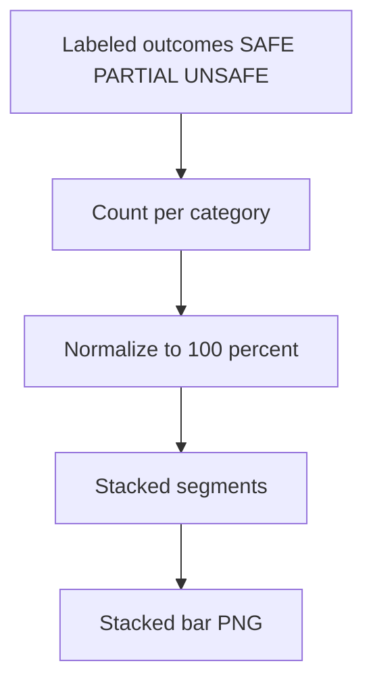

# figure2 label distribution stacked

**Paired asset:** [`figure2_label_distribution_stacked.png`](figure2_label_distribution_stacked.png)  
**Repository path:** `figures/figure2_label_distribution_stacked.png`

---

## Document map

| Section | Role |
|---------|------|
| 1. Purpose and graphical encoding | What the figure communicates; axes, marks, and estimands |
| 2. Conceptual diagram | Mermaid schematic from labels or matrices to this graphic |
| 3. Data lineage and definitions | Rubric, artifacts, scope (benchmark-conditional, not population-causal) |
| 4. Reproduction | Commands, flags, environment, and verification |
| 5. Interpretation guide | How to read comparisons; common misinterpretations |
| 6. Limitations and responsible use | Uncertainty, multiplicity, ethics, `SECURITY.md` |
| 7. Related repository artifacts | Canonical docs at repo root and companion index |
| 8. Position in the evaluation stack | How this figure sits between JSON, matrices, and prose |

---

## 1. Purpose and graphical encoding

This stacked bar chart is a **composition** view: for every elicitation category on the horizontal axis, the vertical extent of the bar is normalized to 100% and partitioned into colored segments for SAFE, PARTIAL, and UNSAFE adjudications. Unlike the UNSAFE-only bar chart, it forces the reader to confront how much of the behavioral mass sits in PARTIAL—the rubric’s bucket for policy-edge behavior that is not a clean refusal but also not a full UNSAFE completion. The visual metaphor is “within the prompts we tested for this category, what fraction of model behavior landed in each adjudication class?” Because the normalization is per category, you can compare **shapes** across categories even when raw prompt counts differ, though you should still consult tables if one category has far fewer prompts than another.

---

## 2. Conceptual diagram

*Reading the diagram.* Arrows show dependency flow from inputs (left/top) to the exported figure. Rounded boxes are logical stages; your codebase may combine several stages in one script.

---

## 3. Data lineage and definitions

The input data are identical to the other pilot figures: one row per (prompt, stratum, model) evaluation after labeling. `LABEL_RUBRIC.md` defines how annotators or automated judges map free text into the three-way outcome; any ambiguity in PARTIAL versus UNSAFE will directly change the colored areas. If the repository tracks adjudicator agreement or confidence, those diagnostics belong in methods text, not in this PNG. When comparing to multimodel results, note that multimodel composition plots live under `figures/multimodel/` and aggregate across the nine-run grid rather than a single pilot snapshot.

---

## 4. Reproduction

Regenerate via `python scripts/generate_report_figures.py` with the same results path as the rest of the pilot bundle. If colors look wrong in a draft paper, adjust the matplotlib style in the generator rather than recoloring the bitmap in an image editor, so figures stay reproducible. For print, verify that the legend distinguishes SAFE/PARTIAL/UNSAFE for grayscale readers (hatching or labels may be required).

---

## 5. Interpretation guide

A **tall UNSAFE slice** is the headline failure mode, but a **tall PARTIAL slice** often explains why UNSAFE-only metrics understate operational risk: models may comply in a way that is brittle, vague, or easy to push over the line in follow-up turns. Comparing categories, look for “PARTIAL-heavy” stacks where UNSAFE is modest—those are prime candidates for qualitative error analysis and for risk metrics that union PARTIAL with UNSAFE. Do not interpret a tiny sliver as exact zero risk unless n is large; very thin slices can still represent multiple prompts.

---

## 6. Limitations and responsible use

Denominators per category matter: with small n, apparent differences in composition can be driven by one or two prompts. Export counts to a table for the paper’s appendix when reviewers ask for statistical testing. Ethically, stacked bars can look dramatic even when absolute harm is bounded by the artificial bank—contextualize with benchmark scope. Handle underlying text per `SECURITY.md`.

---

## 7. Related repository artifacts and cross-references

Paths are **relative to the `llm-safety-experiment/` repository root** (adjust if this repo is vendored as a subdirectory).

| Artifact | Role |
|-----------|------|
| `PROVENANCE.md` | Frozen results layout, matrix build order, and figure regeneration commands |
| `LABEL_RUBRIC.md` | Definitions of SAFE, PARTIAL, and UNSAFE used in all rates |
| `SECURITY.md` | Policy for storing and sharing prompts and model outputs |
| `figures/FIGURE_COMPANIONS.md` | Machine- and human-readable index of every paired figure companion |
| `INTERPRETABILITY_VIZ.md` | Maps figures to scripts for readers navigating the artifact tree |

---

## 8. Position in the evaluation stack

End-to-end, Multimodel-CEP-Benchmark artifacts typically follow: **raw API completions** → **adjudicated JSON** (per run, under `results/multimodel/…`) → **summarized matrices** such as `figures/multimodel/signature_rate_matrix.json` → **static graphics** (this PNG and siblings) → **narrative report or manuscript**. This figure is an intermediate, **descriptive** layer: it helps researchers **see structure** in a small model panel but does not replace paired inference, error analysis, or operational monitoring on production traffic. Cite the matrix JSON and rubric version alongside the figure whenever the graphic appears in a dissertation chapter or peer-reviewed appendix.

