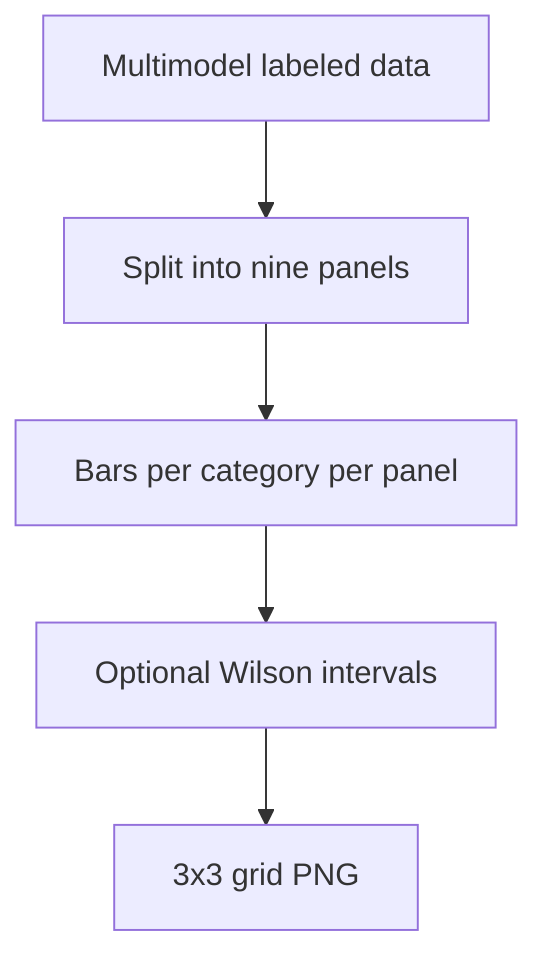

# combined 9panel unsafe by category

**Paired asset:** [`combined_9panel_unsafe_by_category.png`](combined_9panel_unsafe_by_category.png)  
**Repository path:** `figures/multimodel/combined_9panel_unsafe_by_category.png`

---

## Document map

| Section | Role |
|---------|------|
| 1. Purpose and graphical encoding | What the figure communicates; axes, marks, and estimands |
| 2. Conceptual diagram | Mermaid schematic from labels or matrices to this graphic |
| 3. Data lineage and definitions | Rubric, artifacts, scope (benchmark-conditional, not population-causal) |
| 4. Reproduction | Commands, flags, environment, and verification |
| 5. Interpretation guide | How to read comparisons; common misinterpretations |
| 6. Limitations and responsible use | Uncertainty, multiplicity, ethics, `SECURITY.md` |
| 7. Related repository artifacts | Canonical docs at repo root and companion index |
| 8. Position in the evaluation stack | How this figure sits between JSON, matrices, and prose |

---

## 1. Purpose and graphical encoding

This **3×3 grid** is the flagship multimodel overview figure in many expositions of the nine-run benchmark: each panel corresponds to one API configuration (a specific provider and pricing tier combination), and within each panel you see UNSAFE rates broken down by elicitation category on a shared axis. When error bars or Wilson intervals are enabled, each bar communicates both point estimate and sampling uncertainty for that cell; when disabled, the figure emphasizes speed and clarity for talks. The layout lets readers perform **at-a-glance** comparisons across vendors while keeping category definitions consistent, which is harder when every model is plotted in a separate file. Because human working memory is limited, the nine-panel design is near the upper bound of complexity for a single slide—use callouts or inset zooms if you discuss one category heavily.

---

## 2. Conceptual diagram

*Reading the diagram.* Arrows show dependency flow from inputs (left/top) to the exported figure. Rounded boxes are logical stages; your codebase may combine several stages in one script.

---

## 3. Data lineage and definitions

Underlying counts come from the multimodel labeled JSONs archived per tier under `results/multimodel/<tier>/...`; the plotting script merges them according to the frozen crosswalk between run IDs and panel positions. Interval computations, when present, require per-cell counts of successes and trials; if bars look smooth but intervals are missing, you may have run with `--no-ci` or failed to export count metadata. Always record model version strings and snapshot dates beside this figure in an appendix; API drift can reorder bars without any change to your code. If a panel looks empty or flat-line, check for API failures or filtering rules that dropped prompts for that run.

---

## 4. Reproduction

Generate via `python scripts/plot_multimodel_nine_panel.py` from `llm-safety-experiment/`, or build it as part of `reproduce_main_figures.py` when configured. `--no-ci` is appropriate for internal drafts but discouraged for publication unless intervals appear elsewhere. Font sizes should be legible when the composite is embedded at single-column width; test shrinking the PNG to your journal’s column inches before final submission.

---

## 5. Interpretation guide

Read **across panels** for vendor/tier differences on the same category bar, and **within panels** for category difficulty profiles. Avoid declaring a global “winner” model unless you define an aggregation rule (macro average vs micro average) and justify it; different rules change rankings. Remember that **multiplicity** is high: with many bars, some contrasts will look large by chance unless controlled. Gemini mid versus expensive comparisons deserve extra caution if documentation notes identifier quirks—cite those notes prominently.

---

## 6. Limitations and responsible use

This figure is still descriptive of a curated bank; do not extrapolate to uncensored user traffic. Harmful completions underpin the counts—handle per `SECURITY.md`. When reproducing externally, ensure evaluators have legal authorization to run the underlying prompts.

---

## 7. Related repository artifacts and cross-references

Paths are **relative to the `llm-safety-experiment/` repository root** (adjust if this repo is vendored as a subdirectory).

| Artifact | Role |
|-----------|------|
| `PROVENANCE.md` | Frozen results layout, matrix build order, and figure regeneration commands |
| `LABEL_RUBRIC.md` | Definitions of SAFE, PARTIAL, and UNSAFE used in all rates |
| `SECURITY.md` | Policy for storing and sharing prompts and model outputs |
| `figures/FIGURE_COMPANIONS.md` | Machine- and human-readable index of every paired figure companion |
| `INTERPRETABILITY_VIZ.md` | Maps figures to scripts for readers navigating the artifact tree |

---

## 8. Position in the evaluation stack

End-to-end, Multimodel-CEP-Benchmark artifacts typically follow: **raw API completions** → **adjudicated JSON** (per run, under `results/multimodel/…`) → **summarized matrices** such as `figures/multimodel/signature_rate_matrix.json` → **static graphics** (this PNG and siblings) → **narrative report or manuscript**. This figure is an intermediate, **descriptive** layer: it helps researchers **see structure** in a small model panel but does not replace paired inference, error analysis, or operational monitoring on production traffic. Cite the matrix JSON and rubric version alongside the figure whenever the graphic appears in a dissertation chapter or peer-reviewed appendix.

