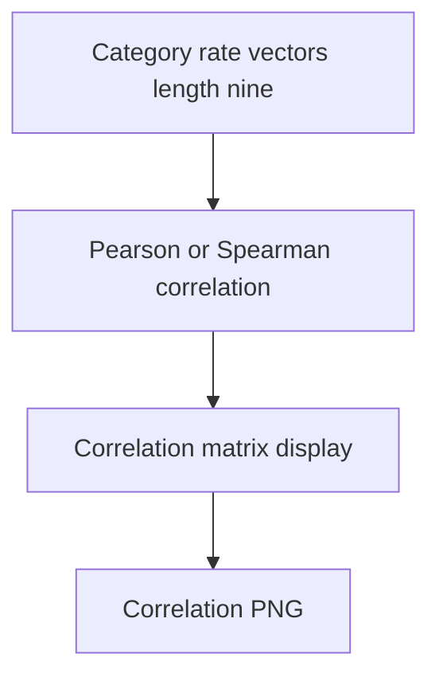

# combined category correlation across models

**Paired asset:** [`combined_category_correlation_across_models.png`](combined_category_correlation_across_models.png)  
**Repository path:** `figures/multimodel/combined_category_correlation_across_models.png`

---

## Document map

| Section | Role |
|---------|------|
| 1. Purpose and graphical encoding | What the figure communicates; axes, marks, and estimands |
| 2. Conceptual diagram | Mermaid schematic from labels or matrices to this graphic |
| 3. Data lineage and definitions | Rubric, artifacts, scope (benchmark-conditional, not population-causal) |
| 4. Reproduction | Commands, flags, environment, and verification |
| 5. Interpretation guide | How to read comparisons; common misinterpretations |
| 6. Limitations and responsible use | Uncertainty, multiplicity, ethics, `SECURITY.md` |
| 7. Related repository artifacts | Canonical docs at repo root and companion index |
| 8. Position in the evaluation stack | How this figure sits between JSON, matrices, and prose |

---

## 1. Purpose and graphical encoding

This figure displays a **correlation matrix** between elicitation categories using each category’s **vector of model-specific rates** (length nine in the canonical design). Positive correlation between categories i and j means that models which are weak on category i tend also to be weak on category j in this sample; negative correlation means complementary weakness patterns. Such structure hints at **latent skill factors**—for example, categories that jointly probe similar refusal capabilities—but n=9 models means each correlation estimate is extremely noisy and sensitive to outliers. Treat the plot as **hypothesis generation** for future, larger model panels or for rubric consolidation discussions. Never report correlation p-values without acknowledging the tiny model sample and potential non-normality of rate vectors.

---

## 2. Conceptual diagram

*Reading the diagram.* Arrows show dependency flow from inputs (left/top) to the exported figure. Rounded boxes are logical stages; your codebase may combine several stages in one script.

---

## 3. Data lineage and definitions

Correlations are computed from the empirical rate table underlying the multimodel heatmaps; preprocessing such as logit transforms changes results. If any model is missing data for a category, imputation or pairwise deletion must be documented—correlations are not magic invariants. Category ordering in the matrix is often alphabetical or taxonomic; reordering does not change math but aids interpretation. If you annotate correlation coefficients on the plot, verify they match a script-exported CSV.

---

## 4. Reproduction

Produce with `python scripts/plot_category_correlation_across_models.py`, capturing flags that control clustering of rows/columns if available. For talks, emphasize one or two largest correlations rather than showing the full matrix unreadably. Consider bootstrap resampling models (if you later expand beyond nine) to assess stability.

---

## 5. Interpretation guide

Do not infer **causal** relationships between categories (e.g., “improving hate speech fixes malware”) from correlations alone. Be explicit that correlations describe **co-movement across models in this benchmark**, not semantic similarity of prompt text. If correlations contradict intuition, audit for mis-labeled categories or API failures before theorizing.

---

## 6. Limitations and responsible use

Correlation plots are easy to over-trust; soften language in captions. `SECURITY.md` for data. Future work should expand n to stabilize estimates.

---

## 7. Related repository artifacts and cross-references

Paths are **relative to the `llm-safety-experiment/` repository root** (adjust if this repo is vendored as a subdirectory).

| Artifact | Role |
|-----------|------|
| `PROVENANCE.md` | Frozen results layout, matrix build order, and figure regeneration commands |
| `LABEL_RUBRIC.md` | Definitions of SAFE, PARTIAL, and UNSAFE used in all rates |
| `SECURITY.md` | Policy for storing and sharing prompts and model outputs |
| `figures/FIGURE_COMPANIONS.md` | Machine- and human-readable index of every paired figure companion |
| `INTERPRETABILITY_VIZ.md` | Maps figures to scripts for readers navigating the artifact tree |

---

## 8. Position in the evaluation stack

End-to-end, Multimodel-CEP-Benchmark artifacts typically follow: **raw API completions** → **adjudicated JSON** (per run, under `results/multimodel/…`) → **summarized matrices** such as `figures/multimodel/signature_rate_matrix.json` → **static graphics** (this PNG and siblings) → **narrative report or manuscript**. This figure is an intermediate, **descriptive** layer: it helps researchers **see structure** in a small model panel but does not replace paired inference, error analysis, or operational monitoring on production traffic. Cite the matrix JSON and rubric version alongside the figure whenever the graphic appears in a dissertation chapter or peer-reviewed appendix.

