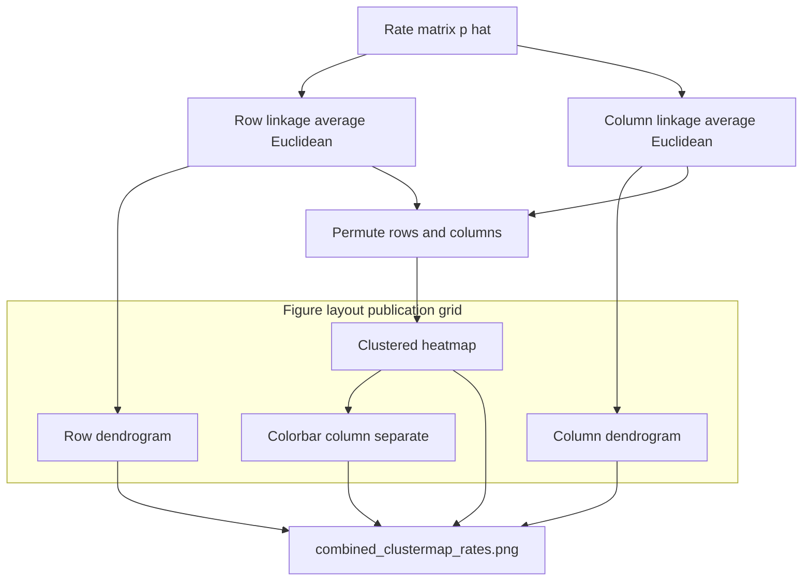

# combined clustermap rates

**Paired asset:** [`combined_clustermap_rates.png`](combined_clustermap_rates.png)  
**Repository path:** `figures/multimodel/combined_clustermap_rates.png`

---

## Document map

| Section | Role |
|---------|------|
| 1. Purpose and graphical encoding | What the figure communicates; axes, marks, and estimands |
| 2. Conceptual diagram | Mermaid schematic from labels or matrices to this graphic |
| 3. Data lineage and definitions | Rubric, artifacts, scope (benchmark-conditional, not population-causal) |
| 4. Reproduction | Commands, flags, environment, and verification |
| 5. Interpretation guide | How to read comparisons; common misinterpretations |
| 6. Limitations and responsible use | Uncertainty, multiplicity, ethics, `SECURITY.md` |
| 7. Related repository artifacts | Canonical docs at repo root and companion index |
| 8. Position in the evaluation stack | How this figure sits between JSON, matrices, and prose |

---

## 1. Purpose and graphical encoding

This figure is a **hierarchically clustered heatmap** (often called a *clustermap*): **rows** index model runs (nine API configurations in the canonical grid) and **columns** index elicitation categories from the fixed benchmark. Each cell encodes an estimated rate $\hat{p}$—typically the **UNSAFE** proportion in that (model, category) cell under `LABEL_RUBRIC.md`, unless you point the script at a risk matrix export instead. **Column** and **row** dendrograms show **average-linkage** agglomerative clustering on **Euclidean** distances between **row vectors** (two models are “close” if their category profiles are similar) and between **column vectors** (two categories are “close” if they evoke similar cross-model failure patterns). The **publication layout** uses a **light, neutral theme**, **wider gutters** between the dendrogram axes and the heatmap, and a **dedicated narrow column** for the color bar so category tick labels and the scale **do not overlap**—a common failure mode in compact dark-theme exports. The title and subtitle state that ordering is **exploratory**; dendrogram topology is **not** a hypothesis test, a causal graph, or a recommendation about which vendor to deploy.

---

## 2. Conceptual diagram

*Reading the diagram.* Arrows show dependency flow from inputs (left/top) to the exported figure. Rounded boxes are logical stages; your codebase may combine several stages in one script.

---

## 3. Data lineage and definitions

The quantitative input is `signature_rate_matrix.json` (unsafe) or the parallel **risk** matrix JSON when you build one; each entry is derived from **adjudicated** completions stored under `results/multimodel/…` after runs complete. Missing or non-finite cells are filled **column-wise** with the column mean before clustering—a pragmatic imputation that should be disclosed if any missingness is structural (for example, an API outage) rather than numerical noise. **Preprocessing changes trees**: z-scoring rows, logit-transforming rates, or weighting categories by harm severity would all yield different merges; PhD-level methods text should record the **exact** recipe used here (raw rates on [0,1], Euclidean, average linkage). Because **n = 9** models, the **row** dendrogram has very few leaves; small perturbations to rates or to tie-breaking can **reorder** nearest-neighbor merges. Treat the row tree as a **conversation starter**, not a stable phylogeny of model families.

---

## 4. Reproduction

Regenerate with `python scripts/plot_multimodel_clustermap.py --matrix-json figures/multimodel/signature_rate_matrix.json` from `llm-safety-experiment/` (see `--out` and `--dpi`). The script writes a **high-DPI PNG** with `bbox_inches='tight'` and extra padding so captions survive two-column downscaling in LaTeX or Word. If you need **vector** output for a thesis, re-export from matplotlib with `fig.savefig(..., format='pdf')` in a short fork—keep font embedding settings consistent with your institution’s template. After regeneration, visually confirm that **top** and **left** dendrograms align with the heatmap extents; misalignment usually means a manual edit broke `imshow(..., extent=...)` or the linkage input order.

---

## 5. Interpretation guide

Read **color intensity** as higher $\hat{p}$ in that cell after clustering; **do not** interpret cell *position before* clustering from this graphic—the matrix is **permuted** for visualization. When two **categories** merge low in the **column** dendrogram, interpret that as “similar **cross-model** rate vectors,” not necessarily similar prompt semantics—different rubric slices can correlate by accident on nine points. When two **models** merge in the **row** tree, you are seeing similar **profiles across categories** under this bank; validate with **`combined_9panel_unsafe_by_category.png`** or **`combined_signature_unsafe_heatmap.png`** because readers parse those layouts more intuitively for *absolute* comparisons. Never describe a branch as “significant” unless you back it with an appropriate **stability analysis** (bootstrap, jackknife, or larger model panels).

---

## 6. Limitations and responsible use

Unsupervised layouts can **over-impress** non-specialist audiences; pair this figure with explicit **uncertainty** displays (Wilson forests, Beta facets) when stakes are high. Category names may reveal **sensitive** benchmark structure; follow `SECURITY.md` before circulating high-resolution crops. Do not use this figure alone for **procurement** or **compliance** decisions—it summarizes one frozen audit, not future API behavior.

---

## 7. Related repository artifacts and cross-references

Paths are **relative to the `llm-safety-experiment/` repository root** (adjust if this repo is vendored as a subdirectory).

| Artifact | Role |
|-----------|------|
| `PROVENANCE.md` | Frozen results layout, matrix build order, and figure regeneration commands |
| `LABEL_RUBRIC.md` | Definitions of SAFE, PARTIAL, and UNSAFE used in all rates |
| `SECURITY.md` | Policy for storing and sharing prompts and model outputs |
| `figures/FIGURE_COMPANIONS.md` | Machine- and human-readable index of every paired figure companion |
| `INTERPRETABILITY_VIZ.md` | Maps figures to scripts for readers navigating the artifact tree |

---

## 8. Position in the evaluation stack

End-to-end, Multimodel-CEP-Benchmark artifacts typically follow: **raw API completions** → **adjudicated JSON** (per run, under `results/multimodel/…`) → **summarized matrices** such as `figures/multimodel/signature_rate_matrix.json` → **static graphics** (this PNG and siblings) → **narrative report or manuscript**. This figure is an intermediate, **descriptive** layer: it helps researchers **see structure** in a small model panel but does not replace paired inference, error analysis, or operational monitoring on production traffic. Cite the matrix JSON and rubric version alongside the figure whenever the graphic appears in a dissertation chapter or peer-reviewed appendix.

