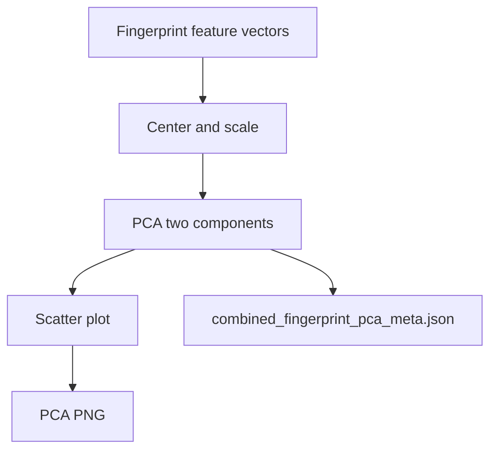

# combined fingerprint pca

**Paired asset:** [`combined_fingerprint_pca.png`](combined_fingerprint_pca.png)  
**Repository path:** `figures/multimodel/combined_fingerprint_pca.png`

---

## Document map

| Section | Role |
|---------|------|
| 1. Purpose and graphical encoding | What the figure communicates; axes, marks, and estimands |
| 2. Conceptual diagram | Mermaid schematic from labels or matrices to this graphic |
| 3. Data lineage and definitions | Rubric, artifacts, scope (benchmark-conditional, not population-causal) |
| 4. Reproduction | Commands, flags, environment, and verification |
| 5. Interpretation guide | How to read comparisons; common misinterpretations |
| 6. Limitations and responsible use | Uncertainty, multiplicity, ethics, `SECURITY.md` |
| 7. Related repository artifacts | Canonical docs at repo root and companion index |
| 8. Position in the evaluation stack | How this figure sits between JSON, matrices, and prose |

---

## 1. Purpose and graphical encoding

This plot applies **principal component analysis** (PCA) to vectors of fingerprint features—often stacked category-wise rates or refusals per model—to embed the nine runs into **two dimensions** for visualization. Nearby points suggest similar **high-dimensional failure profiles** under Euclidean geometry after centering and scaling; distant points suggest structurally different behavior across the benchmark. PCA is **not** a causal model and **not** guaranteed to separate “safe” from “unsafe” models unless variance aligns with that axis; PC1 may capture provider-specific quirks rather than interpretable safety. With only nine observations, PCA is **unstable**: leaving one model out can rotate axes dramatically; bootstrap or jackknife analyses belong in robustness appendices if you lean on PCA narratively. The sidecar JSON `combined_fingerprint_pca_meta.json` typically records loadings, explained variance ratios, and point labels—cite those numbers when you claim “PC1 explains X% of variance.”

---

## 2. Conceptual diagram

*Reading the diagram.* Arrows show dependency flow from inputs (left/top) to the exported figure. Rounded boxes are logical stages; your codebase may combine several stages in one script.

---

## 3. Data lineage and definitions

Feature construction must be documented: did you standardize per category? Drop sparse categories? Include refusals and UNSAFE in one vector or separate blocks? If features are highly correlated, PCA may merge them into one component that is hard to name—avoid over-interpretation. Outliers in fingerprint features dominate PCA; check robust PCA or t-SNE/UMAP alternatives if one model skews the map, noting that alternatives have their own hyperparameters. Ensure you did not accidentally duplicate features or leak tier twice under different names.

---

## 4. Reproduction

Regenerate via `python scripts/plot_fingerprint_pca.py` after fingerprint JSON exists. Commit the meta JSON in the same changeset as the PNG. For slides, annotate arrows showing how loadings contribute to positions if space allows.

---

## 5. Interpretation guide

Tell readers that proximity is **exploratory similarity**, not certification of equivalence. If two models overlap in PCA space but differ sharply on a rare catastrophic category, PCA may hide that risk—cross-check extremes. Prefer qualitative fingerprints or incidence plots when stakes are high.

---

## 6. Limitations and responsible use

PCA can reveal vendor clustering—word neutrally to avoid commercial defamation. `SECURITY.md`. Nine points cannot support strong subspace claims without replication.

---

## 7. Related repository artifacts and cross-references

Paths are **relative to the `llm-safety-experiment/` repository root** (adjust if this repo is vendored as a subdirectory).

| Artifact | Role |
|-----------|------|
| `PROVENANCE.md` | Frozen results layout, matrix build order, and figure regeneration commands |
| `LABEL_RUBRIC.md` | Definitions of SAFE, PARTIAL, and UNSAFE used in all rates |
| `SECURITY.md` | Policy for storing and sharing prompts and model outputs |
| `figures/FIGURE_COMPANIONS.md` | Machine- and human-readable index of every paired figure companion |
| `INTERPRETABILITY_VIZ.md` | Maps figures to scripts for readers navigating the artifact tree |

---

## 8. Position in the evaluation stack

End-to-end, Multimodel-CEP-Benchmark artifacts typically follow: **raw API completions** → **adjudicated JSON** (per run, under `results/multimodel/…`) → **summarized matrices** such as `figures/multimodel/signature_rate_matrix.json` → **static graphics** (this PNG and siblings) → **narrative report or manuscript**. This figure is an intermediate, **descriptive** layer: it helps researchers **see structure** in a small model panel but does not replace paired inference, error analysis, or operational monitoring on production traffic. Cite the matrix JSON and rubric version alongside the figure whenever the graphic appears in a dissertation chapter or peer-reviewed appendix.

