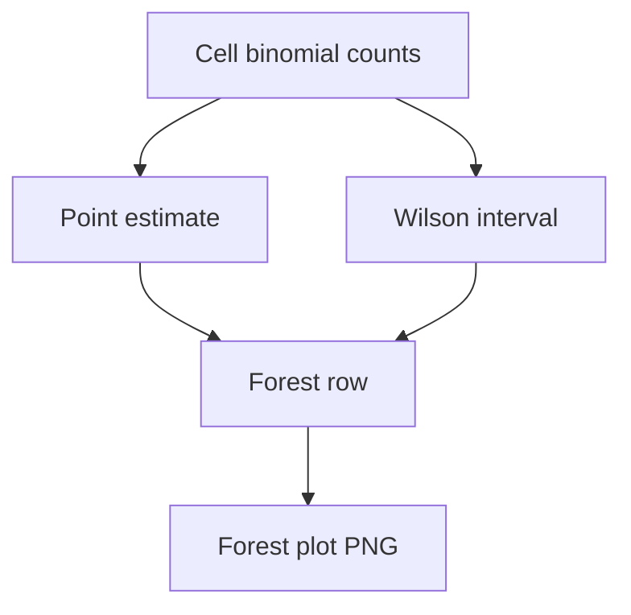

# combined forest wilson risk

**Paired asset:** [`combined_forest_wilson_risk.png`](combined_forest_wilson_risk.png)  
**Repository path:** `figures/multimodel/combined_forest_wilson_risk.png`

---

## Document map

| Section | Role |
|---------|------|
| 1. Purpose and graphical encoding | What the figure communicates; axes, marks, and estimands |
| 2. Conceptual diagram | Mermaid schematic from labels or matrices to this graphic |
| 3. Data lineage and definitions | Rubric, artifacts, scope (benchmark-conditional, not population-causal) |
| 4. Reproduction | Commands, flags, environment, and verification |
| 5. Interpretation guide | How to read comparisons; common misinterpretations |
| 6. Limitations and responsible use | Uncertainty, multiplicity, ethics, `SECURITY.md` |
| 7. Related repository artifacts | Canonical docs at repo root and companion index |
| 8. Position in the evaluation stack | How this figure sits between JSON, matrices, and prose |

---

## 1. Purpose and graphical encoding

This forest plot parallels the UNSAFE forest but targets the **risk** outcome (PARTIAL ∪ UNSAFE), so point estimates are typically **higher** and intervals may be wider when PARTIAL is common. It communicates uncertainty about **borderline-inclusive** failure rates, which often track operational moderation load more closely than UNSAFE-only metrics. Reviewers may ask why both forests exist; the answer is that they answer different policy questions—catastrophic misuse vs general policy stress. Side-by-side placement in a PDF helps readers grasp how much mass lives in PARTIAL for each cell. If risk and unsafe forests use different row orders, align them for easier comparison or note the discrepancy.

---

## 2. Conceptual diagram

*Reading the diagram.* Arrows show dependency flow from inputs (left/top) to the exported figure. Rounded boxes are logical stages; your codebase may combine several stages in one script.

---

## 3. Data lineage and definitions

Inputs come from `signature_rate_matrix_risk.json` and the same labeled multimodel JSON corpus. Risk labeling noise flows straight into interval width; if PARTIAL is ambiguous in the rubric, expect wide intervals and heated qualitative debates—address that in methods. Do not compare risk intervals to unsafe intervals on the same numeric scale without transforming; they measure different events. Document handling of cells where UNSAFE is zero but PARTIAL is nonzero—these are especially important for customer trust narratives.

---

## 4. Reproduction

Run `plot_multimodel_forest_wilson.py` with risk inputs as documented in that script’s CLI. Verify you did not pass unsafe JSON by mistake—file names are similar and errors are costly. Consider exporting the same data as a CSV for accessibility.

---

## 5. Interpretation guide

Interpret shifts as changes in **policy-adjacent** behavior, not only overt violations. Non-overlap still does not replace paired tests when prompts are matched. When speaking to non-technical stakeholders, translate “risk” into concrete moderator actions (“would this completion get blocked?”).

---

## 6. Limitations and responsible use

Risk metrics are rubric-relative; include `LABEL_RUBRIC.md` excerpts in supplements. Respect `SECURITY.md` for completions that illustrate PARTIAL edge cases.

---

## 7. Related repository artifacts and cross-references

Paths are **relative to the `llm-safety-experiment/` repository root** (adjust if this repo is vendored as a subdirectory).

| Artifact | Role |
|-----------|------|
| `PROVENANCE.md` | Frozen results layout, matrix build order, and figure regeneration commands |
| `LABEL_RUBRIC.md` | Definitions of SAFE, PARTIAL, and UNSAFE used in all rates |
| `SECURITY.md` | Policy for storing and sharing prompts and model outputs |
| `figures/FIGURE_COMPANIONS.md` | Machine- and human-readable index of every paired figure companion |
| `INTERPRETABILITY_VIZ.md` | Maps figures to scripts for readers navigating the artifact tree |

---

## 8. Position in the evaluation stack

End-to-end, Multimodel-CEP-Benchmark artifacts typically follow: **raw API completions** → **adjudicated JSON** (per run, under `results/multimodel/…`) → **summarized matrices** such as `figures/multimodel/signature_rate_matrix.json` → **static graphics** (this PNG and siblings) → **narrative report or manuscript**. This figure is an intermediate, **descriptive** layer: it helps researchers **see structure** in a small model panel but does not replace paired inference, error analysis, or operational monitoring on production traffic. Cite the matrix JSON and rubric version alongside the figure whenever the graphic appears in a dissertation chapter or peer-reviewed appendix.

