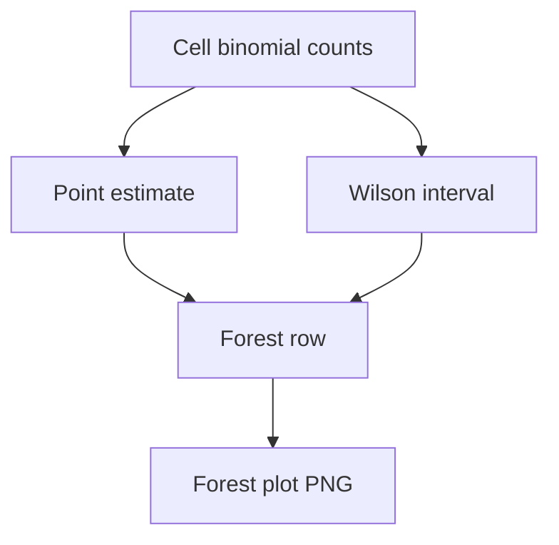

# combined forest wilson unsafe

**Paired asset:** [`combined_forest_wilson_unsafe.png`](combined_forest_wilson_unsafe.png)  
**Repository path:** `figures/multimodel/combined_forest_wilson_unsafe.png`

---

## Document map

| Section | Role |
|---------|------|
| 1. Purpose and graphical encoding | What the figure communicates; axes, marks, and estimands |
| 2. Conceptual diagram | Mermaid schematic from labels or matrices to this graphic |
| 3. Data lineage and definitions | Rubric, artifacts, scope (benchmark-conditional, not population-causal) |
| 4. Reproduction | Commands, flags, environment, and verification |
| 5. Interpretation guide | How to read comparisons; common misinterpretations |
| 6. Limitations and responsible use | Uncertainty, multiplicity, ethics, `SECURITY.md` |
| 7. Related repository artifacts | Canonical docs at repo root and companion index |
| 8. Position in the evaluation stack | How this figure sits between JSON, matrices, and prose |

---

## 1. Purpose and graphical encoding

A **forest plot** (or forest-like interval panel) displays UNSAFE proportions with **Wilson confidence intervals** for many model–category cells at once, prioritizing statistical transparency over compact color fields. Each row typically shows a point estimate and a horizontal interval; longer intervals warn that the effective sample size for that cell is small or the rate is near 0.5. Forests shine in appendices where reviewers demand uncertainty, and in regulatory-style memos where point estimates without intervals are considered incomplete. Unlike heatmaps, forests do not force a colormap choice that might downplay uncertainty; the eye naturally weights wide intervals as less certain. The cost is vertical space: full grids may require multi-page PDFs.

---

## 2. Conceptual diagram

*Reading the diagram.* Arrows show dependency flow from inputs (left/top) to the exported figure. Rounded boxes are logical stages; your codebase may combine several stages in one script.

---

## 3. Data lineage and definitions

Intervals are derived from the same unsafe counts as `signature_rate_matrix.json`, with denominators taken from evaluated prompts after filtering. Wilson intervals are not simultaneous confidence bands across all rows unless you apply a multiplicity correction in post-processing; the plotting script may not do that automatically. If you sort rows by effect size, disclose the sorting rule to avoid post-hoc selection bias narratives. Cells with zero denominators should be omitted or flagged, not drawn as point estimates at arbitrary values.

---

## 4. Reproduction

Create the figure with `python scripts/plot_multimodel_forest_wilson.py` pointed at the unsafe metric inputs. Tune label fonts so model names and categories remain readable when the forest has dozens of rows. For blind review, anonymize model names consistently across all supplementary figures.

---

## 5. Interpretation guide

Non-overlapping intervals provide **weak evidence** of differences for independent samples; for paired prompts, prefer McNemar-style summaries that the PHD companion plots may provide. Do not rank models by counting how many intervals sit above a threshold unless that counting rule was prespecified. Combine with `combined_forest_wilson_risk.png` when PARTIAL mass matters for deployment.

---

## 6. Limitations and responsible use

Forests can reveal rare failure modes—handle associated prompts carefully. `SECURITY.md` applies. Archive the CSV of intervals next to the PNG for reproducibility.

---

## 7. Related repository artifacts and cross-references

Paths are **relative to the `llm-safety-experiment/` repository root** (adjust if this repo is vendored as a subdirectory).

| Artifact | Role |
|-----------|------|
| `PROVENANCE.md` | Frozen results layout, matrix build order, and figure regeneration commands |
| `LABEL_RUBRIC.md` | Definitions of SAFE, PARTIAL, and UNSAFE used in all rates |
| `SECURITY.md` | Policy for storing and sharing prompts and model outputs |
| `figures/FIGURE_COMPANIONS.md` | Machine- and human-readable index of every paired figure companion |
| `INTERPRETABILITY_VIZ.md` | Maps figures to scripts for readers navigating the artifact tree |

---

## 8. Position in the evaluation stack

End-to-end, Multimodel-CEP-Benchmark artifacts typically follow: **raw API completions** → **adjudicated JSON** (per run, under `results/multimodel/…`) → **summarized matrices** such as `figures/multimodel/signature_rate_matrix.json` → **static graphics** (this PNG and siblings) → **narrative report or manuscript**. This figure is an intermediate, **descriptive** layer: it helps researchers **see structure** in a small model panel but does not replace paired inference, error analysis, or operational monitoring on production traffic. Cite the matrix JSON and rubric version alongside the figure whenever the graphic appears in a dissertation chapter or peer-reviewed appendix.

