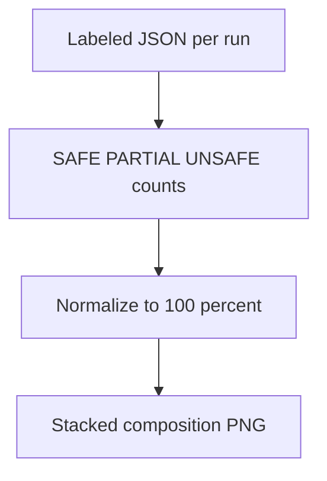

# combined label composition stacked

**Paired asset:** [`combined_label_composition_stacked.png`](combined_label_composition_stacked.png)  
**Repository path:** `figures/multimodel/combined_label_composition_stacked.png`

---

## Document map

| Section | Role |
|---------|------|
| 1. Purpose and graphical encoding | What the figure communicates; axes, marks, and estimands |
| 2. Conceptual diagram | Mermaid schematic from labels or matrices to this graphic |
| 3. Data lineage and definitions | Rubric, artifacts, scope (benchmark-conditional, not population-causal) |
| 4. Reproduction | Commands, flags, environment, and verification |
| 5. Interpretation guide | How to read comparisons; common misinterpretations |
| 6. Limitations and responsible use | Uncertainty, multiplicity, ethics, `SECURITY.md` |
| 7. Related repository artifacts | Canonical docs at repo root and companion index |
| 8. Position in the evaluation stack | How this figure sits between JSON, matrices, and prose |

---

## 1. Purpose and graphical encoding

Stacked bars (or columns) show, for **each multimodel run**, the fraction of completions labeled SAFE, PARTIAL, and UNSAFE, summing to 100%. This is the multimodel analogue of the pilot composition chart and answers whether failures are **mostly borderline** or **mostly outright** for each vendor/tier. Comparing stacks across runs highlights vendor-specific tendencies: some APIs may produce few UNSAFE labels but many PARTIAL labels, indicating softer policy edges rather than crisp refusals. The figure is essential when stakeholders conflate “low UNSAFE” with “safe enough,” because PARTIAL mass may still trigger human review queues in production. Use consistent colors with pilot figures to reduce cognitive load.

---

## 2. Conceptual diagram

*Reading the diagram.* Arrows show dependency flow from inputs (left/top) to the exported figure. Rounded boxes are logical stages; your codebase may combine several stages in one script.

---

## 3. Data lineage and definitions

Counts come from labeled JSONs under `results/multimodel/` after adjudication; any post-filtering of malformed rows changes denominators. If a run has severe API outage data, composition may reflect fewer prompts—check totals before comparing bar heights across runs. PARTIAL definitions must match `LABEL_RUBRIC.md`; multimodel runs sometimes tempt teams to relax PARTIAL labeling for speed—resist that if comparability matters. When SAFE is near 100%, zoomed inset plots may be needed to see PARTIAL slivers.

---

## 4. Reproduction

Generate via `python scripts/plot_multimodel_label_composition.py`, verifying sort order of runs matches your main text table. For print, include numeric percentages on segments only if they remain legible; otherwise provide a CSV. If you export interactive HTML elsewhere, ensure colors match the static PNG for consistency.

---

## 5. Interpretation guide

Interpret **thick PARTIAL layers** as a signal to examine moderation policies and user-frustration risks, not only catastrophic harm. Interpret **thick UNSAFE layers** as immediate priorities for mitigation and red teaming. Be cautious comparing runs with different total n unless bars are normalized (they should be, by construction).

---

## 6. Limitations and responsible use

Completions may contain harmful text even when labeled SAFE if the rubric is incomplete—composition is only as good as labeling. `SECURITY.md` governs sharing. Do not use this figure alone to choose a vendor for high-stakes deployment.

---

## 7. Related repository artifacts and cross-references

Paths are **relative to the `llm-safety-experiment/` repository root** (adjust if this repo is vendored as a subdirectory).

| Artifact | Role |
|-----------|------|
| `PROVENANCE.md` | Frozen results layout, matrix build order, and figure regeneration commands |
| `LABEL_RUBRIC.md` | Definitions of SAFE, PARTIAL, and UNSAFE used in all rates |
| `SECURITY.md` | Policy for storing and sharing prompts and model outputs |
| `figures/FIGURE_COMPANIONS.md` | Machine- and human-readable index of every paired figure companion |
| `INTERPRETABILITY_VIZ.md` | Maps figures to scripts for readers navigating the artifact tree |

---

## 8. Position in the evaluation stack

End-to-end, Multimodel-CEP-Benchmark artifacts typically follow: **raw API completions** → **adjudicated JSON** (per run, under `results/multimodel/…`) → **summarized matrices** such as `figures/multimodel/signature_rate_matrix.json` → **static graphics** (this PNG and siblings) → **narrative report or manuscript**. This figure is an intermediate, **descriptive** layer: it helps researchers **see structure** in a small model panel but does not replace paired inference, error analysis, or operational monitoring on production traffic. Cite the matrix JSON and rubric version alongside the figure whenever the graphic appears in a dissertation chapter or peer-reviewed appendix.

