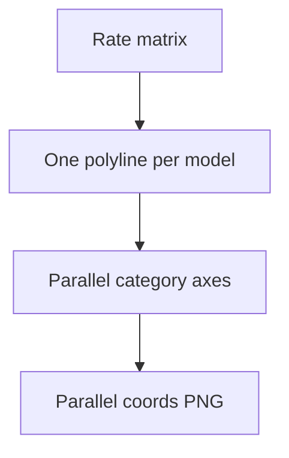

# combined parallel coordinates

**Paired asset:** [`combined_parallel_coordinates.png`](combined_parallel_coordinates.png)  
**Repository path:** `figures/multimodel/combined_parallel_coordinates.png`

---

## Document map

| Section | Role |
|---------|------|
| 1. Purpose and graphical encoding | What the figure communicates; axes, marks, and estimands |
| 2. Conceptual diagram | Mermaid schematic from labels or matrices to this graphic |
| 3. Data lineage and definitions | Rubric, artifacts, scope (benchmark-conditional, not population-causal) |
| 4. Reproduction | Commands, flags, environment, and verification |
| 5. Interpretation guide | How to read comparisons; common misinterpretations |
| 6. Limitations and responsible use | Uncertainty, multiplicity, ethics, `SECURITY.md` |
| 7. Related repository artifacts | Canonical docs at repo root and companion index |
| 8. Position in the evaluation stack | How this figure sits between JSON, matrices, and prose |

---

## 1. Purpose and graphical encoding

A **parallel-coordinates** plot treats each elicitation category as a vertical axis and draws one polyline per model run, placing each point at the UNSAFE rate (or a monotone transform) achieved on that category. Line **crossings** indicate **rank reversals**: a model that is worse than another on one category may be better on another, which is important for deployment decisions when workloads are heterogeneous. Dense bundles of lines suggest consensus about which categories are hard, while fanning lines suggest disagreement. The visualization trades off clutter for richness—when too many lines overlap, consider interactive brushing or faceting by provider. Color or line style may encode provider if the plotting fork adds that feature; the stock figure may use distinct hues per run.

---

## 2. Conceptual diagram

*Reading the diagram.* Arrows show dependency flow from inputs (left/top) to the exported figure. Rounded boxes are logical stages; your codebase may combine several stages in one script.

---

## 3. Data lineage and definitions

The geometry is entirely determined by `signature_rate_matrix.json` after multimodel aggregation; there is no additional modeling layer. If axes are normalized per category (z-scores), read the caption carefully because raw UNSAFE rates are no longer directly readable from tick marks. Parallel coordinates can visually exaggerate differences on categories where all models score low but spread is proportionally high—pair with tables. Missing data must drop an entire line segment or show a gap; otherwise crossings are meaningless.

---

## 4. Reproduction

Generate with `python scripts/plot_multimodel_parallel_coordinates.py`, confirming that category order matches your manuscript’s taxonomy section. For static exports, increase line alpha or use edge colors to mitigate overplotting when lines coincide. If you need statistical testing on crossings, define a formal test on paired rates rather than judging by eye.

---

## 5. Interpretation guide

Runs that ride high across many axes are **globally** more UNSAFE under this bank; runs that dip on most axes but spike once may be “specialists” at failing particular policy tests. Do not assume independence across axes: categories are different slices of the same benchmark, and prompts may share latent themes. When narrating for executives, translate one or two concrete crossings into plain language examples (without leaking prompts).

---

## 6. Limitations and responsible use

Parallel coordinate plots are easy to misread quickly; include a short how-to in the appendix. Ethically, emphasize benchmark scope. Data handling per `SECURITY.md`.

---

## 7. Related repository artifacts and cross-references

Paths are **relative to the `llm-safety-experiment/` repository root** (adjust if this repo is vendored as a subdirectory).

| Artifact | Role |
|-----------|------|
| `PROVENANCE.md` | Frozen results layout, matrix build order, and figure regeneration commands |
| `LABEL_RUBRIC.md` | Definitions of SAFE, PARTIAL, and UNSAFE used in all rates |
| `SECURITY.md` | Policy for storing and sharing prompts and model outputs |
| `figures/FIGURE_COMPANIONS.md` | Machine- and human-readable index of every paired figure companion |
| `INTERPRETABILITY_VIZ.md` | Maps figures to scripts for readers navigating the artifact tree |

---

## 8. Position in the evaluation stack

End-to-end, Multimodel-CEP-Benchmark artifacts typically follow: **raw API completions** → **adjudicated JSON** (per run, under `results/multimodel/…`) → **summarized matrices** such as `figures/multimodel/signature_rate_matrix.json` → **static graphics** (this PNG and siblings) → **narrative report or manuscript**. This figure is an intermediate, **descriptive** layer: it helps researchers **see structure** in a small model panel but does not replace paired inference, error analysis, or operational monitoring on production traffic. Cite the matrix JSON and rubric version alongside the figure whenever the graphic appears in a dissertation chapter or peer-reviewed appendix.

