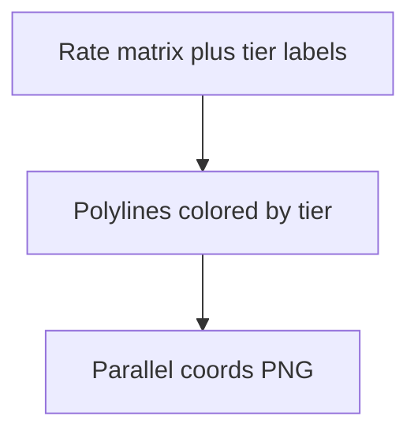

# combined parallel coordinates by tier

**Paired asset:** [`combined_parallel_coordinates_by_tier.png`](combined_parallel_coordinates_by_tier.png)  
**Repository path:** `figures/multimodel/combined_parallel_coordinates_by_tier.png`

---

## Document map

| Section | Role |
|---------|------|
| 1. Purpose and graphical encoding | What the figure communicates; axes, marks, and estimands |
| 2. Conceptual diagram | Mermaid schematic from labels or matrices to this graphic |
| 3. Data lineage and definitions | Rubric, artifacts, scope (benchmark-conditional, not population-causal) |
| 4. Reproduction | Commands, flags, environment, and verification |
| 5. Interpretation guide | How to read comparisons; common misinterpretations |
| 6. Limitations and responsible use | Uncertainty, multiplicity, ethics, `SECURITY.md` |
| 7. Related repository artifacts | Canonical docs at repo root and companion index |
| 8. Position in the evaluation stack | How this figure sits between JSON, matrices, and prose |

---

## 1. Purpose and graphical encoding

This variant augments parallel coordinates by **coloring lines according to commercial tier** (cheap vs mid vs expensive) rather than only by model identity. The goal is to visualize whether **price segmentation** correlates with safety profiles under the benchmark: do budget endpoints cluster in the upper envelope of UNSAFE rates, or do expensive endpoints separate cleanly? Because tier and provider are partially aligned in the nine-run design, color clusters may reflect vendor identity as much as list price—disentangling those requires careful prose or additional model covariates. The figure is best used to **motivate** tier-stratified analyses (forests, regressions) rather than to certify causal effects of pricing. If two lines share a color, ensure the legend encodes provider as well or readers will confuse distinct APIs.

---

## 2. Conceptual diagram

*Reading the diagram.* Arrows show dependency flow from inputs (left/top) to the exported figure. Rounded boxes are logical stages; your codebase may combine several stages in one script.

---

## 3. Data lineage and definitions

Data are identical to the uncolored parallel-coordinates plot; only the aesthetic mapping changes. If tiers were relabeled between API pricing updates, regenerate labels from the frozen configuration JSON rather than hand-editing the figure. When tiers have unequal counts (here, three per tier in the canonical grid), avoid implying balanced sampling beyond the design. Document whether rates on axes are raw or variance-stabilized.

---

## 4. Reproduction

Run `plot_multimodel_parallel_coordinates.py` with `--color-by tier` or the equivalent flag documented in `--help`. Validate colorblind palettes; tier is nominal, so hue choices should maximize discriminability. Export a grayscale test slide before conference projection on unknown equipment.

---

## 5. Interpretation guide

Read **vertical banding** of colors as tier-related clustering, but test statistically before claiming “cheaper models are less safe.” Consider interactions: a cheap model from vendor A may outperform an expensive model from vendor B, undermining simplistic tier narratives. Pair with `phd_tier_provider_interaction_unsafe.png` if available.

---

## 6. Limitations and responsible use

Tier is not randomized; respect `SECURITY.md`; avoid implying vendor malice from descriptive plots.

---

## 7. Related repository artifacts and cross-references

Paths are **relative to the `llm-safety-experiment/` repository root** (adjust if this repo is vendored as a subdirectory).

| Artifact | Role |
|-----------|------|
| `PROVENANCE.md` | Frozen results layout, matrix build order, and figure regeneration commands |
| `LABEL_RUBRIC.md` | Definitions of SAFE, PARTIAL, and UNSAFE used in all rates |
| `SECURITY.md` | Policy for storing and sharing prompts and model outputs |
| `figures/FIGURE_COMPANIONS.md` | Machine- and human-readable index of every paired figure companion |
| `INTERPRETABILITY_VIZ.md` | Maps figures to scripts for readers navigating the artifact tree |

---

## 8. Position in the evaluation stack

End-to-end, Multimodel-CEP-Benchmark artifacts typically follow: **raw API completions** → **adjudicated JSON** (per run, under `results/multimodel/…`) → **summarized matrices** such as `figures/multimodel/signature_rate_matrix.json` → **static graphics** (this PNG and siblings) → **narrative report or manuscript**. This figure is an intermediate, **descriptive** layer: it helps researchers **see structure** in a small model panel but does not replace paired inference, error analysis, or operational monitoring on production traffic. Cite the matrix JSON and rubric version alongside the figure whenever the graphic appears in a dissertation chapter or peer-reviewed appendix.

