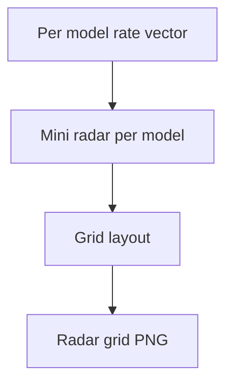

# combined radar grid unsafe

**Paired asset:** [`combined_radar_grid_unsafe.png`](combined_radar_grid_unsafe.png)  
**Repository path:** `figures/multimodel/combined_radar_grid_unsafe.png`

---

## Document map

| Section | Role |
|---------|------|
| 1. Purpose and graphical encoding | What the figure communicates; axes, marks, and estimands |
| 2. Conceptual diagram | Mermaid schematic from labels or matrices to this graphic |
| 3. Data lineage and definitions | Rubric, artifacts, scope (benchmark-conditional, not population-causal) |
| 4. Reproduction | Commands, flags, environment, and verification |
| 5. Interpretation guide | How to read comparisons; common misinterpretations |
| 6. Limitations and responsible use | Uncertainty, multiplicity, ethics, `SECURITY.md` |
| 7. Related repository artifacts | Canonical docs at repo root and companion index |
| 8. Position in the evaluation stack | How this figure sits between JSON, matrices, and prose |

---

## 1. Purpose and graphical encoding

This figure is a **small-multiples** layout of radar plots: each subplot shows one model’s UNSAFE profile across elicitation categories, echoing the pilot fingerprint radar but scaled to compare nine APIs on one page. The value of the grid is **pattern parallelism**—you can see whether models share the same “spiky” categories or whether failures are idiosyncratic. Because each radar is small, the graphic belongs in exploratory analysis, internal reviews, or supplementary PDFs rather than as the sole evidence for fine quantitative claims. Axis scaling is typically shared or normalized across subplots so that shapes are comparable; if scaling differs, the caption must say so or readers will mis-rank models. Use this figure when heatmaps feel too abstract for stakeholders who prefer geometric intuition.

---

## 2. Conceptual diagram

*Reading the diagram.* Arrows show dependency flow from inputs (left/top) to the exported figure. Rounded boxes are logical stages; your codebase may combine several stages in one script.

---

## 3. Data lineage and definitions

Each mini radar is fed by the same category-level UNSAFE proportions that populate `signature_rate_matrix.json` (or a tensor derived from it). If categories are reordered around the circle differently across subplots, that is a bug—radar comparability requires consistent angular positions. Zeros and ones on the boundary of rates can distort polygon corners; some code paths clip or smooth—verify against tables. When a model has missing categories due to failed runs, imputation or gaps should be explicit rather than silently drawing a misleading polygon.

---

## 4. Reproduction

Rebuild using `python scripts/plot_multimodel_radar_grid.py`, ensuring matplotlib has a reproducible random seed if jitter is used for label positions. For presentations, export high-DPI PNG or PDF; for the paper, consider moving key panels to full-width vector figures if detail matters. If file size explodes because of nine high-resolution rasters, downsample for web but keep archival copies.

---

## 5. Interpretation guide

Interpretation should emphasize **qualitative similarity** (“these three models spike on the same wedge of categories”) rather than ranking models by polygon area. Cross-check any surprising ordering with the nine-panel bar chart, which is usually easier for precise comparisons. Avoid claiming statistical significance from visual overlap of polygons.

---

## 6. Limitations and responsible use

Radar grids can inadvertently highlight sensitive categories by name; redact or aggregate labels if needed. Follow `SECURITY.md` for underlying data. Remember that nine models is a tiny sample of the market; external validity is limited.

---

## 7. Related repository artifacts and cross-references

Paths are **relative to the `llm-safety-experiment/` repository root** (adjust if this repo is vendored as a subdirectory).

| Artifact | Role |
|-----------|------|
| `PROVENANCE.md` | Frozen results layout, matrix build order, and figure regeneration commands |
| `LABEL_RUBRIC.md` | Definitions of SAFE, PARTIAL, and UNSAFE used in all rates |
| `SECURITY.md` | Policy for storing and sharing prompts and model outputs |
| `figures/FIGURE_COMPANIONS.md` | Machine- and human-readable index of every paired figure companion |
| `INTERPRETABILITY_VIZ.md` | Maps figures to scripts for readers navigating the artifact tree |

---

## 8. Position in the evaluation stack

End-to-end, Multimodel-CEP-Benchmark artifacts typically follow: **raw API completions** → **adjudicated JSON** (per run, under `results/multimodel/…`) → **summarized matrices** such as `figures/multimodel/signature_rate_matrix.json` → **static graphics** (this PNG and siblings) → **narrative report or manuscript**. This figure is an intermediate, **descriptive** layer: it helps researchers **see structure** in a small model panel but does not replace paired inference, error analysis, or operational monitoring on production traffic. Cite the matrix JSON and rubric version alongside the figure whenever the graphic appears in a dissertation chapter or peer-reviewed appendix.

