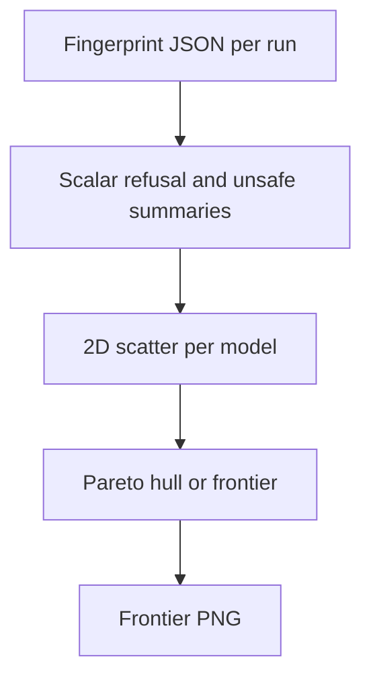

# combined safety frontier

**Paired asset:** [`combined_safety_frontier.png`](combined_safety_frontier.png)  
**Repository path:** `figures/multimodel/combined_safety_frontier.png`

---

## Document map

| Section | Role |
|---------|------|
| 1. Purpose and graphical encoding | What the figure communicates; axes, marks, and estimands |
| 2. Conceptual diagram | Mermaid schematic from labels or matrices to this graphic |
| 3. Data lineage and definitions | Rubric, artifacts, scope (benchmark-conditional, not population-causal) |
| 4. Reproduction | Commands, flags, environment, and verification |
| 5. Interpretation guide | How to read comparisons; common misinterpretations |
| 6. Limitations and responsible use | Uncertainty, multiplicity, ethics, `SECURITY.md` |
| 7. Related repository artifacts | Canonical docs at repo root and companion index |
| 8. Position in the evaluation stack | How this figure sits between JSON, matrices, and prose |

---

## 1. Purpose and graphical encoding

The **safety frontier** figure places each model run as a point in a **two-objective** plane, commonly trading off a **refusal or abstention metric** (higher is “safer” under the project’s definition) against an **UNSAFE or risk rate** (lower is better). A **Pareto-style hull** or envelope highlights runs that are not uniformly dominated: no other run is strictly better on both axes simultaneously under the plotted metrics. Points inside the hull are **dominated** in this narrow mathematical sense, though dominated models might still be preferable for non-safety reasons (latency, cost) not shown on the axes. The figure is rhetorically powerful but **metric-dependent**: changing how refusal is measured—or normalizing rates differently—can reshuffle who lies on the frontier. Always publish the exact formulas for both axes and any smoothing or winsorization applied to fingerprint statistics.

---

## 2. Conceptual diagram

*Reading the diagram.* Arrows show dependency flow from inputs (left/top) to the exported figure. Rounded boxes are logical stages; your codebase may combine several stages in one script.

---

## 3. Data lineage and definitions

Inputs are derived from **fingerprint** summaries—category-wise traces of refusal, UNSAFE, and risk—aggregated into scalars per model, typically after `fingerprint_all_multimodel.py` materializes JSON and `plot_safety_frontier.py` consumes it. If fingerprints omit categories due to errors, frontier points move; validate completeness. Some pipelines use convex hulls; others use epsilon-non-dominated sets; specify which. If you plot confidence clouds rather than points, say how uncertainty was propagated—analytic deltas, bootstrap, or Bayesian draws.

---

## 4. Reproduction

Typical commands: `python scripts/fingerprint_all_multimodel.py` followed by `python scripts/plot_safety_frontier.py`, with paths documented in `--help`. Archive the intermediate fingerprint JSON alongside the PNG so the frontier can be reproduced after font tweaks without recomputing fingerprints. For presentations, label each point with anonymized IDs if blind review requires it.

---

## 5. Interpretation guide

On the frontier, emphasize **trade-offs**, not “winners” in a moral sense—different deployments weigh refusal versus helpfulness differently. Interior points may dominate on axes you did not plot (e.g., calibration, fairness), so avoid shaming vendors with partial objectives. Discuss whether refusal itself can harm users (over-refusal) if that debate matters to your audience.

---

## 6. Limitations and responsible use

Frontier plots can be misread as comprehensive safety rankings—contextualize heavily. `SECURITY.md` for underlying completions. Update the figure whenever fingerprint definitions change.

---

## 7. Related repository artifacts and cross-references

Paths are **relative to the `llm-safety-experiment/` repository root** (adjust if this repo is vendored as a subdirectory).

| Artifact | Role |
|-----------|------|
| `PROVENANCE.md` | Frozen results layout, matrix build order, and figure regeneration commands |
| `LABEL_RUBRIC.md` | Definitions of SAFE, PARTIAL, and UNSAFE used in all rates |
| `SECURITY.md` | Policy for storing and sharing prompts and model outputs |
| `figures/FIGURE_COMPANIONS.md` | Machine- and human-readable index of every paired figure companion |
| `INTERPRETABILITY_VIZ.md` | Maps figures to scripts for readers navigating the artifact tree |

---

## 8. Position in the evaluation stack

End-to-end, Multimodel-CEP-Benchmark artifacts typically follow: **raw API completions** → **adjudicated JSON** (per run, under `results/multimodel/…`) → **summarized matrices** such as `figures/multimodel/signature_rate_matrix.json` → **static graphics** (this PNG and siblings) → **narrative report or manuscript**. This figure is an intermediate, **descriptive** layer: it helps researchers **see structure** in a small model panel but does not replace paired inference, error analysis, or operational monitoring on production traffic. Cite the matrix JSON and rubric version alongside the figure whenever the graphic appears in a dissertation chapter or peer-reviewed appendix.

