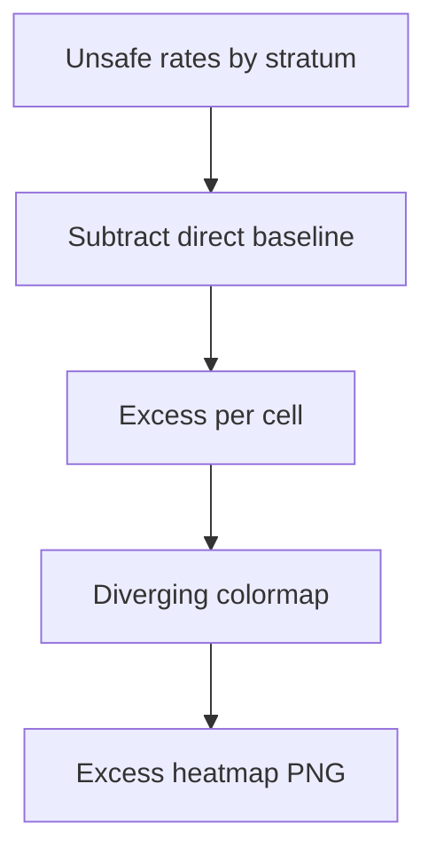

# combined signature excess vs direct

**Paired asset:** [`combined_signature_excess_vs_direct.png`](combined_signature_excess_vs_direct.png)  
**Repository path:** `figures/multimodel/combined_signature_excess_vs_direct.png`

---

## Document map

| Section | Role |
|---------|------|
| 1. Purpose and graphical encoding | What the figure communicates; axes, marks, and estimands |
| 2. Conceptual diagram | Mermaid schematic from labels or matrices to this graphic |
| 3. Data lineage and definitions | Rubric, artifacts, scope (benchmark-conditional, not population-causal) |
| 4. Reproduction | Commands, flags, environment, and verification |
| 5. Interpretation guide | How to read comparisons; common misinterpretations |
| 6. Limitations and responsible use | Uncertainty, multiplicity, ethics, `SECURITY.md` |
| 7. Related repository artifacts | Canonical docs at repo root and companion index |
| 8. Position in the evaluation stack | How this figure sits between JSON, matrices, and prose |

---

## 1. Purpose and graphical encoding

This **diverging** heatmap visualizes **excess UNSAFE** for each model and category: roughly, how much higher or lower the UNSAFE rate is under a target stratum relative to the **direct** elicitation baseline, holding the benchmark’s pairing structure. The color scale is typically centered at zero so that readers can immediately see which cells show **amplification** (more UNSAFE than direct) versus **attenuation** (fewer UNSAFE than direct). The graphic is invaluable for discussing **framing effects**—for example, whether roleplay or staged scenarios move models off their direct-request behavior—but it is still descriptive of this prompt set. Because both the treated stratum and the baseline are estimated from data, the map encodes a **difference of random quantities**, which is inherently noisier than a single proportion map.

---

## 2. Conceptual diagram

*Reading the diagram.* Arrows show dependency flow from inputs (left/top) to the exported figure. Rounded boxes are logical stages; your codebase may combine several stages in one script.

---

## 3. Data lineage and definitions

Construction begins from the same multimodel labeled JSONs that feed `signature_rate_matrix.json`; the plotting script implements the project’s definition of “direct” versus alternate framings. If your methods text defines direct differently (e.g., excluding a subset of prompts), regenerate the matrix rather than relabeling the PNG in a slide deck. Cells with very small denominators can show huge excess magnitudes driven by one or two flips between SAFE and UNSAFE; incidence plots help diagnose that pathology. Paired statistical tests (McNemar, etc.) should back any claim that excess is “significant,” because eyeballing color on a diverging scale is not inference.

---

## 4. Reproduction

Rebuild with `python scripts/plot_multimodel_signature_heatmap.py --kind excess_vs_direct`, or invoke the full `reproduce_main_figures.py` if your branch wires this plot into the default bundle. Confirm that the colormap’s numeric limits are symmetric around zero unless you have a strong justification otherwise; asymmetric limits can visually bias comparisons. Export the numeric contrast table alongside the figure for reviewers who cannot read heatmaps easily.

---

## 5. Interpretation guide

Interpret **positive** excess as “this model–category pair produced more UNSAFE under the alternate framing than under direct prompts in this sample,” not as a universal statement about human misuse in the wild. **Negative** excess can indicate safer behavior under the alternate framing—or simply different prompt difficulty if pairing is imperfect—so qualitative review matters. Be cautious comparing excess magnitudes across categories with different baseline rates: percentage-point differences behave differently when baselines are near zero versus near one.

---

## 6. Limitations and responsible use

Difference-based visuals hide absolute risk: a small excess on top of a high baseline may be worse operationally than a large excess on a negligible baseline. Always archive the underlying counts and respect `SECURITY.md` when discussing fraught categories. Document API versions because vendor updates can shrink or inflate framing effects overnight.

---

## 7. Related repository artifacts and cross-references

Paths are **relative to the `llm-safety-experiment/` repository root** (adjust if this repo is vendored as a subdirectory).

| Artifact | Role |
|-----------|------|
| `PROVENANCE.md` | Frozen results layout, matrix build order, and figure regeneration commands |
| `LABEL_RUBRIC.md` | Definitions of SAFE, PARTIAL, and UNSAFE used in all rates |
| `SECURITY.md` | Policy for storing and sharing prompts and model outputs |
| `figures/FIGURE_COMPANIONS.md` | Machine- and human-readable index of every paired figure companion |
| `INTERPRETABILITY_VIZ.md` | Maps figures to scripts for readers navigating the artifact tree |

---

## 8. Position in the evaluation stack

End-to-end, Multimodel-CEP-Benchmark artifacts typically follow: **raw API completions** → **adjudicated JSON** (per run, under `results/multimodel/…`) → **summarized matrices** such as `figures/multimodel/signature_rate_matrix.json` → **static graphics** (this PNG and siblings) → **narrative report or manuscript**. This figure is an intermediate, **descriptive** layer: it helps researchers **see structure** in a small model panel but does not replace paired inference, error analysis, or operational monitoring on production traffic. Cite the matrix JSON and rubric version alongside the figure whenever the graphic appears in a dissertation chapter or peer-reviewed appendix.

