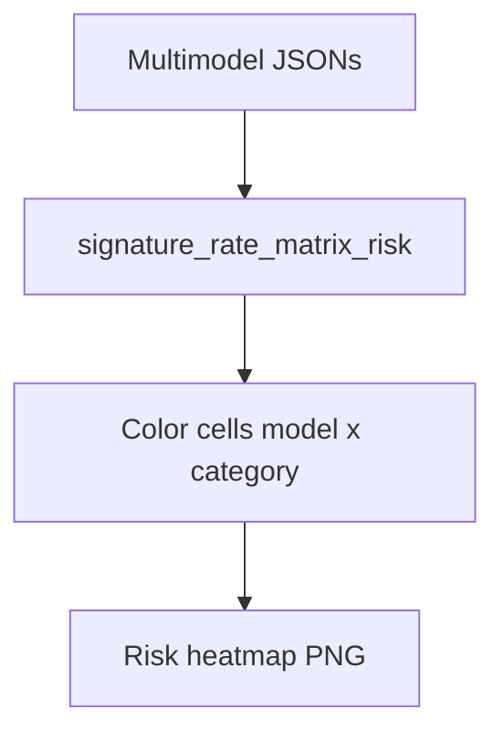

# combined signature risk heatmap

**Paired asset:** [`combined_signature_risk_heatmap.png`](combined_signature_risk_heatmap.png)  
**Repository path:** `figures/multimodel/combined_signature_risk_heatmap.png`

---

## Document map

| Section | Role |
|---------|------|
| 1. Purpose and graphical encoding | What the figure communicates; axes, marks, and estimands |
| 2. Conceptual diagram | Mermaid schematic from labels or matrices to this graphic |
| 3. Data lineage and definitions | Rubric, artifacts, scope (benchmark-conditional, not population-causal) |
| 4. Reproduction | Commands, flags, environment, and verification |
| 5. Interpretation guide | How to read comparisons; common misinterpretations |
| 6. Limitations and responsible use | Uncertainty, multiplicity, ethics, `SECURITY.md` |
| 7. Related repository artifacts | Canonical docs at repo root and companion index |
| 8. Position in the evaluation stack | How this figure sits between JSON, matrices, and prose |

---

## 1. Purpose and graphical encoding

This heatmap mirrors the unsafe signature map but uses a **risk** outcome defined as **PARTIAL ∪ UNSAFE** under `LABEL_RUBRIC.md`, i.e., any completion that is not cleanly SAFE. The motivation is operational: many deployments care about borderline compliance even when a completion is not a “full” UNSAFE violation. Visually, you should expect risk cells to be **numerically larger** than unsafe cells in the same positions, with the gap indicating how much mass lives in PARTIAL. Hot spots here highlight categories where models hedge, partially comply, or soft-refuse in ways that may still be problematic in product settings. Comparing the risk heatmap to the unsafe heatmap side-by-side is one of the fastest ways to communicate “UNSAFE-only metrics understate stress in category X.”

---

## 2. Conceptual diagram

*Reading the diagram.* Arrows show dependency flow from inputs (left/top) to the exported figure. Rounded boxes are logical stages; your codebase may combine several stages in one script.

---

## 3. Data lineage and definitions

The matrix is stored at `figures/multimodel/signature_rate_matrix_risk.json`, produced once the risk aggregator has processed the same multimodel JSON corpus as the unsafe matrix. Risk is not a universal concept—document your PARTIAL definition carefully because stakeholders may assume risk means malware or violence when you mean “any non-SAFE rubric bucket.” If PARTIAL labels are noisier than UNSAFE labels, risk heatmaps inherit that noise; inter-annotator disagreement metrics belong in the appendix. Gemini-related caveats about tier labeling apply equally here; mislabeling a tier can falsely imply a price band effect.

---

## 4. Reproduction

Regenerate using the multimodel heatmap script pointed at the risk JSON (`--kind raw` or the documented flag for risk), or rely on `reproduce_main_figures.py` if it already sequences that build. Ensure you do not accidentally pass the unsafe JSON into the risk plotter—the colormap may still look plausible while being wrong. After regeneration, diff the JSON against prior commits if you need to explain shifts between arXiv v1 and v2.

---

## 5. Interpretation guide

When reading, prioritize **category-specific** comparisons across models rather than ranking models on a single scalar unless you define such a scalar in methods. Be explicit that risk includes PARTIAL, so security teams should not conflate this map with incident rates of overtly illegal instructions. Pair with `combined_label_composition_stacked.png` to see whether risk is PARTIAL-driven or UNSAFE-driven for a given vendor.

---

## 6. Limitations and responsible use

Changing PARTIAL criteria between paper versions invalidates cross-version comparisons; version the rubric. Ethically, risk heatmaps can look alarming—contextualize with benchmark intent and follow `SECURITY.md` for data handling.

---

## 7. Related repository artifacts and cross-references

Paths are **relative to the `llm-safety-experiment/` repository root** (adjust if this repo is vendored as a subdirectory).

| Artifact | Role |
|-----------|------|
| `PROVENANCE.md` | Frozen results layout, matrix build order, and figure regeneration commands |
| `LABEL_RUBRIC.md` | Definitions of SAFE, PARTIAL, and UNSAFE used in all rates |
| `SECURITY.md` | Policy for storing and sharing prompts and model outputs |
| `figures/FIGURE_COMPANIONS.md` | Machine- and human-readable index of every paired figure companion |
| `INTERPRETABILITY_VIZ.md` | Maps figures to scripts for readers navigating the artifact tree |

---

## 8. Position in the evaluation stack

End-to-end, Multimodel-CEP-Benchmark artifacts typically follow: **raw API completions** → **adjudicated JSON** (per run, under `results/multimodel/…`) → **summarized matrices** such as `figures/multimodel/signature_rate_matrix.json` → **static graphics** (this PNG and siblings) → **narrative report or manuscript**. This figure is an intermediate, **descriptive** layer: it helps researchers **see structure** in a small model panel but does not replace paired inference, error analysis, or operational monitoring on production traffic. Cite the matrix JSON and rubric version alongside the figure whenever the graphic appears in a dissertation chapter or peer-reviewed appendix.

