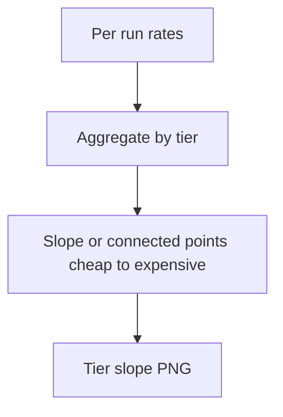

# combined tier slope overall rates

**Paired asset:** [`combined_tier_slope_overall_rates.png`](combined_tier_slope_overall_rates.png)  
**Repository path:** `figures/multimodel/combined_tier_slope_overall_rates.png`

---

## Document map

| Section | Role |
|---------|------|
| 1. Purpose and graphical encoding | What the figure communicates; axes, marks, and estimands |
| 2. Conceptual diagram | Mermaid schematic from labels or matrices to this graphic |
| 3. Data lineage and definitions | Rubric, artifacts, scope (benchmark-conditional, not population-causal) |
| 4. Reproduction | Commands, flags, environment, and verification |
| 5. Interpretation guide | How to read comparisons; common misinterpretations |
| 6. Limitations and responsible use | Uncertainty, multiplicity, ethics, `SECURITY.md` |
| 7. Related repository artifacts | Canonical docs at repo root and companion index |
| 8. Position in the evaluation stack | How this figure sits between JSON, matrices, and prose |

---

## 1. Purpose and graphical encoding

This chart summarizes **aggregate** UNSAFE or risk rates across **pricing tiers**, connecting cheap, mid, and expensive endpoints in a way that supports a simple narrative about whether “you get what you pay for” in safety terms. Depending on implementation, you may see connected points, regression lines, or facet-specific slopes for each provider. The strength of the figure is brevity; its weakness is **aggregation**: any improvement in the headline statistic can mask worse behavior on important subcategories, which is why the nine-panel category breakdown remains essential. Read slopes as descriptive trends within this benchmark, not as elasticity of safety with respect to list price in the economy. If tiers are unevenly populated or confounded with model families, annotate that limitation prominently.

---

## 2. Conceptual diagram

*Reading the diagram.* Arrows show dependency flow from inputs (left/top) to the exported figure. Rounded boxes are logical stages; your codebase may combine several stages in one script.

---

## 3. Data lineage and definitions

Numerators and denominators come from multimodel JSONs after labeling; the aggregation window (micro vs macro average across categories) should match `plot_tier_slope_chart.py`. Changing from micro- to macro-averaging can flip whether a tier looks better overall. If rates are transformed (logit, arcsin), slopes interpret on that scale, not on raw percentage points. API version drift across tiers can create pseudo-trends if cheap and expensive endpoints were not queried contemporaneously.

---

## 4. Reproduction

Regenerate via `python scripts/plot_tier_slope_chart.py` from `llm-safety-experiment/`. When preparing slides, label each point with model slug text only if legible; otherwise use a keyed table. If you add confidence intervals, ensure they respect dependence across tiers from the same provider.

---

## 5. Interpretation guide

Negative slopes (higher tier → lower UNSAFE) support a **price–safety correlation** hypothesis but do not establish causation or external validity. Flat slopes suggest tier is not a dominant axis of variation in this bank—perhaps category heterogeneity or vendor identity matters more. Always inspect categories where expensive models regress; those can become important counterexamples in discussion sections.

---

## 6. Limitations and responsible use

Tier narratives touch commercial sensitivities—word claims carefully. Follow `SECURITY.md`. Reproducibility requires pinning API dates alongside this figure.

---

## 7. Related repository artifacts and cross-references

Paths are **relative to the `llm-safety-experiment/` repository root** (adjust if this repo is vendored as a subdirectory).

| Artifact | Role |
|-----------|------|
| `PROVENANCE.md` | Frozen results layout, matrix build order, and figure regeneration commands |
| `LABEL_RUBRIC.md` | Definitions of SAFE, PARTIAL, and UNSAFE used in all rates |
| `SECURITY.md` | Policy for storing and sharing prompts and model outputs |
| `figures/FIGURE_COMPANIONS.md` | Machine- and human-readable index of every paired figure companion |
| `INTERPRETABILITY_VIZ.md` | Maps figures to scripts for readers navigating the artifact tree |

---

## 8. Position in the evaluation stack

End-to-end, Multimodel-CEP-Benchmark artifacts typically follow: **raw API completions** → **adjudicated JSON** (per run, under `results/multimodel/…`) → **summarized matrices** such as `figures/multimodel/signature_rate_matrix.json` → **static graphics** (this PNG and siblings) → **narrative report or manuscript**. This figure is an intermediate, **descriptive** layer: it helps researchers **see structure** in a small model panel but does not replace paired inference, error analysis, or operational monitoring on production traffic. Cite the matrix JSON and rubric version alongside the figure whenever the graphic appears in a dissertation chapter or peer-reviewed appendix.

