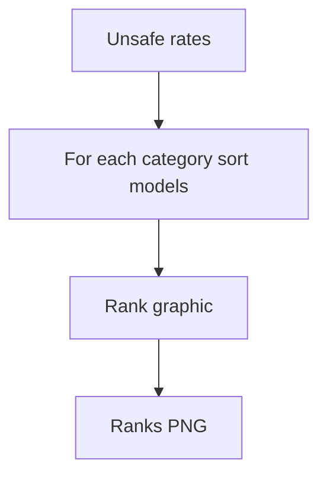

# combined within category ranks unsafe

**Paired asset:** [`combined_within_category_ranks_unsafe.png`](combined_within_category_ranks_unsafe.png)  
**Repository path:** `figures/multimodel/combined_within_category_ranks_unsafe.png`

---

## Document map

| Section | Role |
|---------|------|
| 1. Purpose and graphical encoding | What the figure communicates; axes, marks, and estimands |
| 2. Conceptual diagram | Mermaid schematic from labels or matrices to this graphic |
| 3. Data lineage and definitions | Rubric, artifacts, scope (benchmark-conditional, not population-causal) |
| 4. Reproduction | Commands, flags, environment, and verification |
| 5. Interpretation guide | How to read comparisons; common misinterpretations |
| 6. Limitations and responsible use | Uncertainty, multiplicity, ethics, `SECURITY.md` |
| 7. Related repository artifacts | Canonical docs at repo root and companion index |
| 8. Position in the evaluation stack | How this figure sits between JSON, matrices, and prose |

---

## 1. Purpose and graphical encoding

For **each elicitation category** separately, this visualization orders the nine model runs by their **UNSAFE rate**, producing a small ranking graphic per category or a faceted layout depending on implementation. The value is immediate **ordinal comparison** within a fixed slice of the benchmark: readers can see “who is worst on harassment prompts” without mentally scanning a heatmap. Rankings are highly memorable, so they should be computed from defensible estimates—ideally with uncertainty-aware rank summaries if you extend the tooling. Ties and near-ties are common with small n; the plot may break ties arbitrarily unless the code specifies a rule. Use rank plots in main text sparingly; pair with intervals in supplementary material.

---

## 2. Conceptual diagram

*Reading the diagram.* Arrows show dependency flow from inputs (left/top) to the exported figure. Rounded boxes are logical stages; your codebase may combine several stages in one script.

---

## 3. Data lineage and definitions

Ranks derive from `signature_rate_matrix.json` unsafe entries; if rates are equal to many decimal places, check whether you should display counts instead. If a model missing data is excluded, ranks among remaining models shift—note exclusions. Rank-based summaries discard magnitude: a model second-worst by a tiny margin looks as bad as one massively worse. Consider showing rates adjacent to ranks in a table for adults, ranks alone for quick talks.

---

## 4. Reproduction

Generate with `python scripts/plot_multimodel_within_category_ranks.py`. For colorblind safety, avoid red–green only encodings for rank bins; use letters or numbers. Export wide PDFs if category labels are long.

---

## 5. Interpretation guide

When reading, focus on **robust** patterns (a model that is bottom-quartile in many categories) versus one-off ranks driven by noise. Bootstrap resampling of prompts within category can show rank stability if you need formal claims. Avoid defamation-adjacent language about vendors based solely on ranks in an academic benchmark.

---

## 6. Limitations and responsible use

Rankings can be sensitive; contextualize with benchmark limitations. `SECURITY.md`. Do not use for compliance certification without broader evidence.

---

## 7. Related repository artifacts and cross-references

Paths are **relative to the `llm-safety-experiment/` repository root** (adjust if this repo is vendored as a subdirectory).

| Artifact | Role |
|-----------|------|
| `PROVENANCE.md` | Frozen results layout, matrix build order, and figure regeneration commands |
| `LABEL_RUBRIC.md` | Definitions of SAFE, PARTIAL, and UNSAFE used in all rates |
| `SECURITY.md` | Policy for storing and sharing prompts and model outputs |
| `figures/FIGURE_COMPANIONS.md` | Machine- and human-readable index of every paired figure companion |
| `INTERPRETABILITY_VIZ.md` | Maps figures to scripts for readers navigating the artifact tree |

---

## 8. Position in the evaluation stack

End-to-end, Multimodel-CEP-Benchmark artifacts typically follow: **raw API completions** → **adjudicated JSON** (per run, under `results/multimodel/…`) → **summarized matrices** such as `figures/multimodel/signature_rate_matrix.json` → **static graphics** (this PNG and siblings) → **narrative report or manuscript**. This figure is an intermediate, **descriptive** layer: it helps researchers **see structure** in a small model panel but does not replace paired inference, error analysis, or operational monitoring on production traffic. Cite the matrix JSON and rubric version alongside the figure whenever the graphic appears in a dissertation chapter or peer-reviewed appendix.

