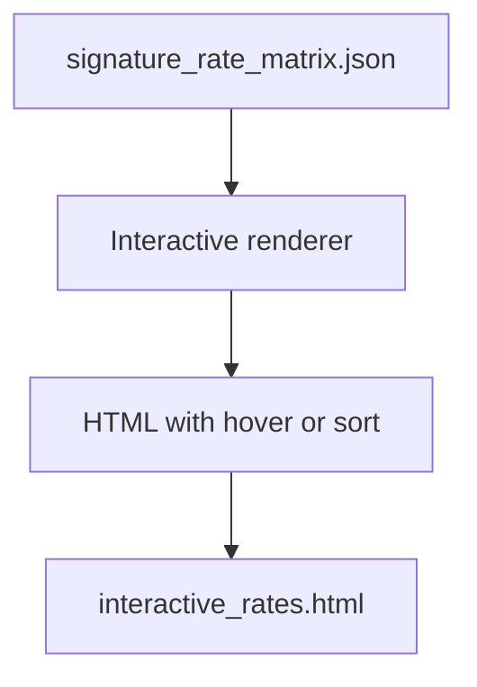

# interactive rates

**Paired asset:** [`interactive_rates.html`](interactive_rates.html)  
**Repository path:** `figures/multimodel/interactive_rates.html`

---

## Document map

| Section | Role |
|---------|------|
| 1. Purpose and graphical encoding | What the figure communicates; axes, marks, and estimands |
| 2. Conceptual diagram | Mermaid schematic from labels or matrices to this graphic |
| 3. Data lineage and definitions | Rubric, artifacts, scope (benchmark-conditional, not population-causal) |
| 4. Reproduction | Commands, flags, environment, and verification |
| 5. Interpretation guide | How to read comparisons; common misinterpretations |
| 6. Limitations and responsible use | Uncertainty, multiplicity, ethics, `SECURITY.md` |
| 7. Related repository artifacts | Canonical docs at repo root and companion index |
| 8. Position in the evaluation stack | How this figure sits between JSON, matrices, and prose |

---

## 1. Purpose and graphical encoding

This **HTML artifact** provides an interactive view of multimodel rates—typically a sortable table, hoverable heatmap, or linked brushing interface—so analysts can explore cells without regenerating static PNGs for every question. Interactivity helps answer ad hoc queries (“sort categories by spread across models” or “highlight cells above 10%”) that would clutter a printed paper. Depending on implementation, the file may be self-contained or may reference local JavaScript; check whether relative paths assume a particular server root. Interactive assets are excellent for internal dashboards but require **access control** if they embed exact rates that could aid misuse when combined with prompt leaks. Browser compatibility and accessibility (keyboard navigation, screen readers) may lag static figures; provide a CSV fallback.

---

## 2. Conceptual diagram

*Reading the diagram.* Arrows show dependency flow from inputs (left/top) to the exported figure. Rounded boxes are logical stages; your codebase may combine several stages in one script.

---

## 3. Data lineage and definitions

The data ultimately trace to `signature_rate_matrix.json` and related multimodel artifacts; the HTML generator should load the same JSON to avoid divergence. If tooltips expose prompt IDs, treat the HTML as **highly sensitive** even when prompt text is not inlined. Version the HTML with the JSON hash in a footer comment so you can prove reproducibility. Large benchmarks may produce multi-megabyte HTML; gzip for distribution if needed.

---

## 4. Reproduction

Build with `python scripts/plot_multimodel_interactive_matrix.py` (or the script name current in your branch) and open locally in a browser. For team sharing, host on an internal HTTPS server rather than emailing raw HTML that mail scanners may strip. If you publish externally, scrub tooltips of internal codenames.

---

## 5. Interpretation guide

Train users that **hover details** can reveal rare failure statistics that should not be screenshotted into public channels. Prefer aggregated views for public blog posts. Interactivity encourages exploratory peeking—inflate multiplicity awareness.

---

## 6. Limitations and responsible use

Follow institutional policy for interactive data products. `SECURITY.md` is mandatory reading before wide distribution.

---

## 7. Related repository artifacts and cross-references

Paths are **relative to the `llm-safety-experiment/` repository root** (adjust if this repo is vendored as a subdirectory).

| Artifact | Role |
|-----------|------|
| `PROVENANCE.md` | Frozen results layout, matrix build order, and figure regeneration commands |
| `LABEL_RUBRIC.md` | Definitions of SAFE, PARTIAL, and UNSAFE used in all rates |
| `SECURITY.md` | Policy for storing and sharing prompts and model outputs |
| `figures/FIGURE_COMPANIONS.md` | Machine- and human-readable index of every paired figure companion |
| `INTERPRETABILITY_VIZ.md` | Maps figures to scripts for readers navigating the artifact tree |

---

## 8. Position in the evaluation stack

End-to-end, Multimodel-CEP-Benchmark artifacts typically follow: **raw API completions** → **adjudicated JSON** (per run, under `results/multimodel/…`) → **summarized matrices** such as `figures/multimodel/signature_rate_matrix.json` → **static graphics** (this PNG and siblings) → **narrative report or manuscript**. This figure is an intermediate, **descriptive** layer: it helps researchers **see structure** in a small model panel but does not replace paired inference, error analysis, or operational monitoring on production traffic. Cite the matrix JSON and rubric version alongside the figure whenever the graphic appears in a dissertation chapter or peer-reviewed appendix.

