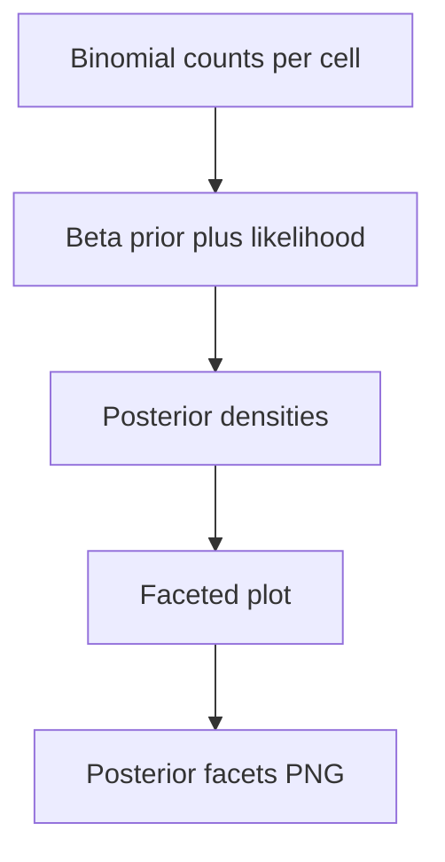

# phd beta posterior unsafe facets

**Paired asset:** [`phd_beta_posterior_unsafe_facets.png`](phd_beta_posterior_unsafe_facets.png)  
**Repository path:** `figures/multimodel/phd_beta_posterior_unsafe_facets.png`

---

## Document map

| Section | Role |
|---------|------|
| 1. Purpose and graphical encoding | What the figure communicates; axes, marks, and estimands |
| 2. Conceptual diagram | Mermaid schematic from labels or matrices to this graphic |
| 3. Data lineage and definitions | Rubric, artifacts, scope (benchmark-conditional, not population-causal) |
| 4. Reproduction | Commands, flags, environment, and verification |
| 5. Interpretation guide | How to read comparisons; common misinterpretations |
| 6. Limitations and responsible use | Uncertainty, multiplicity, ethics, `SECURITY.md` |
| 7. Related repository artifacts | Canonical docs at repo root and companion index |
| 8. Position in the evaluation stack | How this figure sits between JSON, matrices, and prose |

---

## 1. Purpose and graphical encoding

This figure displays **Bayesian Beta posteriors** (or Beta–Binomial updates) for UNSAFE probabilities in small cells, often arranged in a **facet grid** by model and category or by hierarchical groupings. The goal is honest uncertainty quantification when binomial counts are tiny: a raw rate of 1/18 and 2/18 look close as point estimates but may imply very different posterior mass under a weakly informative prior. Posterior plots make **shrinkage** intuitive—extreme empirical rates are pulled toward the prior mean when data are sparse, which can prevent overreacting to single prompts. Readers familiar only with frequentist confidence intervals should be told explicitly what prior was used and why; otherwise posteriors look like arbitrary Bayesian decoration. Faceting many small plots demands large page real estate; supplemental PDFs are appropriate.

---

## 2. Conceptual diagram

*Reading the diagram.* Arrows show dependency flow from inputs (left/top) to the exported figure. Rounded boxes are logical stages; your codebase may combine several stages in one script.

---

## 3. Data lineage and definitions

Each facet’s sufficient statistics are success counts and trial counts extracted from multimodel JSONs; the script may use a **Beta(α,β)** prior with α=β=1 (uniform) or another documented choice. If hierarchical partial pooling is implemented in a different branch, say so—pooled and unpooled posteriors differ materially. Prior sensitivity analyses belong in appendix figures if conclusions hinge on tail probabilities. Cells with zero successes still have posterior support for nonzero UNSAFE unless the prior is degenerate—this is a feature when communicating residual uncertainty.

---

## 4. Reproduction

Run `python scripts/plot_multimodel_beta_posterior_facets.py` and archive the prior parameters in `PROVENANCE.md` or methods. Ensure plotting uses consistent x-axis limits (0,1) across facets for comparability unless logit scales are used. For color, show posterior means and credible intervals distinctly if both are plotted.

---

## 5. Interpretation guide

Read **wide** posteriors as “we know little here,” not as “the model is safe.” Compare posteriors across models by assessing stochastic ordering or overlapping credible intervals, not just means. Do not confuse posterior predictive distributions with posteriors on rates unless you plot the former.

---

## 6. Limitations and responsible use

Bayesian methods do not erase ethics: extreme posterior tails may correspond to harmful completions. `SECURITY.md`. Document software (PyMC, Stan, or analytic Beta) for reproducibility.

---

## 7. Related repository artifacts and cross-references

Paths are **relative to the `llm-safety-experiment/` repository root** (adjust if this repo is vendored as a subdirectory).

| Artifact | Role |
|-----------|------|
| `PROVENANCE.md` | Frozen results layout, matrix build order, and figure regeneration commands |
| `LABEL_RUBRIC.md` | Definitions of SAFE, PARTIAL, and UNSAFE used in all rates |
| `SECURITY.md` | Policy for storing and sharing prompts and model outputs |
| `figures/FIGURE_COMPANIONS.md` | Machine- and human-readable index of every paired figure companion |
| `INTERPRETABILITY_VIZ.md` | Maps figures to scripts for readers navigating the artifact tree |

---

## 8. Position in the evaluation stack

End-to-end, Multimodel-CEP-Benchmark artifacts typically follow: **raw API completions** → **adjudicated JSON** (per run, under `results/multimodel/…`) → **summarized matrices** such as `figures/multimodel/signature_rate_matrix.json` → **static graphics** (this PNG and siblings) → **narrative report or manuscript**. This figure is an intermediate, **descriptive** layer: it helps researchers **see structure** in a small model panel but does not replace paired inference, error analysis, or operational monitoring on production traffic. Cite the matrix JSON and rubric version alongside the figure whenever the graphic appears in a dissertation chapter or peer-reviewed appendix.

