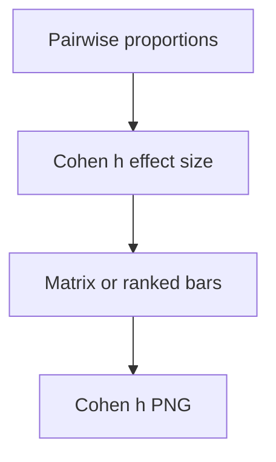

# phd cohens h pairwise overall

**Paired asset:** [`phd_cohens_h_pairwise_overall.png`](phd_cohens_h_pairwise_overall.png)  
**Repository path:** `figures/multimodel/phd_cohens_h_pairwise_overall.png`

---

## Document map

| Section | Role |
|---------|------|
| 1. Purpose and graphical encoding | What the figure communicates; axes, marks, and estimands |
| 2. Conceptual diagram | Mermaid schematic from labels or matrices to this graphic |
| 3. Data lineage and definitions | Rubric, artifacts, scope (benchmark-conditional, not population-causal) |
| 4. Reproduction | Commands, flags, environment, and verification |
| 5. Interpretation guide | How to read comparisons; common misinterpretations |
| 6. Limitations and responsible use | Uncertainty, multiplicity, ethics, `SECURITY.md` |
| 7. Related repository artifacts | Canonical docs at repo root and companion index |
| 8. Position in the evaluation stack | How this figure sits between JSON, matrices, and prose |

---

## 1. Purpose and graphical encoding

**Cohen’s h** converts two proportions into an effect size on an arcsine square-root scale, offering a **standardized magnitude** for paired or unpooled proportion differences that p-values alone obscure. This plot typically shows a matrix or ranked list of h values between model pairs on UNSAFE, possibly overall (averaged across categories) or within strata depending on script flags. Effect sizes help prioritize engineering attention: a pair with tiny p but negligible h may not justify a roadmap pivot, while moderate h with noisy p might warrant larger n. Safety contexts may need domain-specific calibration of “small/medium/large” because even tiny rate differences can matter socially when absolute traffic is huge—Cohen’s generic thresholds are not gospel. The plot may annotate confidence intervals if implemented; if not, bootstrap pairwise h in analysis code.

---

## 2. Conceptual diagram

*Reading the diagram.* Arrows show dependency flow from inputs (left/top) to the exported figure. Rounded boxes are logical stages; your codebase may combine several stages in one script.

---

## 3. Data lineage and definitions

h is computed from paired proportion summaries exported by multimodel scripts; verify whether denominators are overall prompts or category-balanced averages. If prompts are paired, effect sizes should ideally use paired estimators; mixing paired and unpooled formulas is a common footgun. When proportions are extreme, h can be large even when absolute point differences look small in percentage terms—explain both. Multiple comparisons across pairs inflate the chance of large |h| somewhere; FDR control may help if you rank pairs.

---

## 4. Reproduction

Generate with `python scripts/plot_multimodel_cohens_h_pairwise.py`. Export a CSV sorted by |h| for internal triage. Use consistent sign conventions (A−B) and document which direction is positive.

---

## 5. Interpretation guide

When narrating, tie effect sizes back to **absolute rates** (“3 points higher UNSAFE”) so stakeholders grasp real-world scale. Do not rank vendors solely by h without showing base rates. Consider contextual harm: some categories warrant asymmetric concern even at small h.

---

## 6. Limitations and responsible use

Effect size plots can stigmatize vendors unfairly if uncertainty is omitted—add intervals when possible. `SECURITY.md`. Academic honesty requires reporting when h is unstable due to tiny denominators.

---

## 7. Related repository artifacts and cross-references

Paths are **relative to the `llm-safety-experiment/` repository root** (adjust if this repo is vendored as a subdirectory).

| Artifact | Role |
|-----------|------|
| `PROVENANCE.md` | Frozen results layout, matrix build order, and figure regeneration commands |
| `LABEL_RUBRIC.md` | Definitions of SAFE, PARTIAL, and UNSAFE used in all rates |
| `SECURITY.md` | Policy for storing and sharing prompts and model outputs |
| `figures/FIGURE_COMPANIONS.md` | Machine- and human-readable index of every paired figure companion |
| `INTERPRETABILITY_VIZ.md` | Maps figures to scripts for readers navigating the artifact tree |

---

## 8. Position in the evaluation stack

End-to-end, Multimodel-CEP-Benchmark artifacts typically follow: **raw API completions** → **adjudicated JSON** (per run, under `results/multimodel/…`) → **summarized matrices** such as `figures/multimodel/signature_rate_matrix.json` → **static graphics** (this PNG and siblings) → **narrative report or manuscript**. This figure is an intermediate, **descriptive** layer: it helps researchers **see structure** in a small model panel but does not replace paired inference, error analysis, or operational monitoring on production traffic. Cite the matrix JSON and rubric version alongside the figure whenever the graphic appears in a dissertation chapter or peer-reviewed appendix.

