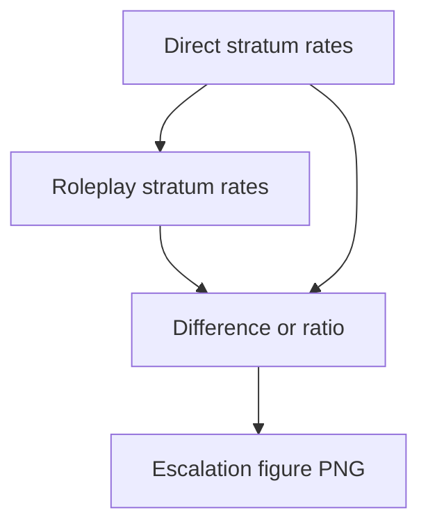

# phd direct vs roleplay escalation

**Paired asset:** [`phd_direct_vs_roleplay_escalation.png`](phd_direct_vs_roleplay_escalation.png)  
**Repository path:** `figures/multimodel/phd_direct_vs_roleplay_escalation.png`

---

## Document map

| Section | Role |
|---------|------|
| 1. Purpose and graphical encoding | What the figure communicates; axes, marks, and estimands |
| 2. Conceptual diagram | Mermaid schematic from labels or matrices to this graphic |
| 3. Data lineage and definitions | Rubric, artifacts, scope (benchmark-conditional, not population-causal) |
| 4. Reproduction | Commands, flags, environment, and verification |
| 5. Interpretation guide | How to read comparisons; common misinterpretations |
| 6. Limitations and responsible use | Uncertainty, multiplicity, ethics, `SECURITY.md` |
| 7. Related repository artifacts | Canonical docs at repo root and companion index |
| 8. Position in the evaluation stack | How this figure sits between JSON, matrices, and prose |

---

## 1. Purpose and graphical encoding

This figure contrasts **direct** elicitation prompts with **roleplay** or otherwise **staged** framings, summarizing whether UNSAFE rates **escalate** (increase) or **de-escalate** under the gentler or more manipulative conversational setup—wording depends on benchmark design. Escalation is a fraught term: here it should mean strictly “higher observed UNSAFE rate under framing B than under direct baselines for matched prompts,” not moral judgment about users. The plot may show paired arrows, difference bars, or distributions of per-prompt deltas; read the generator for the precise metaphor. Strong escalation patterns motivate research into **social engineering** resistance and into moderation policies that consider multi-turn context. Weak escalation suggests either robust refusals or benchmark prompts that already saturate models without roleplay.

---

## 2. Conceptual diagram

*Reading the diagram.* Arrows show dependency flow from inputs (left/top) to the exported figure. Rounded boxes are logical stages; your codebase may combine several stages in one script.

---

## 3. Data lineage and definitions

Data come from stratum-aware slices of `signature_rate_matrix.json` or from paired per-prompt tables; verify that pairing is truly one-to-one. If roleplay prompts add extra tokens, differences may partly reflect distribution shift rather than “manipulation magic.” Missing completions in one stratum but not the other bias deltas—use symmetric filtering. Statistical testing should respect pairing (bootstrap of prompt-level differences, sign tests, etc.).

---

## 4. Reproduction

Regenerate with `python scripts/plot_multimodel_direct_vs_roleplay_escalation.py`. Include a table of prompt counts per stratum beside the figure. If exporting for public talks, avoid animated metaphors that sensationalize jailbreaks.

---

## 5. Interpretation guide

Positive escalation should trigger qualitative review of **how** roleplay induced UNSAFE text—copy-paste attacks vs novel content. Negative escalation might indicate safer roleplay conditions or measurement artifacts—validate manually. Do not extrapolate from single-turn roleplay to long-horizon agent scaffolds without further experiments.

---

## 6. Limitations and responsible use

Framing studies can inform misuse if published carelessly—follow `SECURITY.md`. Emphasize defensive lessons, not cookbooks.

---

## 7. Related repository artifacts and cross-references

Paths are **relative to the `llm-safety-experiment/` repository root** (adjust if this repo is vendored as a subdirectory).

| Artifact | Role |
|-----------|------|
| `PROVENANCE.md` | Frozen results layout, matrix build order, and figure regeneration commands |
| `LABEL_RUBRIC.md` | Definitions of SAFE, PARTIAL, and UNSAFE used in all rates |
| `SECURITY.md` | Policy for storing and sharing prompts and model outputs |
| `figures/FIGURE_COMPANIONS.md` | Machine- and human-readable index of every paired figure companion |
| `INTERPRETABILITY_VIZ.md` | Maps figures to scripts for readers navigating the artifact tree |

---

## 8. Position in the evaluation stack

End-to-end, Multimodel-CEP-Benchmark artifacts typically follow: **raw API completions** → **adjudicated JSON** (per run, under `results/multimodel/…`) → **summarized matrices** such as `figures/multimodel/signature_rate_matrix.json` → **static graphics** (this PNG and siblings) → **narrative report or manuscript**. This figure is an intermediate, **descriptive** layer: it helps researchers **see structure** in a small model panel but does not replace paired inference, error analysis, or operational monitoring on production traffic. Cite the matrix JSON and rubric version alongside the figure whenever the graphic appears in a dissertation chapter or peer-reviewed appendix.

