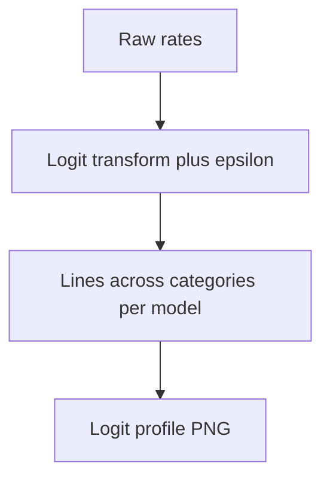

# phd logit category profiles unsafe

**Paired asset:** [`phd_logit_category_profiles_unsafe.png`](phd_logit_category_profiles_unsafe.png)  
**Repository path:** `figures/multimodel/phd_logit_category_profiles_unsafe.png`

---

## Document map

| Section | Role |
|---------|------|
| 1. Purpose and graphical encoding | What the figure communicates; axes, marks, and estimands |
| 2. Conceptual diagram | Mermaid schematic from labels or matrices to this graphic |
| 3. Data lineage and definitions | Rubric, artifacts, scope (benchmark-conditional, not population-causal) |
| 4. Reproduction | Commands, flags, environment, and verification |
| 5. Interpretation guide | How to read comparisons; common misinterpretations |
| 6. Limitations and responsible use | Uncertainty, multiplicity, ethics, `SECURITY.md` |
| 7. Related repository artifacts | Canonical docs at repo root and companion index |
| 8. Position in the evaluation stack | How this figure sits between JSON, matrices, and prose |

---

## 1. Purpose and graphical encoding

This visualization plots **logit-transformed** UNSAFE rates across categories for each model, turning bounded proportions into unbounded reals so that differences near 0% and 100% are not visually squashed as they are on linear scales. Continuity corrections (adding ε to 0/n or subtracting from n/n) are often applied to avoid infinities; the exact ε should appear in methods because it slightly shifts points. Parallel curves suggest models share a **similar category profile** up to monotone scaling; diverging curves flag structural differences in which categories dominate failures. Logits aid **statistical modeling** (logistic regression intuition) but are not themselves causal parameters—do not overinterpret literal distances without a generative model. Category ordering on the x-axis is not temporal unless stated.

---

## 2. Conceptual diagram

*Reading the diagram.* Arrows show dependency flow from inputs (left/top) to the exported figure. Rounded boxes are logical stages; your codebase may combine several stages in one script.

---

## 3. Data lineage and definitions

Values derive from `signature_rate_matrix.json` or per-run tables merged into long-form data; zeros and ones are handled per script policy. If categories have different n, logits still plot point estimates but should ideally carry interval ribbons—check whether the generator overlays them. Comparing logits across different rubrics or different prompt sets is invalid. If models have missing categories, interpolation gaps should be explicit.

---

## 4. Reproduction

Run `python scripts/plot_multimodel_logit_category_profile.py`. Export underlying logits and rates as CSV for reviewers who want to replot in ggplot. Use colorblind-safe palettes for nine lines; consider faceting instead of overplotting.

---

## 5. Interpretation guide

When reading, focus on **shape** and **crossings** rather than individual point noise. Crossings imply rank changes in UNSAFE severity across categories—pair with rank plots. Do not use logits to compare absolute harm across categories with different real-world stakes unless you weight categories normatively.

---

## 6. Limitations and responsible use

Logit plots can expose rare categories—mind `SECURITY.md`. Explain transforms to non-statistical readers to avoid mystification.

---

## 7. Related repository artifacts and cross-references

Paths are **relative to the `llm-safety-experiment/` repository root** (adjust if this repo is vendored as a subdirectory).

| Artifact | Role |
|-----------|------|
| `PROVENANCE.md` | Frozen results layout, matrix build order, and figure regeneration commands |
| `LABEL_RUBRIC.md` | Definitions of SAFE, PARTIAL, and UNSAFE used in all rates |
| `SECURITY.md` | Policy for storing and sharing prompts and model outputs |
| `figures/FIGURE_COMPANIONS.md` | Machine- and human-readable index of every paired figure companion |
| `INTERPRETABILITY_VIZ.md` | Maps figures to scripts for readers navigating the artifact tree |

---

## 8. Position in the evaluation stack

End-to-end, Multimodel-CEP-Benchmark artifacts typically follow: **raw API completions** → **adjudicated JSON** (per run, under `results/multimodel/…`) → **summarized matrices** such as `figures/multimodel/signature_rate_matrix.json` → **static graphics** (this PNG and siblings) → **narrative report or manuscript**. This figure is an intermediate, **descriptive** layer: it helps researchers **see structure** in a small model panel but does not replace paired inference, error analysis, or operational monitoring on production traffic. Cite the matrix JSON and rubric version alongside the figure whenever the graphic appears in a dissertation chapter or peer-reviewed appendix.

