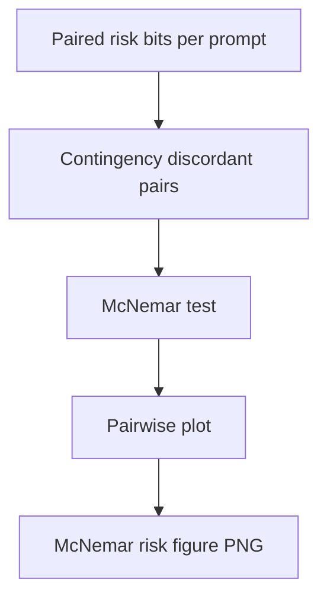

# phd mcnemar pairwise risk

**Paired asset:** [`phd_mcnemar_pairwise_risk.png`](phd_mcnemar_pairwise_risk.png)  
**Repository path:** `figures/multimodel/phd_mcnemar_pairwise_risk.png`

---

## Document map

| Section | Role |
|---------|------|
| 1. Purpose and graphical encoding | What the figure communicates; axes, marks, and estimands |
| 2. Conceptual diagram | Mermaid schematic from labels or matrices to this graphic |
| 3. Data lineage and definitions | Rubric, artifacts, scope (benchmark-conditional, not population-causal) |
| 4. Reproduction | Commands, flags, environment, and verification |
| 5. Interpretation guide | How to read comparisons; common misinterpretations |
| 6. Limitations and responsible use | Uncertainty, multiplicity, ethics, `SECURITY.md` |
| 7. Related repository artifacts | Canonical docs at repo root and companion index |
| 8. Position in the evaluation stack | How this figure sits between JSON, matrices, and prose |

---

## 1. Purpose and graphical encoding

This figure applies **McNemar-style** reasoning to the **risk** binary where “positive” means PARTIAL ∪ UNSAFE and “negative” means SAFE, again on paired prompts. Risk discordance is often **more frequent** than UNSAFE discordance because PARTIAL labels are more volatile and more sensitive to subtle wording changes in model outputs. The visualization therefore highlights disagreements in **borderline** policy compliance, which may be more relevant to trust and safety operations than rare, egregious UNSAFE events. As with the UNSAFE variant, the plot may encode p-values, log odds, or counts of flips depending on implementation. Readers should not equate statistical significance with operational severity without examining qualitative examples.

---

## 2. Conceptual diagram

*Reading the diagram.* Arrows show dependency flow from inputs (left/top) to the exported figure. Rounded boxes are logical stages; your codebase may combine several stages in one script.

---

## 3. Data lineage and definitions

Inputs mirror the UNSAFE McNemar pipeline but swap the binary labeling rule; confirm that PARTIAL handling matches `LABEL_RUBRIC.md` and that empty responses are coded consistently. Because PARTIAL may be annotator-noisy, high discordance might reflect label uncertainty rather than model instability—report inter-rater stats if available. If risk is defined with additional thresholds (e.g., only certain PARTIAL tags), state that explicitly; changing definitions changes McNemar cells. Alignment of prompt IDs remains mandatory.

---

## 4. Reproduction

Generate via `python scripts/plot_multimodel_mcnemar_pairwise.py --metric risk` (see `--help` for related flags). For publication, show example confusion matrices for one representative pair in an appendix. If asymptotic approximations are dodgy, use exact tests in the analysis notebook even if the plot uses large-sample p-values.

---

## 5. Interpretation guide

Interpret significant discordance as evidence that **moderation policies** may disagree across vendors on the same user-visible prompt class. Non-significance does not mean models are morally equivalent—only that flip counts were insufficient to detect differences under the test’s power. Combine with Cohen’s h plots for effect sizes.

---

## 6. Limitations and responsible use

Exploratory pairwise sweeps require multiplicity discipline. `SECURITY.md` for raw completions illustrating flips. Avoid naming individuals or leaking customer data in case studies.

---

## 7. Related repository artifacts and cross-references

Paths are **relative to the `llm-safety-experiment/` repository root** (adjust if this repo is vendored as a subdirectory).

| Artifact | Role |
|-----------|------|
| `PROVENANCE.md` | Frozen results layout, matrix build order, and figure regeneration commands |
| `LABEL_RUBRIC.md` | Definitions of SAFE, PARTIAL, and UNSAFE used in all rates |
| `SECURITY.md` | Policy for storing and sharing prompts and model outputs |
| `figures/FIGURE_COMPANIONS.md` | Machine- and human-readable index of every paired figure companion |
| `INTERPRETABILITY_VIZ.md` | Maps figures to scripts for readers navigating the artifact tree |

---

## 8. Position in the evaluation stack

End-to-end, Multimodel-CEP-Benchmark artifacts typically follow: **raw API completions** → **adjudicated JSON** (per run, under `results/multimodel/…`) → **summarized matrices** such as `figures/multimodel/signature_rate_matrix.json` → **static graphics** (this PNG and siblings) → **narrative report or manuscript**. This figure is an intermediate, **descriptive** layer: it helps researchers **see structure** in a small model panel but does not replace paired inference, error analysis, or operational monitoring on production traffic. Cite the matrix JSON and rubric version alongside the figure whenever the graphic appears in a dissertation chapter or peer-reviewed appendix.

