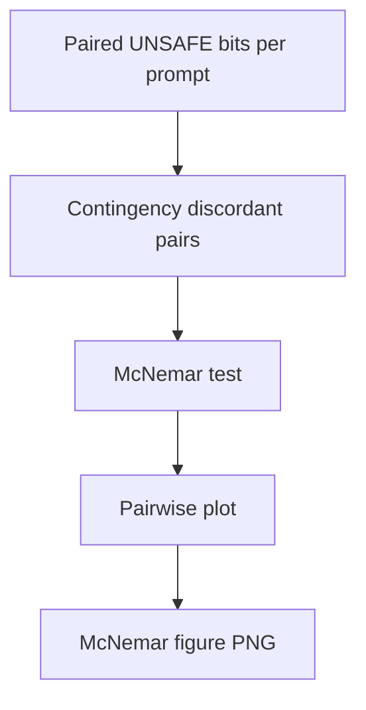

# phd mcnemar pairwise unsafe

**Paired asset:** [`phd_mcnemar_pairwise_unsafe.png`](phd_mcnemar_pairwise_unsafe.png)  
**Repository path:** `figures/multimodel/phd_mcnemar_pairwise_unsafe.png`

---

## Document map

| Section | Role |
|---------|------|
| 1. Purpose and graphical encoding | What the figure communicates; axes, marks, and estimands |
| 2. Conceptual diagram | Mermaid schematic from labels or matrices to this graphic |
| 3. Data lineage and definitions | Rubric, artifacts, scope (benchmark-conditional, not population-causal) |
| 4. Reproduction | Commands, flags, environment, and verification |
| 5. Interpretation guide | How to read comparisons; common misinterpretations |
| 6. Limitations and responsible use | Uncertainty, multiplicity, ethics, `SECURITY.md` |
| 7. Related repository artifacts | Canonical docs at repo root and companion index |
| 8. Position in the evaluation stack | How this figure sits between JSON, matrices, and prose |

---

## 1. Purpose and graphical encoding

This diagnostic graphic summarizes **paired binary discordance** on the UNSAFE label between two model runs that answered the **same** prompts in the benchmark. Unlike independent two-proportion z-tests, McNemar’s framework accounts for the fact that the two classifiers (API snapshots) see identical inputs, so dependence across columns is the right statistical metaphor. The plot may show matrices of p-values, counts of discordant pairs, or faceted summaries for each vendor pairing depending on the script version. Substantively, significant McNemar results mean the models disagree **on which specific prompts** cross the UNSAFE threshold, not merely that marginal rates differ—a distinction that matters for red teaming and for understanding whether failures are systemic or idiosyncratic. Pairwise grids explode in size as you add models; the nine-run design keeps this tractable but still demands multiplicity caution.

---

## 2. Conceptual diagram

*Reading the diagram.* Arrows show dependency flow from inputs (left/top) to the exported figure. Rounded boxes are logical stages; your codebase may combine several stages in one script.

---

## 3. Data lineage and definitions

You need aligned prompt IDs across JSON artifacts for every compared pair; silent misalignment yields nonsense discordance counts. The UNSAFE bit is defined by `LABEL_RUBRIC.md`; if labeling drifted between runs, McNemar tests compare apples to oranges unless you freeze labels. Sparse discordance (very few flipped labels) produces unstable test statistics; exact McNemar variants may be preferable to asymptotic ones. Document how missing completions (timeouts, refusals to return JSON) are coded—often they must be excluded or imputed with explicit rules.

---

## 4. Reproduction

Run `python scripts/plot_multimodel_mcnemar_pairwise.py --metric unsafe` from `llm-safety-experiment/` after multimodel JSONs exist. Capture CLI flags and random seeds in lab notes; some plots jitter labels for readability. If generating for a paper, export underlying contingency tables for each pair as CSV for reviewers. Consider false discovery rate control when testing many pairs post hoc.

---

## 5. Interpretation guide

A significant result with **tiny** discordance counts may be statistically “real” but practically negligible—always report **b** and **c** cells (unsafe-only vs safe-only flips). Non-significant results do not prove equivalence unless you run an equivalence test with prespecified margins. Interpretation should connect to **error taxonomy**: are flips mostly near-miss paraphrases or wildly different behaviors?

---

## 6. Limitations and responsible use

Pairwise testing multiplies opportunities for fishing; pre-register primary vendor contrasts. Harmful prompt text underpins each discordant pair—`SECURITY.md` applies. Do not weaponize p-values in vendor disputes without context.

---

## 7. Related repository artifacts and cross-references

Paths are **relative to the `llm-safety-experiment/` repository root** (adjust if this repo is vendored as a subdirectory).

| Artifact | Role |
|-----------|------|
| `PROVENANCE.md` | Frozen results layout, matrix build order, and figure regeneration commands |
| `LABEL_RUBRIC.md` | Definitions of SAFE, PARTIAL, and UNSAFE used in all rates |
| `SECURITY.md` | Policy for storing and sharing prompts and model outputs |
| `figures/FIGURE_COMPANIONS.md` | Machine- and human-readable index of every paired figure companion |
| `INTERPRETABILITY_VIZ.md` | Maps figures to scripts for readers navigating the artifact tree |

---

## 8. Position in the evaluation stack

End-to-end, Multimodel-CEP-Benchmark artifacts typically follow: **raw API completions** → **adjudicated JSON** (per run, under `results/multimodel/…`) → **summarized matrices** such as `figures/multimodel/signature_rate_matrix.json` → **static graphics** (this PNG and siblings) → **narrative report or manuscript**. This figure is an intermediate, **descriptive** layer: it helps researchers **see structure** in a small model panel but does not replace paired inference, error analysis, or operational monitoring on production traffic. Cite the matrix JSON and rubric version alongside the figure whenever the graphic appears in a dissertation chapter or peer-reviewed appendix.

