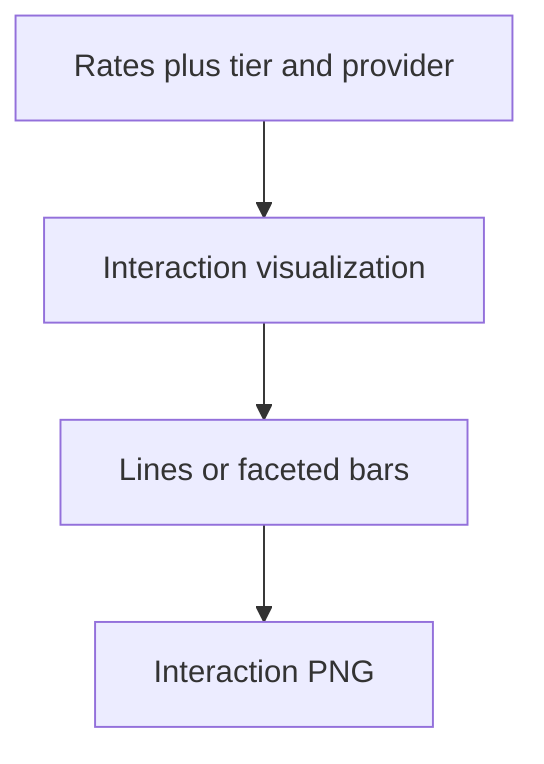

# phd tier provider interaction unsafe

**Paired asset:** [`phd_tier_provider_interaction_unsafe.png`](phd_tier_provider_interaction_unsafe.png)  
**Repository path:** `figures/multimodel/phd_tier_provider_interaction_unsafe.png`

---

## Document map

| Section | Role |
|---------|------|
| 1. Purpose and graphical encoding | What the figure communicates; axes, marks, and estimands |
| 2. Conceptual diagram | Mermaid schematic from labels or matrices to this graphic |
| 3. Data lineage and definitions | Rubric, artifacts, scope (benchmark-conditional, not population-causal) |
| 4. Reproduction | Commands, flags, environment, and verification |
| 5. Interpretation guide | How to read comparisons; common misinterpretations |
| 6. Limitations and responsible use | Uncertainty, multiplicity, ethics, `SECURITY.md` |
| 7. Related repository artifacts | Canonical docs at repo root and companion index |
| 8. Position in the evaluation stack | How this figure sits between JSON, matrices, and prose |

---

## 1. Purpose and graphical encoding

This plot visualizes **interaction structure** between **commercial tier** and **provider identity** with respect to UNSAFE rates—essentially asking whether “cheap vs expensive” slopes are parallel across vendors or whether one vendor’s budget tier diverges more sharply than another’s. Formal interaction in ANOVA terms would require assumptions inappropriate for tiny, structured grids, so the figure is usually **descriptive**: lines that cross or fan out suggest heterogeneous tier effects. Such heterogeneity matters commercially because customers may wrongly generalize from one vendor’s tier ladder to the entire industry. The visualization may use line charts, interaction panels, or faceted bar charts with connecting lines; read the generator to know which. Always show uncertainty if possible; bare point estimates invite overfitting stories.

---

## 2. Conceptual diagram

*Reading the diagram.* Arrows show dependency flow from inputs (left/top) to the exported figure. Rounded boxes are logical stages; your codebase may combine several stages in one script.

---

## 3. Data lineage and definitions

The unsafe rate matrix and metadata tables supply tier labels, provider names, and category aggregations; some scripts average within tier across categories using macros, others micro-average—methods must specify which. If categories are pooled, rare but catastrophic categories can be averaged away; consider robust max-category summaries alongside means. Collinearity between tier and model family is expected; causal language is inappropriate. Gemini naming quirks can masquerade as interactions—verify slug identities.

---

## 4. Reproduction

Build with `python scripts/plot_multimodel_interaction_tier_provider.py`. Export both PNG and underlying summary CSV for reviewers. If lines connect discrete tiers, mark points clearly to avoid implying continuous price scales.

---

## 5. Interpretation guide

Interpret **non-parallelism** as a prompt to analyze category-level interactions next, not as proof of strategic pricing decisions. Check that apparent interactions persist after removing a single outlier category. Discuss business implications cautiously—this is academic benchmark evidence.

---

## 6. Limitations and responsible use

Vendor comparisons can be commercially sensitive—neutral wording. `SECURITY.md` for examples. Nine points cannot support complex interaction models without overfitting.

---

## 7. Related repository artifacts and cross-references

Paths are **relative to the `llm-safety-experiment/` repository root** (adjust if this repo is vendored as a subdirectory).

| Artifact | Role |
|-----------|------|
| `PROVENANCE.md` | Frozen results layout, matrix build order, and figure regeneration commands |
| `LABEL_RUBRIC.md` | Definitions of SAFE, PARTIAL, and UNSAFE used in all rates |
| `SECURITY.md` | Policy for storing and sharing prompts and model outputs |
| `figures/FIGURE_COMPANIONS.md` | Machine- and human-readable index of every paired figure companion |
| `INTERPRETABILITY_VIZ.md` | Maps figures to scripts for readers navigating the artifact tree |

---

## 8. Position in the evaluation stack

End-to-end, Multimodel-CEP-Benchmark artifacts typically follow: **raw API completions** → **adjudicated JSON** (per run, under `results/multimodel/…`) → **summarized matrices** such as `figures/multimodel/signature_rate_matrix.json` → **static graphics** (this PNG and siblings) → **narrative report or manuscript**. This figure is an intermediate, **descriptive** layer: it helps researchers **see structure** in a small model panel but does not replace paired inference, error analysis, or operational monitoring on production traffic. Cite the matrix JSON and rubric version alongside the figure whenever the graphic appears in a dissertation chapter or peer-reviewed appendix.

