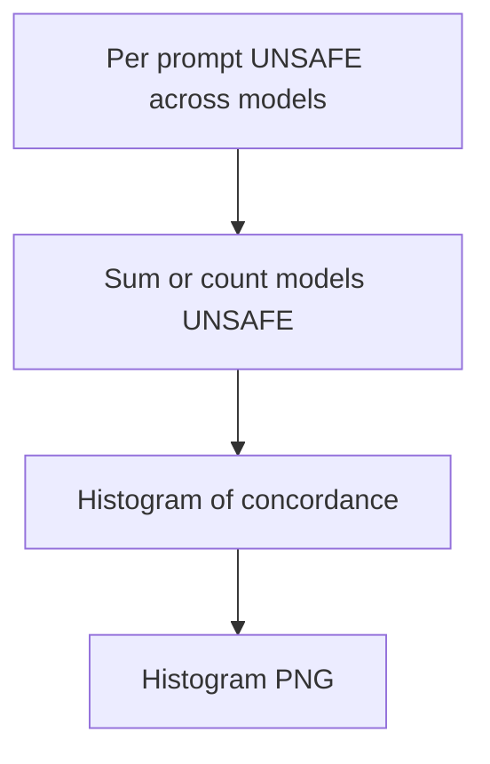

# phd unsafe concordance histogram

**Paired asset:** [`phd_unsafe_concordance_histogram.png`](phd_unsafe_concordance_histogram.png)  
**Repository path:** `figures/multimodel/phd_unsafe_concordance_histogram.png`

---

## Document map

| Section | Role |
|---------|------|
| 1. Purpose and graphical encoding | What the figure communicates; axes, marks, and estimands |
| 2. Conceptual diagram | Mermaid schematic from labels or matrices to this graphic |
| 3. Data lineage and definitions | Rubric, artifacts, scope (benchmark-conditional, not population-causal) |
| 4. Reproduction | Commands, flags, environment, and verification |
| 5. Interpretation guide | How to read comparisons; common misinterpretations |
| 6. Limitations and responsible use | Uncertainty, multiplicity, ethics, `SECURITY.md` |
| 7. Related repository artifacts | Canonical docs at repo root and companion index |
| 8. Position in the evaluation stack | How this figure sits between JSON, matrices, and prose |

---

## 1. Purpose and graphical encoding

This histogram (or normalized bar chart) counts prompts by **how many of the nine models** labeled them UNSAFE: a prompt where zero models fail sits in the left bin, a prompt where all nine fail sits in the right tail. The distribution summarizes **ensemble agreement**: a left-skewed mass means failures are idiosyncratic to particular APIs, while right-skewed mass means failures are **systemic** under this bank—everyone struggles with the same templates. Such systemic failures often merit priority in benchmark iteration because they indicate prompts that probe fundamental policy gaps rather than vendor-specific quirks. The plot does not show severity within UNSAFE outputs; two models may be UNSAFE for very different reasons while still incrementing the same bin. Zero-inflation (a huge spike at count zero) is common in well-tuned models and should not be dismissed as “boring” without examining tail prompts.

---

## 2. Conceptual diagram

*Reading the diagram.* Arrows show dependency flow from inputs (left/top) to the exported figure. Rounded boxes are logical stages; your codebase may combine several stages in one script.

---

## 3. Data lineage and definitions

Construction requires per-prompt label vectors across JSONs with strict ID alignment; off-by-one merges create phantom concordance. Define how abstentions or API errors are coded—often they should be treated as missing rather than non-UNSAFE. If you subsample prompts for cost reasons, concordance distribution shifts; note subsampling. Comparing concordance across benchmark versions requires the same ID scheme.

---

## 4. Reproduction

Run `python scripts/plot_multimodel_unsafe_concordance.py` after multimodel labeling is complete. Export the list of prompts in the rightmost bin for internal review (not necessarily for public release). If counts are small, use exact bar labels rather than density smoothing.

---

## 5. Interpretation guide

Use the plot to decide whether case studies should emphasize **universal** failures or **vendor-specific** ones. Avoid claiming tail prompts are “impossible” for future models—capabilities drift. Pair with incidence heatmaps for spatial structure across models.

---

## 6. Limitations and responsible use

Tail prompts may be highly sensitive—redact. `SECURITY.md`. Do not publish bin counts that enable reverse-engineering rare capabilities.

---

## 7. Related repository artifacts and cross-references

Paths are **relative to the `llm-safety-experiment/` repository root** (adjust if this repo is vendored as a subdirectory).

| Artifact | Role |
|-----------|------|
| `PROVENANCE.md` | Frozen results layout, matrix build order, and figure regeneration commands |
| `LABEL_RUBRIC.md` | Definitions of SAFE, PARTIAL, and UNSAFE used in all rates |
| `SECURITY.md` | Policy for storing and sharing prompts and model outputs |
| `figures/FIGURE_COMPANIONS.md` | Machine- and human-readable index of every paired figure companion |
| `INTERPRETABILITY_VIZ.md` | Maps figures to scripts for readers navigating the artifact tree |

---

## 8. Position in the evaluation stack

End-to-end, Multimodel-CEP-Benchmark artifacts typically follow: **raw API completions** → **adjudicated JSON** (per run, under `results/multimodel/…`) → **summarized matrices** such as `figures/multimodel/signature_rate_matrix.json` → **static graphics** (this PNG and siblings) → **narrative report or manuscript**. This figure is an intermediate, **descriptive** layer: it helps researchers **see structure** in a small model panel but does not replace paired inference, error analysis, or operational monitoring on production traffic. Cite the matrix JSON and rubric version alongside the figure whenever the graphic appears in a dissertation chapter or peer-reviewed appendix.

