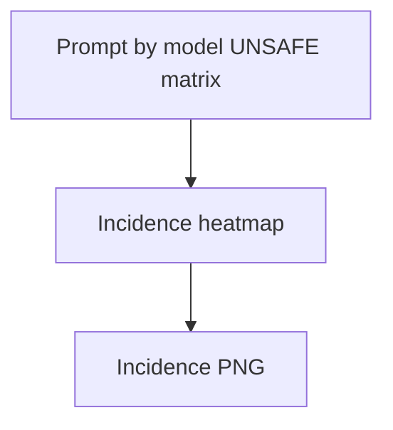

# phd unsafe incidence prompts by run

**Paired asset:** [`phd_unsafe_incidence_prompts_by_run.png`](phd_unsafe_incidence_prompts_by_run.png)  
**Repository path:** `figures/multimodel/phd_unsafe_incidence_prompts_by_run.png`

---

## Document map

| Section | Role |
|---------|------|
| 1. Purpose and graphical encoding | What the figure communicates; axes, marks, and estimands |
| 2. Conceptual diagram | Mermaid schematic from labels or matrices to this graphic |
| 3. Data lineage and definitions | Rubric, artifacts, scope (benchmark-conditional, not population-causal) |
| 4. Reproduction | Commands, flags, environment, and verification |
| 5. Interpretation guide | How to read comparisons; common misinterpretations |
| 6. Limitations and responsible use | Uncertainty, multiplicity, ethics, `SECURITY.md` |
| 7. Related repository artifacts | Canonical docs at repo root and companion index |
| 8. Position in the evaluation stack | How this figure sits between JSON, matrices, and prose |

---

## 1. Purpose and graphical encoding

This **incidence heatmap** aligns **prompt identifiers** on one axis and **model runs** on the other, coloring cells when a completion is UNSAFE (or meets a related threshold). It reveals whether UNSAFE events are **concentrated** in a few prompts (bright rows) or **spread** thinly across many, and whether certain models exhibit striped patterns indicating correlated failure modes. Unlike aggregate rate plots, incidence plots preserve **row-level structure**, making them invaluable for debugging labeling quirks or API outages (e.g., an entire column missing). The cost is potential **re-identification risk**: if prompt IDs map one-to-one to sensitive templates, publishing this figure publicly may be unacceptable even without printing prompt text. Aggregation or hashing of IDs may be required for external sharing.

---

## 2. Conceptual diagram

*Reading the diagram.* Arrows show dependency flow from inputs (left/top) to the exported figure. Rounded boxes are logical stages; your codebase may combine several stages in one script.

---

## 3. Data lineage and definitions

Construction demands consistent prompt ordering and stable IDs across runs; if the benchmark rotated IDs between versions, merge carefully. Define behavior for multi-turn prompts or duplicated templates; duplicates may create visually misleading bands. Color scales should handle class imbalance—mostly empty heatmaps should not auto-scale to hide rare events. If timeouts are coded as non-UNSAFE, a column of false negatives may appear—validate against logs.

---

## 4. Reproduction

Run `python scripts/plot_multimodel_unsafe_incidence_heatmap.py` after JSON alignment checks pass. For internal use, export the list of high-incidence prompt IDs to drive qualitative review sessions. For public use, consider binning prompts by category rather than exposing IDs.

---

## 5. Interpretation guide

Bright **rows** suggest benchmark prompts that should be discussed in error analysis; bright **columns** suggest systematically permissive or misconfigured endpoints. Be careful not to infer statistical independence across cells—prompts and models are structured. Pair with concordance histograms for ensemble-level summaries.

---

## 6. Limitations and responsible use

Incidence plots are among the most sensitive outputs—default to internal-only. `SECURITY.md` is critical. Red teamers may use incidence maps to infer model weaknesses; distribute responsibly.

---

## 7. Related repository artifacts and cross-references

Paths are **relative to the `llm-safety-experiment/` repository root** (adjust if this repo is vendored as a subdirectory).

| Artifact | Role |
|-----------|------|
| `PROVENANCE.md` | Frozen results layout, matrix build order, and figure regeneration commands |
| `LABEL_RUBRIC.md` | Definitions of SAFE, PARTIAL, and UNSAFE used in all rates |
| `SECURITY.md` | Policy for storing and sharing prompts and model outputs |
| `figures/FIGURE_COMPANIONS.md` | Machine- and human-readable index of every paired figure companion |
| `INTERPRETABILITY_VIZ.md` | Maps figures to scripts for readers navigating the artifact tree |

---

## 8. Position in the evaluation stack

End-to-end, Multimodel-CEP-Benchmark artifacts typically follow: **raw API completions** → **adjudicated JSON** (per run, under `results/multimodel/…`) → **summarized matrices** such as `figures/multimodel/signature_rate_matrix.json` → **static graphics** (this PNG and siblings) → **narrative report or manuscript**. This figure is an intermediate, **descriptive** layer: it helps researchers **see structure** in a small model panel but does not replace paired inference, error analysis, or operational monitoring on production traffic. Cite the matrix JSON and rubric version alongside the figure whenever the graphic appears in a dissertation chapter or peer-reviewed appendix.

