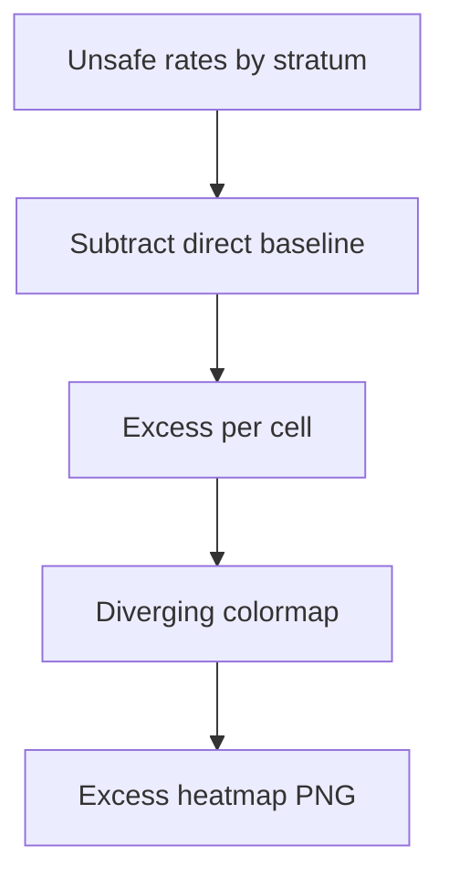

# signature excess unsafe vs direct

**Paired asset:** [`signature_excess_unsafe_vs_direct.png`](signature_excess_unsafe_vs_direct.png)  
**Repository path:** `figures/multimodel/signature_excess_unsafe_vs_direct.png`

---

## Document map

| Section | Role |
|---------|------|
| 1. Purpose and graphical encoding | What the figure communicates; axes, marks, and estimands |
| 2. Conceptual diagram | Mermaid schematic from labels or matrices to this graphic |
| 3. Data lineage and definitions | Rubric, artifacts, scope (benchmark-conditional, not population-causal) |
| 4. Reproduction | Commands, flags, environment, and verification |
| 5. Interpretation guide | How to read comparisons; common misinterpretations |
| 6. Limitations and responsible use | Uncertainty, multiplicity, ethics, `SECURITY.md` |
| 7. Related repository artifacts | Canonical docs at repo root and companion index |
| 8. Position in the evaluation stack | How this figure sits between JSON, matrices, and prose |

---

## 1. Purpose and graphical encoding

This PNG preserves a **legacy basename** for the excess-versus-direct UNSAFE heatmap, parallel to `combined_signature_excess_vs_direct.png`. Legacy names persist so that older documents, Zenodo snapshots, or colleague scripts keep working without silent 404s. You should treat both files as interchangeable **if and only if** they were generated from the same matrix build; verify timestamps or checksums when both exist. If you are cleaning the repository, deprecate one filename only after searching the codebase and any external citations. Manuscripts should standardize on the `combined_` naming going forward unless a venue already printed the legacy path.

---

## 2. Conceptual diagram

*Reading the diagram.* Arrows show dependency flow from inputs (left/top) to the exported figure. Rounded boxes are logical stages; your codebase may combine several stages in one script.

---

## 3. Data lineage and definitions

Data dependencies mirror the combined figure: start from `signature_rate_matrix.json` and multimodel JSON roots under `results/multimodel/`. When writing methods, describe the pairing of prompts across framings precisely enough that a third party could recompute the contrast. If the legacy file is regenerated rarely, it is especially easy for it to go stale—add a CI check or Makefile target if this bites you repeatedly.

---

## 4. Reproduction

Regenerate via `plot_multimodel_signature_heatmap.py --kind excess_vs_direct` with identical parameters to the combined export. Consider deleting redundant legacy outputs in favor of symlinks if your OS supports them and your tooling tolerates symlinks in Git LFS.

---

## 5. Interpretation guide

Reading guidance is identical to the combined-named sibling: positive values mean more UNSAFE than the direct baseline for that cell, negative values mean less. Do not double-count both PNGs in a publication as if they were independent analyses.

---

## 6. Limitations and responsible use

Maintain the same statistical cautions: differences are noisy, baselines matter, and harmful content may appear in supporting data—see `SECURITY.md`.

---

## 7. Related repository artifacts and cross-references

Paths are **relative to the `llm-safety-experiment/` repository root** (adjust if this repo is vendored as a subdirectory).

| Artifact | Role |
|-----------|------|
| `PROVENANCE.md` | Frozen results layout, matrix build order, and figure regeneration commands |
| `LABEL_RUBRIC.md` | Definitions of SAFE, PARTIAL, and UNSAFE used in all rates |
| `SECURITY.md` | Policy for storing and sharing prompts and model outputs |
| `figures/FIGURE_COMPANIONS.md` | Machine- and human-readable index of every paired figure companion |
| `INTERPRETABILITY_VIZ.md` | Maps figures to scripts for readers navigating the artifact tree |

---

## 8. Position in the evaluation stack

End-to-end, Multimodel-CEP-Benchmark artifacts typically follow: **raw API completions** → **adjudicated JSON** (per run, under `results/multimodel/…`) → **summarized matrices** such as `figures/multimodel/signature_rate_matrix.json` → **static graphics** (this PNG and siblings) → **narrative report or manuscript**. This figure is an intermediate, **descriptive** layer: it helps researchers **see structure** in a small model panel but does not replace paired inference, error analysis, or operational monitoring on production traffic. Cite the matrix JSON and rubric version alongside the figure whenever the graphic appears in a dissertation chapter or peer-reviewed appendix.

