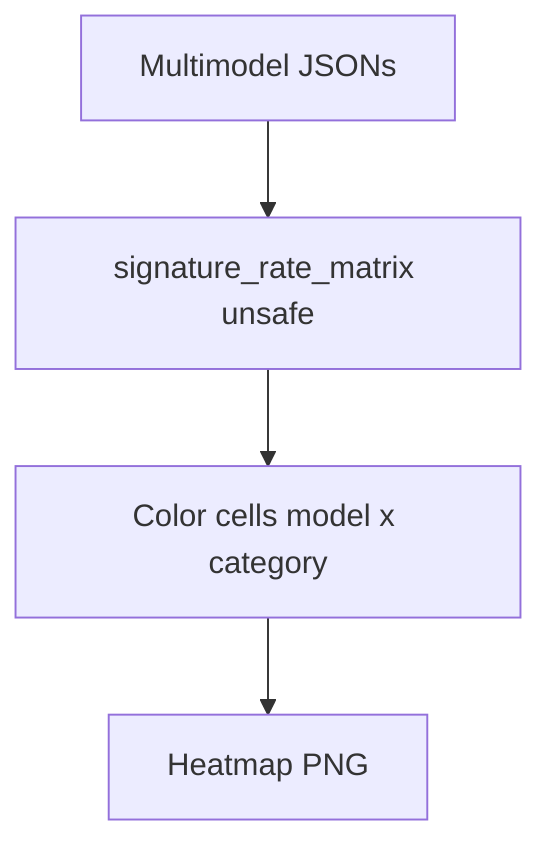

# signature unsafe heatmap

**Paired asset:** [`signature_unsafe_heatmap.png`](signature_unsafe_heatmap.png)  
**Repository path:** `figures/multimodel/signature_unsafe_heatmap.png`

---

## Document map

| Section | Role |
|---------|------|
| 1. Purpose and graphical encoding | What the figure communicates; axes, marks, and estimands |
| 2. Conceptual diagram | Mermaid schematic from labels or matrices to this graphic |
| 3. Data lineage and definitions | Rubric, artifacts, scope (benchmark-conditional, not population-causal) |
| 4. Reproduction | Commands, flags, environment, and verification |
| 5. Interpretation guide | How to read comparisons; common misinterpretations |
| 6. Limitations and responsible use | Uncertainty, multiplicity, ethics, `SECURITY.md` |
| 7. Related repository artifacts | Canonical docs at repo root and companion index |
| 8. Position in the evaluation stack | How this figure sits between JSON, matrices, and prose |

---

## 1. Purpose and graphical encoding

This asset is a **filename alias** for the multimodel UNSAFE signature heatmap: some older automation, drafts, or external notebooks may still reference `signature_unsafe_heatmap.png` instead of `combined_signature_unsafe_heatmap.png`. Except for naming, the analytic content should match the combined file produced in the same pipeline; if the two diverge in your working tree, that indicates a stale export or a manual copy error rather than an intentional difference. When starting a new manuscript, pick one canonical name and symlink or configure generators to avoid duplication; duplication nonetheless helps backward compatibility for frozen supplementary materials. Readers should not reinterpret the legacy name as a different statistical estimand.

---

## 2. Conceptual diagram

*Reading the diagram.* Arrows show dependency flow from inputs (left/top) to the exported figure. Rounded boxes are logical stages; your codebase may combine several stages in one script.

---

## 3. Data lineage and definitions

The quantitative backbone is `figures/multimodel/signature_rate_matrix.json`, which stores the unsafe-rate matrix and metadata after `build_multimodel_rate_matrix.py --metric unsafe` (or an equivalent aggregator) has ingested the per-run labeled JSONs under `results/multimodel/`. Each entry is only as trustworthy as the alignment of prompt IDs across runs: the benchmark assumes comparable rows for paired analyses. UNSAFE semantics are unchanged from `LABEL_RUBRIC.md`; multimodel adds complexity because labeling pipelines must stay consistent across months of API drift. If you regenerate models with updated system prompts, treat new outputs as a new artifact series rather than silently patching old JSON. When Gemini appears in multiple tiers, read captions carefully: some snapshots reuse similar model identifiers across price bands, and conflating them misstates the independent variable.

---

## 4. Reproduction

Regenerate the figure from `llm-safety-experiment/` using either the orchestrated path `python scripts/reproduce_main_figures.py` or the targeted plotter `python scripts/plot_multimodel_signature_heatmap.py --kind raw`, passing paths that match your checkout layout. If colors diverge between runs, confirm you did not mix an old `signature_rate_matrix.json` with freshly plotted PNGs—hash or timestamp artifacts in `PROVENANCE.md` when possible. For print, export vector formats if the plotting script supports it; otherwise ensure DPI and font sizes meet venue requirements. When debugging empty cells, trace back to missing labels or failed API calls logged in the run metadata rather than tweaking the colormap.

---

## 5. Interpretation guide

Read **hot** cells (per the chosen palette) as model–category pairs with elevated UNSAFE under this bank, but always ask whether elevation is driven by a handful of prompts or a broad trend—drill into incidence heatmaps for the former. Compare providers with the caveat that **tier and vendor are partially confounded** in a nine-run design: you are seeing a structured sample, not a random draw from all commercial models. Avoid causal language (“GPT-4o caused higher UNSAFE”) without a design that supports causal identification; prefer “observed higher UNSAFE under this API snapshot.” When categories have different within-cell sample sizes, shade or annotate cells with n if your plotting fork supports it.

---

## 6. Limitations and responsible use

These rates describe **benchmark-conditioned** behavior, not real-world incident prevalence; the prompts are adversarially informative by design. Raw completions may include actionable harm; follow `SECURITY.md` for storage and publication. Be explicit that results may change when vendors update post-training or safety policies without notice.

---

## 7. Related repository artifacts and cross-references

Paths are **relative to the `llm-safety-experiment/` repository root** (adjust if this repo is vendored as a subdirectory).

| Artifact | Role |
|-----------|------|
| `PROVENANCE.md` | Frozen results layout, matrix build order, and figure regeneration commands |
| `LABEL_RUBRIC.md` | Definitions of SAFE, PARTIAL, and UNSAFE used in all rates |
| `SECURITY.md` | Policy for storing and sharing prompts and model outputs |
| `figures/FIGURE_COMPANIONS.md` | Machine- and human-readable index of every paired figure companion |
| `INTERPRETABILITY_VIZ.md` | Maps figures to scripts for readers navigating the artifact tree |

---

## 8. Position in the evaluation stack

End-to-end, Multimodel-CEP-Benchmark artifacts typically follow: **raw API completions** → **adjudicated JSON** (per run, under `results/multimodel/…`) → **summarized matrices** such as `figures/multimodel/signature_rate_matrix.json` → **static graphics** (this PNG and siblings) → **narrative report or manuscript**. This figure is an intermediate, **descriptive** layer: it helps researchers **see structure** in a small model panel but does not replace paired inference, error analysis, or operational monitoring on production traffic. Cite the matrix JSON and rubric version alongside the figure whenever the graphic appears in a dissertation chapter or peer-reviewed appendix.

