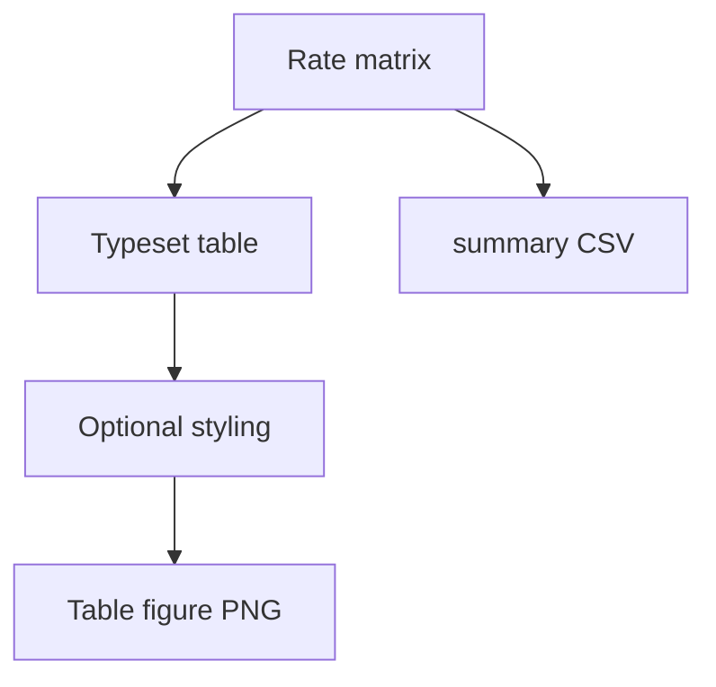

# summary table models categories

**Paired asset:** [`summary_table_models_categories.png`](summary_table_models_categories.png)  
**Repository path:** `figures/multimodel/summary_table_models_categories.png`

---

## Document map

| Section | Role |
|---------|------|
| 1. Purpose and graphical encoding | What the figure communicates; axes, marks, and estimands |
| 2. Conceptual diagram | Mermaid schematic from labels or matrices to this graphic |
| 3. Data lineage and definitions | Rubric, artifacts, scope (benchmark-conditional, not population-causal) |
| 4. Reproduction | Commands, flags, environment, and verification |
| 5. Interpretation guide | How to read comparisons; common misinterpretations |
| 6. Limitations and responsible use | Uncertainty, multiplicity, ethics, `SECURITY.md` |
| 7. Related repository artifacts | Canonical docs at repo root and companion index |
| 8. Position in the evaluation stack | How this figure sits between JSON, matrices, and prose |

---

## 1. Purpose and graphical encoding

This graphic is a **typeset table** of model×category statistics—often UNSAFE or risk rates, sometimes with uncertainty—aimed at readers who prefer numbers to color fields. It functions as a bridge between exploratory heatmaps and the exact values reviewers ask you to paste into appendices. Depending on generator settings, cells may show percentages rounded to one decimal, counts in parentheses, or significance stars; always read the caption for the convention used. Tables trade compactness for space: wide tables may span two journal pages; consider rotating headers or splitting by provider family. Alignment and monospace fonts help scan columns but should remain venue-compliant.

---

## 2. Conceptual diagram

*Reading the diagram.* Arrows show dependency flow from inputs (left/top) to the exported figure. Rounded boxes are logical stages; your codebase may combine several stages in one script.

---

## 3. Data lineage and definitions

The authoritative machine-readable export is typically `summary_table_models_categories.csv`, produced by `export_multimodel_summary_table.py` alongside the PNG. Treat the CSV as the **source of truth** for digits; the PNG is a human-facing view that may round or truncate. If you detect a mismatch between CSV and PNG, assume the PNG is stale until you regenerate. When merging supplemental tables into LaTeX, import from CSV to avoid transcription errors.

---

## 4. Reproduction

Regenerate using `python scripts/export_multimodel_summary_table.py`, then rerun any plotting helper if your pipeline separates tabular export from visual rendering. Version-control both CSV and PNG in the same commit to keep artifacts synchronized. For blind submissions, mask model names consistently with other figures.

---

## 5. Interpretation guide

Use the table to support **precise comparisons** called out in the main text (“Model A is 4.2 points higher than Model B on category C”). Remember that rounded differences can hide tiny but important gaps—carry extra precision in supplementary CSVs. Highlight cells discussed in the narrative with care to avoid cherry-picking without multiplicity control.

---

## 6. Limitations and responsible use

Tables may make rare failure rates look deceptively exact; include denominators. `SECURITY.md` applies to underlying data. Large tables can deanonymize niche categories—aggregate if needed.

---

## 7. Related repository artifacts and cross-references

Paths are **relative to the `llm-safety-experiment/` repository root** (adjust if this repo is vendored as a subdirectory).

| Artifact | Role |
|-----------|------|
| `PROVENANCE.md` | Frozen results layout, matrix build order, and figure regeneration commands |
| `LABEL_RUBRIC.md` | Definitions of SAFE, PARTIAL, and UNSAFE used in all rates |
| `SECURITY.md` | Policy for storing and sharing prompts and model outputs |
| `figures/FIGURE_COMPANIONS.md` | Machine- and human-readable index of every paired figure companion |
| `INTERPRETABILITY_VIZ.md` | Maps figures to scripts for readers navigating the artifact tree |

---

## 8. Position in the evaluation stack

End-to-end, Multimodel-CEP-Benchmark artifacts typically follow: **raw API completions** → **adjudicated JSON** (per run, under `results/multimodel/…`) → **summarized matrices** such as `figures/multimodel/signature_rate_matrix.json` → **static graphics** (this PNG and siblings) → **narrative report or manuscript**. This figure is an intermediate, **descriptive** layer: it helps researchers **see structure** in a small model panel but does not replace paired inference, error analysis, or operational monitoring on production traffic. Cite the matrix JSON and rubric version alongside the figure whenever the graphic appears in a dissertation chapter or peer-reviewed appendix.

