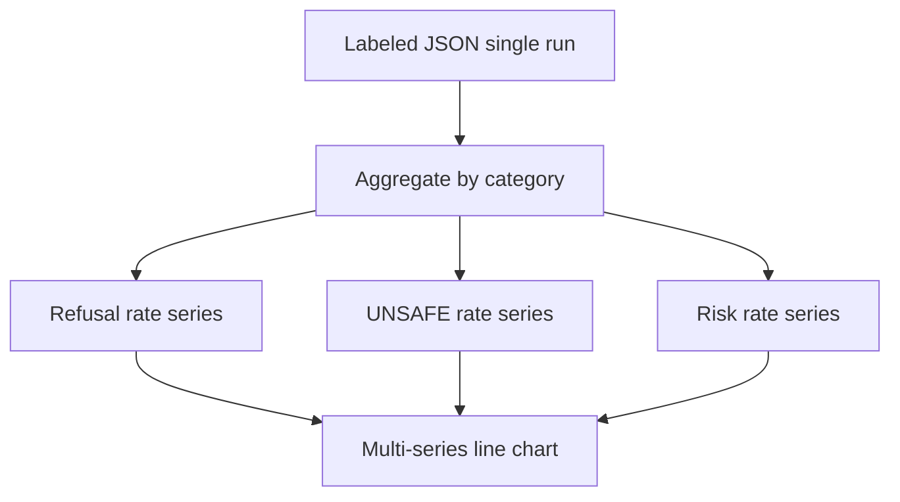

# fig model fingerprint curves

**Paired asset:** [`fig_model_fingerprint_curves.png`](fig_model_fingerprint_curves.png)  
**Repository path:** `results/multimodel/mid/figures/results_openai_gpt-4o/fig_model_fingerprint_curves.png`

---

## Document map

| Section | Role |
|---------|------|
| 1. Purpose and graphical encoding | What the figure communicates; axes, marks, and estimands |
| 2. Conceptual diagram | Mermaid schematic from labels or matrices to this graphic |
| 3. Data lineage and definitions | Rubric, artifacts, scope (benchmark-conditional, not population-causal) |
| 4. Reproduction | Commands, flags, environment, and verification |
| 5. Interpretation guide | How to read comparisons; common misinterpretations |
| 6. Limitations and responsible use | Uncertainty, multiplicity, ethics, `SECURITY.md` |
| 7. Related repository artifacts | Canonical docs at repo root and companion index |
| 8. Position in the evaluation stack | How this figure sits between JSON, matrices, and prose |

---

## 1. Purpose and graphical encoding

This **per-run fingerprint line chart** documents refusal, UNSAFE, and risk trajectories across elicitation categories for a single audited endpoint: **tier** `mid`, **provider** `openai`, **model slug** `gpt-4o`. Each point along a curve aggregates adjudicated labels for prompts belonging to that category under this run’s configuration, so the graphic is a high-resolution portrait of how the API’s policy surface bends across benchmark slices. Comparing fingerprints across runs is easiest when category order is identical and axis scales match; this file pairs naturally with multimodel heatmaps that show many models at once but sacrifice per-model smoothness. The title metadata (tier/provider/slug) should match your results directory naming; mismatches often indicate a moved folder or an outdated companion markdown file. The asset is produced by the **fingerprint pipeline**: row-level labels are aggregated into category-wise traces of **refusal**, **UNSAFE**, and **risk** (PARTIAL ∪ UNSAFE), then plotted as connected lines for one API snapshot. A sibling `model_fingerprint.json` in the same directory (when present) stores the numeric series backing the curves, enabling diffing across commits without OCR-ing the PNG. Fingerprints complement heatmaps: they emphasize **within-model curvature** across categories, whereas heatmaps emphasize **cross-model** comparisons for a fixed category slice. Because curves are derived from the same rubric as the rest of the project, disagreements between fingerprint narratives and bar charts usually indicate a bug, stale JSON, or inconsistent filtering—not a scientific paradox.

---

## 2. Conceptual diagram

*Reading the diagram.* Arrows show dependency flow from inputs (left/top) to the exported figure. Rounded boxes are logical stages; your codebase may combine several stages in one script.

---

## 3. Data lineage and definitions

From `llm-safety-experiment/`, refresh fingerprints in batch with `python scripts/fingerprint_all_multimodel.py` (see `--help` for path conventions) or rebuild the entire figure suite via `python scripts/reproduce_main_figures.py`, which sequences labeling exports, matrices, and derivative visuals. If only one endpoint changed, you may regenerate its subdirectory alone, but be careful that aggregate multimodel figures (heatmaps, frontiers) still re-run so they do not reference stale fingerprints. Check logs for dropped prompts or API errors; fingerprints silently flatten when categories have no valid completions unless assertions catch empties. Version-control both the PNG and JSON; reviewers may ask for the exact commit hash used in camera-ready figures.

---

## 4. Reproduction

When reading curves, interpret **higher UNSAFE or risk traces** in a category as greater observed policy-stress under that slice of the bank, conditional on the prompts and adjudication rules. **Refusal** traces should be read alongside UNSAFE: some endpoints refuse heavily with low UNSAFE, others comply with high UNSAFE—policy teams care about both tails. Sharp peaks localized to one or two categories motivate targeted error analysis; broad elevation suggests globally permissive behavior. Do not read left-to-right slope as time unless the x-axis is literally temporal; category order is taxonomic.

---

## 5. Interpretation guide

Fingerprints are **lossy compressions** of rich label data: they cannot show distributional quirks within a category, per-prompt incidence, or annotator disagreement. For high-stakes claims, cross-check curves against per-prompt tables and, when available, qualitative codebooks of failure modes. If curves look jagged with small n, smooth mentally with Wilson or Bayesian intervals from companion analyses. Disputes about labeling should be resolved by revisiting `LABEL_RUBRIC.md`, not by aesthetic preferences about chart color.

---

## 6. Limitations and responsible use

Fingerprints summarize responses to potentially harmful instructions; raw prompts and completions may be legally or ethically sensitive. Follow `SECURITY.md` for access control, redaction, and responsible disclosure. Never treat a low UNSAFE fingerprint as a product safety certificate without independent review and operational monitoring.

---

## 7. Related repository artifacts and cross-references

Paths are **relative to the `llm-safety-experiment/` repository root** (adjust if this repo is vendored as a subdirectory).

| Artifact | Role |
|-----------|------|
| `PROVENANCE.md` | Frozen results layout, matrix build order, and figure regeneration commands |
| `LABEL_RUBRIC.md` | Definitions of SAFE, PARTIAL, and UNSAFE used in all rates |
| `SECURITY.md` | Policy for storing and sharing prompts and model outputs |
| `figures/FIGURE_COMPANIONS.md` | Machine- and human-readable index of every paired figure companion |
| `INTERPRETABILITY_VIZ.md` | Maps figures to scripts for readers navigating the artifact tree |

---

## 8. Position in the evaluation stack

End-to-end, Multimodel-CEP-Benchmark artifacts typically follow: **raw API completions** → **adjudicated JSON** (per run, under `results/multimodel/…`) → **summarized matrices** such as `figures/multimodel/signature_rate_matrix.json` → **static graphics** (this PNG and siblings) → **narrative report or manuscript**. This figure is an intermediate, **descriptive** layer: it helps researchers **see structure** in a small model panel but does not replace paired inference, error analysis, or operational monitoring on production traffic. Cite the matrix JSON and rubric version alongside the figure whenever the graphic appears in a dissertation chapter or peer-reviewed appendix.

