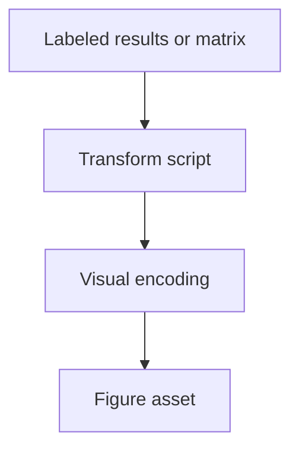

# fig model fingerprint curves

**Paired asset:** [`fig_model_fingerprint_curves.png`](fig_model_fingerprint_curves.png)  
**Repository path:** `results/pilot/fig_model_fingerprint_curves.png`

---

## Document map

| Section | Role |
|---------|------|
| 1. Purpose and graphical encoding | What the figure communicates; axes, marks, and estimands |
| 2. Conceptual diagram | Mermaid schematic from labels or matrices to this graphic |
| 3. Data lineage and definitions | Rubric, artifacts, scope (benchmark-conditional, not population-causal) |
| 4. Reproduction | Commands, flags, environment, and verification |
| 5. Interpretation guide | How to read comparisons; common misinterpretations |
| 6. Limitations and responsible use | Uncertainty, multiplicity, ethics, `SECURITY.md` |
| 7. Related repository artifacts | Canonical docs at repo root and companion index |
| 8. Position in the evaluation stack | How this figure sits between JSON, matrices, and prose |

---

## 1. Purpose and graphical encoding

This Markdown companion sits beside `fig_model_fingerprint_curves.png` at repository path `results/pilot/fig_model_fingerprint_curves.png` but **no curated long-form entry** exists yet in `docs/FIGURE_COMPANION_WRITER.md` / `COMPANIONS`. That usually means the asset was added recently, renamed, or produced by an auxiliary script not yet wired into the companion dictionary. Before publishing, add a bespoke `add("results/pilot/fig_model_fingerprint_curves.png", ...)` block (five paragraphs) describing the visualization encoding, data provenance, reproduction commands, interpretation guide, and limitations/ethics—then rerun `sync_figure_companion_writer.py` and `write_figure_companions.py`. Until then, treat this file as a **placeholder** that orients readers to the paired binary asset but does not substitute for methods text.

---

## 2. Conceptual diagram

*Reading the diagram.* Arrows show dependency flow from inputs (left/top) to the exported figure. Rounded boxes are logical stages; your codebase may combine several stages in one script.

---

## 3. Data lineage and definitions

To locate the generator, search `scripts/` for `fig_model_fingerprint_curves.png` or for related stem substrings, and read `PROVENANCE.md`, `reproduce_main_figures.py`, and any Makefile or CI workflow that invokes plotting utilities. If the figure is an intermediate export under `results/`, check the nearest `results.json` or log files for the command that produced it. Document dependencies (matplotlib, plotly, seaborn, etc.) if they differ from the core requirements.txt. If multiple scripts can emit the same filename, disambiguate using timestamps or checksums.

---

## 4. Reproduction

Typical regeneration paths start from `python scripts/reproduce_main_figures.py` with flags such as `--extra-visuals`, `--phd-visuals`, or `--sankey`, but your asset may require a narrower command—verify before batching. Always run commands from `llm-safety-experiment/` so relative paths resolve consistently. After regeneration, run any repository verification scripts (for example `verify_artifact_chain.py`) if your team relies on them for paper submission hygiene. Commit the updated figure and this companion together to avoid drift.

---

## 5. Interpretation guide

Without custom text, interpret the graphic as a **descriptive** artifact tied to the frozen benchmark and rubric, not as standalone statistical evidence unless separate inference sections justify that use. Readers should cross-link to the main report (`LLM_SAFETY_EXPERIMENT_REPORT.md` or successor) for definitions and to multimethod summaries for context. If the figure encodes novel metrics, define them inline in the companion once you replace this default. Avoid causal language when the experimental design is observational.

---

## 6. Limitations and responsible use

Evaluation repositories routinely contain sensitive prompts and model outputs—even figures that look aggregate can be reverse-engineered when paired with public code. Comply with `SECURITY.md` and institutional policies before redistribution. When in doubt, keep the asset team-internal until a security review clears publication.

---

## 7. Related repository artifacts and cross-references

Paths are **relative to the `llm-safety-experiment/` repository root** (adjust if this repo is vendored as a subdirectory).

| Artifact | Role |
|-----------|------|
| `PROVENANCE.md` | Frozen results layout, matrix build order, and figure regeneration commands |
| `LABEL_RUBRIC.md` | Definitions of SAFE, PARTIAL, and UNSAFE used in all rates |
| `SECURITY.md` | Policy for storing and sharing prompts and model outputs |
| `figures/FIGURE_COMPANIONS.md` | Machine- and human-readable index of every paired figure companion |
| `INTERPRETABILITY_VIZ.md` | Maps figures to scripts for readers navigating the artifact tree |

---

## 8. Position in the evaluation stack

End-to-end, Multimodel-CEP-Benchmark artifacts typically follow: **raw API completions** → **adjudicated JSON** (per run, under `results/multimodel/…`) → **summarized matrices** such as `figures/multimodel/signature_rate_matrix.json` → **static graphics** (this PNG and siblings) → **narrative report or manuscript**. This figure is an intermediate, **descriptive** layer: it helps researchers **see structure** in a small model panel but does not replace paired inference, error analysis, or operational monitoring on production traffic. Cite the matrix JSON and rubric version alongside the figure whenever the graphic appears in a dissertation chapter or peer-reviewed appendix.

